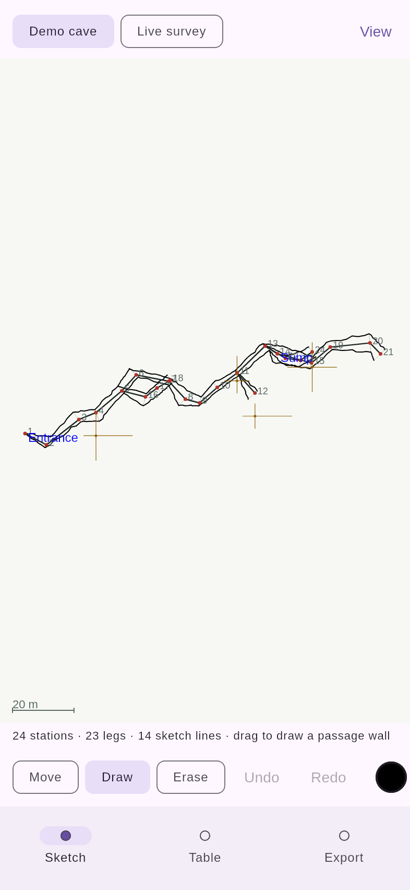
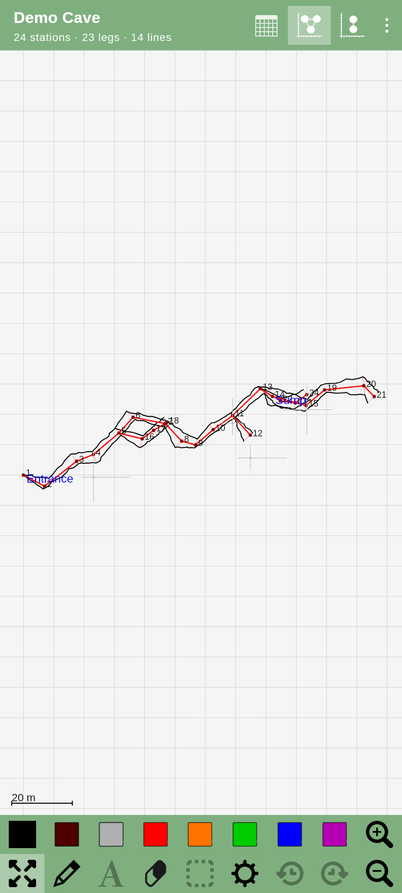
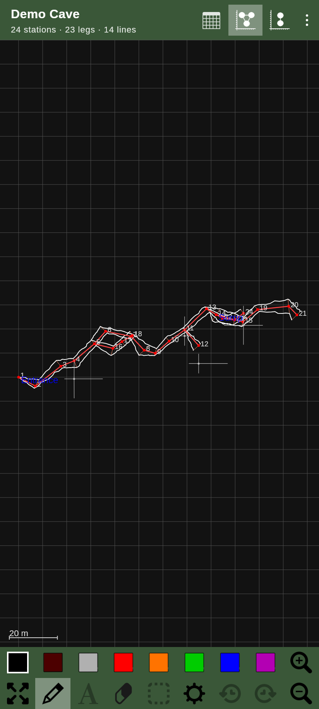
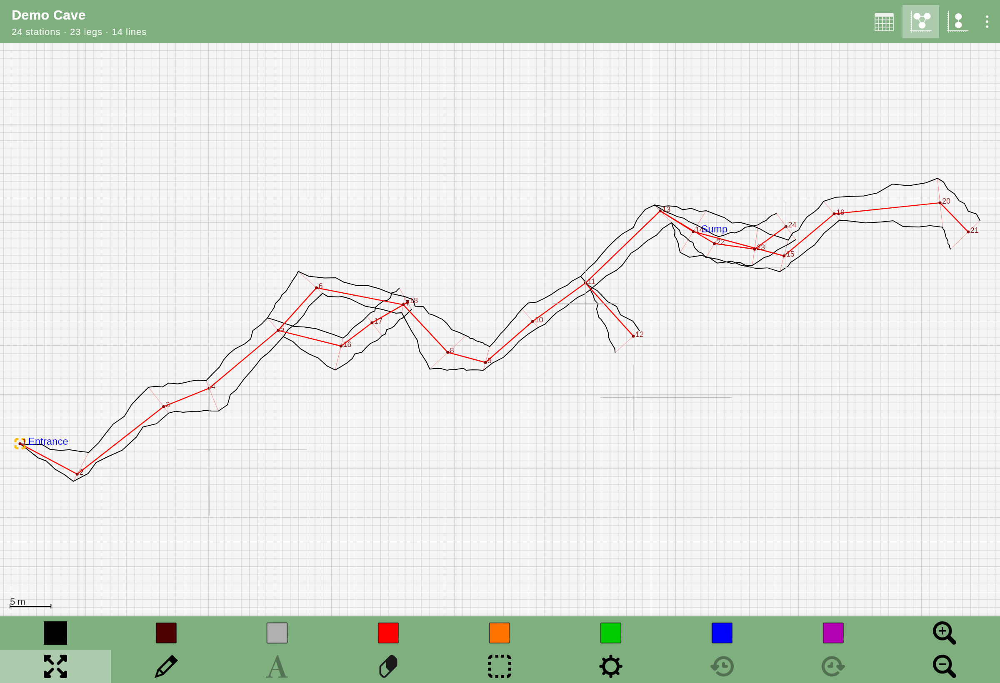
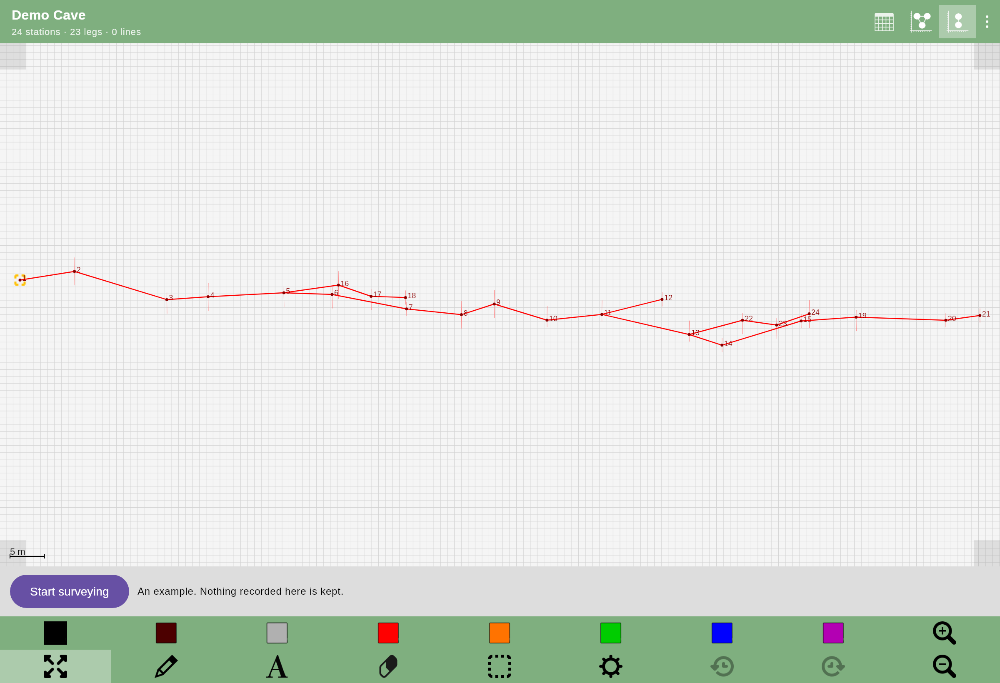
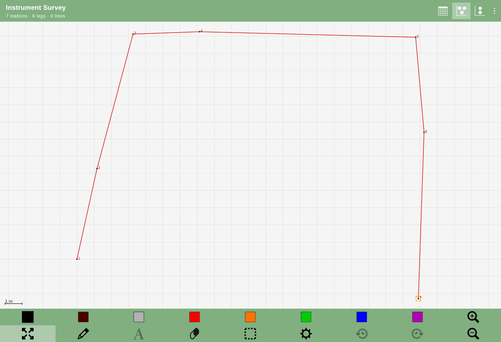
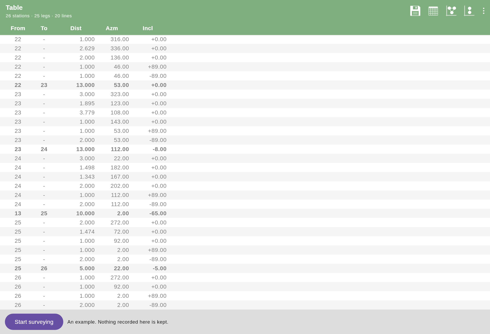
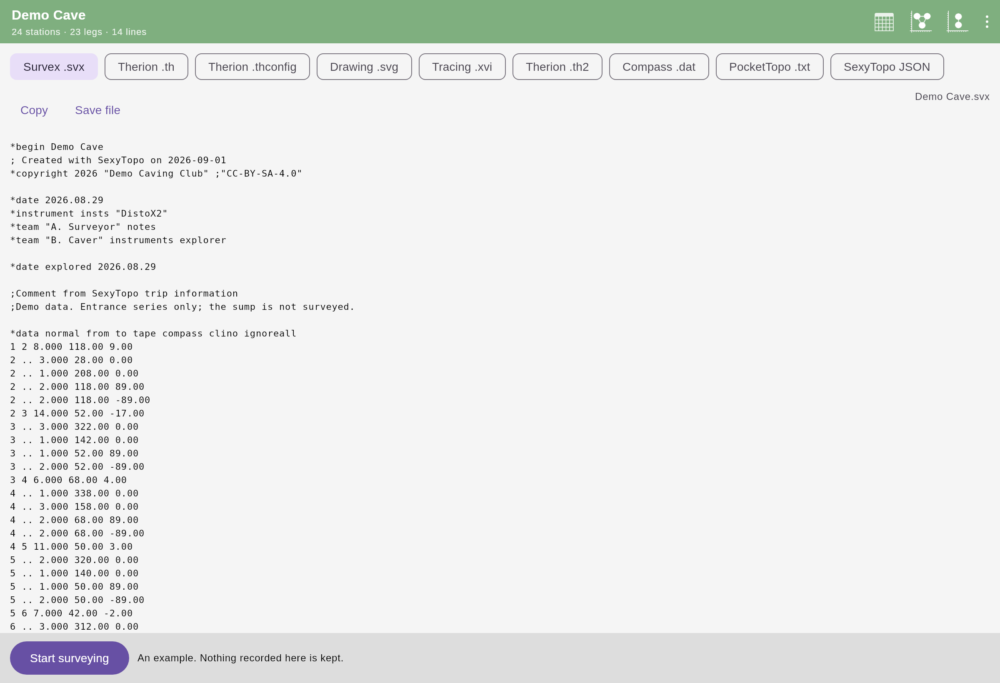
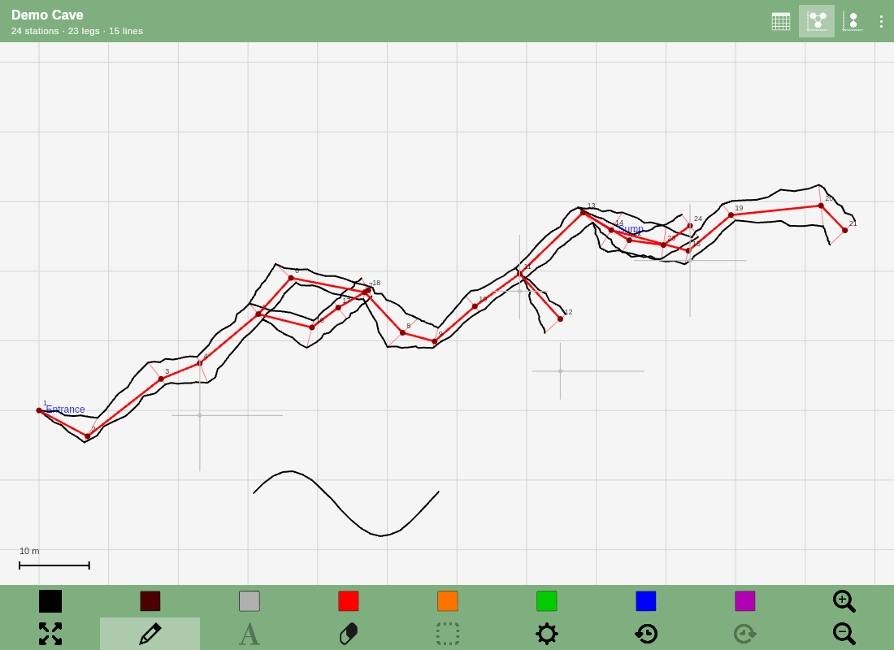

# SexyTopo on iOS — a Kotlin Multiplatform proof of concept

This directory is an **experiment**, not a product, and not a proposal to change the Android app
yet. It exists to answer one question with running code rather than argument:

> If SexyTopo's survey core were shared Kotlin instead of Android Java, would the same code
> actually drive an iOS app?

So far the answer is **yes for everything except the parts that need a Mac to check**. The survey
engine, the instrument protocols, the projection maths, the sketch model, the sketch *editor*, the
Survex and Therion exporters and the native file format are ported and covered by over 660 tests. The UI
is written once in Compose Multiplatform and renders through Skia, which is what Compose uses on
iOS — and it drives the ported logic rather than reimplementing it, which is the part that actually
tests the claim.

**Try it now:** <https://paperclipmonkey.github.io/sexytopo/> - the whole app compiled to
WebAssembly, including in Safari on an iPhone. That is the browser build rather than the
native one, but the survey core, the sketch engine and the Compose UI in it are the same code
the iOS build compiles.

Nothing in the existing Android app has been touched. `kmp/` is a separate Gradle build alongside
it; everything except the Android host builds without an Android SDK at all, which is the clearest
demonstration that the core no longer depends on one.

---

## What is actually proven, and what is not

Being precise about this matters more than the demo looking good.

| Claim | Status | Evidence |
| --- | --- | --- |
| Survey model, projection maths and the extended-elevation unroll port to Kotlin | **Verified** | tests, on two targets |
| The survey engine builds stations from readings the way the app does | **Verified** | `SurveyUpdaterTest` (55 tests), triple-shot promotion and all three amalgamation algorithms |
| Instrument packets decode identically | **Verified** | byte-level tests for DistoX, DistoX-BLE, BRIC, SAP6, Cavway, FCL |
| The whole chain works end to end | **Verified** | `SurveyingEndToEndTest`: simulated instrument → packet decode → station promotion → JSON round-trip |
| Native JSON survey/sketch formats read and written compatibly | **Verified** | round-trip tests against Android-shaped fixtures, including corrupt and old-format files |
| Survex and Therion export byte-identically | **Verified** | golden tests asserting the full file, metadata block included |
| **PocketTopo's own binary `.top` imports** | **Verified** | the format's primitives against the Android app's own `PocketTopoFileTest`, the shot-ordering and repeat-averaging rules against its `PocketTopoImporterTest` fixtures byte for byte, and its real `CeiledUp.top` — 12 stations, 68 legs, 203 strokes — read identically on the JVM, Kotlin/Wasm and Kotlin/Native, and through the file chooser in a browser |
| A PocketTopo text export imports, drawing included | **Verified** | the Android app's own `FAKE_TEXT` fixture and its three assertions, on three targets, plus the four files that crash the Java |
| A Survex or Therion file from other software imports | **Verified** | round-trip tests through the ported exporters, plus a `.svx` written by hand — team, date, backsights, splays, station comments and leg comments — and `field.mjs` brings one into the browser build end to end |
| Compass `.dat` exports byte-identically | **Verified** | a golden captured by *running* the Android app's own exporter, not by reading it — which caught a transcription slip on the first attempt |
| PocketTopo `.txt` exports the same survey data | **Verified** | its DATA section is golden against the Android app; its station sections deliberately diverge, because the Java's are not reproducible even against themselves |
| A station being made can be felt rather than looked at | **Verified** | the callback fires once per station and not once per reading, the preference round-trips, and `field.mjs` turns it off through the settings screen and checks it stayed off |
| The instrument log is kept, persisted and readable on the phone | **Verified** | `ActivityLogTest` for the bounded queues and the file format; `instrument.mjs` connects a fake DistoX-BLE, takes a calibration, and then reads the log back off the clipboard — count, timestamps and all |
| The desktop build keeps its surveys too | **Verified** | a survey written by one `SurveyLibrary` and read by a second over the same directory, in SexyTopo's own file layout, plus the three platform conventions for where that directory goes |
| Surveys save and load through a platform-free storage layer | **Verified** | a full round trip - naming, directories, autosave, listing - over an in-memory `FileStore`, on all three targets. The Android app's equivalent test is `@Ignore`d because `DocumentFile` cannot be mocked |
| The sketch editor — tools, viewport, hit-testing, undo — is platform-free | **Verified** | `shared/sketch/`, driven by the demo and tested on two targets |
| The BLE connection logic is platform-free | **Verified** | `GattLinkTest` and `GattSessionTest` — the profile matrix *and* the connection lifecycle; only callback plumbing is left in `iosMain` |
| The DistoX calibration solver reproduces the Java exactly | **Verified** | the Android app's own two 56-shot datasets, asserting the *iteration counts* (43, 75, 53) as well as the errors — reproduced on the JVM, Kotlin/Wasm **and Kotlin/Native** |
| The 3D view's camera and projection port off OpenGL | **Verified** | `Matrix4Test` and `Camera3DTest` — the Android `Matrix` routines the renderer uses, and the camera on top of them, including that the whole survey stays on a portrait screen through 128 different angles; `field.mjs` opens it in the browser, counts what got drawn and turns it |
| Shared Compose UI draws, and can be drawn on | **Verified** | `./gradlew :demo:renderDemoPng`; drawing/erasing/undo covered by tests |
| **The shared core has no JVM-only dependencies** | **Verified** | every shared test passes on **Kotlin/Wasm** as well as the JVM |
| **The same code compiles for iOS** | **Verified** | `:shared:compileKotlinIosSimulatorArm64` in CI on a macOS runner — `iosMain`, `CoreBluetoothTransport` included |
| **The ported test suite passes on Kotlin/Native** | **Verified** | `:shared:iosSimulatorArm64Test` — the same tests as the JVM and Wasm jobs, on the actual target rather than a proxy for it |
| **The shared Compose UI links as an iOS framework** | **Verified** | `:demo:linkDebugFrameworkIosSimulatorArm64` — Compose's own Native klibs, the bundled font and the toolbar PNGs, resolved into the static framework `iosApp/` links against |
| **The same code compiles for a real iPhone** | **Verified** | `:shared:compileKotlinIosArm64` and `:demo:linkDebugFrameworkIosArm64` — a separate Kotlin/Native target from the simulator, with its own platform libraries, so a green simulator build does not imply it |
| The iOS app runs on a device | **Not verified** | needs Xcode, an Apple developer account and a physical phone |
| **The app can ask to connect to an instrument** | **Verified** | `instrument.mjs` in CI stands a stub where `navigator.bluetooth` would be and makes it behave like a DistoX-BLE: the profile's name prefix and UUIDs reach the browser API, the notification arrives as a frame, the decoder reads it, the acknowledgement goes back, and three readings make a station in a saved survey |
| **A calibration can be taken, solved and written back** | **Verified** | `instrument.mjs` puts the fake DistoX-BLE into calibration mode, feeds it the Android app's own 56-shot dataset over Web Bluetooth, and checks the twelve coefficient blocks reach the device |
| `CoreBluetoothTransport` works | **Not verified** | it compiles, it now has a caller, and it has still never talked to a radio; the simulator has no Bluetooth stack, so this needs a real instrument |
| Web Bluetooth works against real hardware | **Not verified** | the chain is driven end to end against a fake instrument in CI; no real one has been near it |
| The whole app runs in a browser | **Verified** | a headless-Chromium smoke test in CI loads the page, draws a stroke and undoes it |
| The same UI builds and packages for **Android** | **Verified** | `:androidApp:assembleDebug` in CI; the APK is a build artifact |

**The honest summary:** the port compiles for iOS, its tests pass on Kotlin/Native, and the shared
Compose UI links as an iOS framework — all three checked on every push by a macOS runner, which
GitHub provides free on public repositories. The Mac that gated this project turned out to be a CI
job rather than a purchase.

What remains unverified is now much narrower, and all of it needs hardware rather than a toolchain:
the app running on a physical device, sketching latency under an Apple Pencil, and either transport
against a real instrument. The iOS *simulator* has no Bluetooth stack, so no amount of CI closes
that last one — but a stub standing where `navigator.bluetooth` goes does close everything either
side of the radio, from the profile's UUIDs to a station in a saved survey.

**"Expect to fix something on the first real build" was right**, and worth recording precisely,
because it is the calibration for everything else here. The first compile of `iosMain` found:

- two delegate properties whose anonymous types Kotlin refuses to infer;
- two pairs of Objective-C selectors that collapse onto one Kotlin signature and need
  `@ObjCSignatureOverride`;
- a missing `BetaInteropApi` opt-in, whose level is ERROR rather than warning.

It took three compile-fix cycles, because the conflicting-overload diagnostic *quotes the signature
the declaration collides with* rather than the one it is reporting — so the message names one
function while the line number points at the other, and reading the message gets you the wrong half
of the pair twice running.

---

## One UI, four platforms

`App()` is one composable, and it is a deliberate copy of SexyTopo's own sketch screen — the layout
of `activity_graph.xml`, the green panels from `colors.xml`, and the app's own toolbar artwork
carried across as Compose resources.

| iPhone 15 Pro | Pixel 8 | The same, dark |
| --- | --- | --- |
|  |  |  |

That copying is the point. A demo restyled to somebody's taste would prove that Compose can draw a
UI, which nobody doubts. A demo a SexyTopo user recognises on an iPhone — and can already use,
because the buttons are where their thumb expects — is an argument. So the centreline is red and
the splays are salmon, because that is what SexyTopo draws, not because it is what anybody would
choose from scratch.



There is one layout rather than a phone one and a tablet one, because the app has one: nine
weighted columns spread out on a tablet and square up on a phone by themselves. Two buttons are
drawn but greyed — the symbol and select tools, which the shared model supports and this demo has
no palette or station menu to drive. Showing them disabled keeps the toolbar honest in both
directions: it is the app's toolbar, and what the demo cannot do is visible rather than quietly
missing.

## What the demo does

- **Two surveys.** A generated demo cave, and a **live survey** you build yourself.
- **Live surveying.** "Take reading" makes the simulated instrument emit a real DistoX wire-format
  packet; the ported protocol decodes it; the ported engine promotes three agreeing readings into a
  station. That is the core interaction of the whole app, and only the radio is pretend.
- **Sketching**, driven entirely by the shared `SketchEditor`, `SketchViewport` and `SketchTool`.
  Draw, erase and move tools, the Android toolbar's eight brush colours, undo/redo. Strokes are
  captured in survey metres (never pixels) and simplified on release. Erasing splits a stroke
  rather than deleting it — rubbing out the middle of a passage wall leaves both ends — and it
  hit-tests through the same visibility rule the renderer uses, so you cannot rub out what is too
  small to see.
- **Cross-sections**, drawn on the plan where the surveyor parked them.
- **The cave in 3D**, turned with a finger. The Android app draws this with OpenGL ES; here the
  projection is arithmetic and the drawing is the same 2D canvas as everything else, so it runs on
  iOS, Android, the desktop and the web from one file.
- **The active station**, in the app's amber corner brackets, and the select tool that moves them.
- **Export** to Survex `.svx`, Therion `.th` and `.th2`, an `.xvi` tracing image, Compass `.dat`,
  PocketTopo `.txt`, SVG, and the app's own JSON — the same bytes the Android app would read back.
- **Import** of a Survex `.svx`, Therion `.th`, PocketTopo `.txt` or PocketTopo's own binary
  `.top`, as well as the app's own files: the club's existing survey of the cave, opened here to be
  extended. Both PocketTopo readers bring the *drawing* in as well as the centreline.
- **An instrument log you can read underground**, kept as it happens and copied off the phone with
  one tap — because a DistoX that will not pair does it in a cave, with no signal and no console.
- **A buzz when a station is made**, so the surveyor can look at the rock instead of the phone.
  Under *Surveying*, and on by default — which is what the Android app's own settings screen shows,
  though not what it does; see finding 13.
- **Plan and extended elevation**, the latter exercising the cave-unrolling maths.
- **The survey table**, with backwards shots normalised back to the reading as taken.
- Light and dark, and a layout that collapses to one scrollable toolbar on a phone.

| Extended elevation | Live survey from the instrument |
| --- | --- |
|  |  |

| Survey table | Export |
| --- | --- |
|  |  |

---

## Building

Everything below works on Linux/macOS/Windows except where noted.

```bash
cd kmp

./gradlew :shared:jvmTest          # the ported test suite
./gradlew :shared:wasmJsNodeTest   # the same tests on a NON-JVM target
./gradlew :demo:jvmTest            # the UI's use of the shared editor
./gradlew :demo:compileKotlinWasmJs      # the UI compiled for a non-JVM target
./gradlew :demo:renderDemoPng            # render the shared UI to PNGs, no display needed
./gradlew :demo:run                      # the desktop app (needs a display; keeps its surveys)
./gradlew :demo:wasmJsBrowserDistribution  # the browser build — see "The browser target" below
./gradlew :androidApp:assembleDebug      # the Android app (needs an Android SDK)
```

### Running on Android

Needs an Android SDK, which is the only thing this build wants that the others do not:

```bash
export ANDROID_HOME=/path/to/android-sdk
cd kmp && ./gradlew :androidApp:installDebug   # or assembleDebug for just the APK
```

The Android-specific surface is one activity that calls `setContent { App() }`, a manifest and a
theme. It installs with its own application id, so it sits on a phone next to the real SexyTopo
rather than replacing it — which is how you would want to compare them.

### Building for iOS (no Mac needed)

Checking that this *builds* for iOS needs nothing but a push. The `ios` job in
`.github/workflows/kmp.yaml` runs on a `macos-latest` runner — free on public repositories — and
does the four things that used to be unanswerable here:

```bash
./gradlew :shared:compileKotlinIosSimulatorArm64        # iosMain, CoreBluetoothTransport included
./gradlew :shared:iosSimulatorArm64Test                 # the ported suite, on Kotlin/Native
./gradlew :demo:linkDebugFrameworkIosSimulatorArm64     # the framework iosApp/ links against
./gradlew :shared:compileKotlinIosArm64 \
          :demo:linkDebugFrameworkIosArm64              # the phone, which is not the simulator
```

Run those locally if you have a Mac; otherwise read them off the last CI run. Two of them are worth
a second look. `iosSimulatorArm64Test` is the same suite the JVM and Wasm jobs run, executing on the
actual target rather than on a target chosen because it also lacks `java.*`. And the last pair
exists because `iosArm64` and `iosSimulatorArm64` are separate Kotlin/Native targets with separate
platform libraries — device UIKit and CoreBluetooth are not the simulator's — so a green simulator
build is not evidence that the thing somebody carries underground compiles.

### Running on iOS (needs macOS + Xcode)

**Before any of this, try `./gradlew :demo:run`.** The desktop build is the same `App()` composable
the iPhone hosts, it needs no SDK and no simulator, and it now keeps its surveys between runs — so
it is the cheapest way to see whether the thing is worth putting on a phone at all.

Putting it on a simulator or a phone is where a Mac becomes unavoidable. The Xcode project is
**generated rather than committed**, because it was authored on Linux where a hand-written
`.pbxproj` cannot be opened or validated:

```bash
brew install xcodegen
cd kmp/iosApp && xcodegen && open iosApp.xcodeproj
```

The build runs `./gradlew :demo:embedAndSignAppleFrameworkForXcode` as a pre-build phase, which
compiles the Kotlin/Native framework and embeds it. `kmp/iosApp/project.yml` and the README section
below it describe a fully manual alternative if you would rather install nothing.

The entire iOS-specific surface is six files: `demo/src/iosMain/.../MainViewController.kt` (one
function), `Storage.ios.kt`, `Clipboard.ios.kt`, `ScreenAwake.ios.kt` and the two Swift files in
`iosApp/` — plus, when you want real instruments,
`shared/src/iosMain/.../CoreBluetoothTransport.kt`.

#### Onto your own phone, step by step

Everything above is checked by CI. This part is not, because no CI runner has a phone plugged into
it — so it is written out in full, including the three places it is known to go wrong.

1. **Install the tools.** Xcode from the App Store — the whole thing, not just the Command Line
   Tools. Launch it once and let it install its additional components. Then:
   ```bash
   brew install xcodegen temurin@21
   # Kotlin/Native needs the full Xcode, not the Command Line Tools. If you have ever installed
   # the CLT on their own, xcode-select is probably still pointing at them, and the build fails
   # with "xcrun: error: unable to find utility" or a linker that cannot find the iOS SDK.
   sudo xcode-select -s /Applications/Xcode.app/Contents/Developer
   sudo xcodebuild -license accept
   ```
2. **Generate and open the project.**
   ```bash
   git clone https://github.com/paperclipmonkey/sexytopo.git
   cd sexytopo/kmp/iosApp && xcodegen && open iosApp.xcodeproj
   ```
   XcodeGen reads `project.yml` and writes `iosApp.xcodeproj` beside it. Open the **project**,
   not a workspace; there is no workspace.

   The build needs the network the first time: Gradle fetches Kotlin/Native's compiler and the
   Compose and Skia artifacts, which is a few hundred megabytes.
3. **Set a signing team.** Select the `iosApp` target → *Signing & Capabilities* → tick *Automatically
   manage signing* and choose your team. A free Apple ID works: add it under *Xcode → Settings →
   Accounts*, and it appears as *(Personal Team)*.
4. **Change the bundle identifier** to something nobody else has used — `org.hwyl.sexytopo.kmpdemo`
   is in this repository, so somebody may already have registered it. `uk.co.yourname.sexytopo` will
   do. Xcode will tell you, in red, if the one you picked is taken.
5. **Turn on Developer Mode on the phone.** iOS 16 and later hide it until you ask: *Settings →
   Privacy & Security → Developer Mode → on*, then restart the phone and confirm after it comes
   back. The toggle only appears once the phone has been plugged into a Mac running Xcode, so do
   step 5 first if you cannot find it. Without this the phone accepts the app and refuses to launch
   it, with a message about the developer being untrusted that looks like step 7's problem but is
   not.
6. **Plug the phone in** with a USB cable and unlock it. The first time, the phone asks whether to
   *Trust This Computer* — say yes. Pick it from the device menu at the top of the Xcode window
   (next to the scheme), and press ⌘R.

   The first build compiles Kotlin/Native and links Skia. Expect **five to fifteen minutes** on a
   modern Mac, with Xcode's progress bar apparently stuck on "Compile Kotlin Framework" for most of
   it — that is Gradle working, and the Xcode log pane (⌘9, then the build) shows what it is doing.
   Later builds are seconds unless Kotlin changes.

   The iPhone needs **iOS 15 or later**, which is anything from an iPhone 6s onwards.
7. **Trust the developer on the phone.** *Settings → General → VPN & Device Management → your Apple
   ID → Trust*. Until you do, the app installs and refuses to launch.

Three things go wrong, in roughly this order of likelihood:

- **"Unable to locate a Java Runtime"** in the build log. Xcode runs script phases with a stripped
  environment and no login shell, so a JDK installed by Homebrew or SDKMAN is not on `PATH`. The
  pre-build script already asks `/usr/libexec/java_home` for one; if you installed a JDK somewhere
  that does not answer to it, set `JAVA_HOME` explicitly in that script phase.
- **"Sandbox: ... deny file-write"**. `ENABLE_USER_SCRIPT_SANDBOXING` is set to `NO` in
  `project.yml`, which is what allows Gradle to run at all. If you built the project by hand rather
  than with XcodeGen, set it yourself in *Build Settings*.
- **The app expires after seven days.** That is a free Apple ID, not a bug. Re-run ⌘R to reinstall,
  or use a paid developer account, which lasts a year. Worth knowing before a weekend underground:
  build it the day before, not a week before.
- **`xcrun: error: unable to find utility`, or a linker that cannot find the iOS SDK.** `xcode-select`
  is pointing at the Command Line Tools rather than at Xcode; see step 1.

Two cosmetic things that are not faults:

- **The app has no icon.** There is no asset catalog in `iosApp/`, so iOS draws the default white
  tile. Adding one is a five-minute job in Xcode and nothing depends on it.
- **The launch screen is blank.** `UILaunchScreen` is an empty dictionary, which iOS reads as
  "plain background".

#### Before you demo it: what has and has not been run

Be precise about this, because it is the difference between a demo that surprises you and one that
does not.

**Checked on every push, on a macOS runner:** the shared code compiles for the phone (`iosArm64`,
a different target from the simulator with its own platform libraries); the whole ported test suite
passes on Kotlin/Native; the Compose UI links as an iOS framework; and the iOS file handling —
`DocumentsFileStore`, the date and clipboard code, a survey saved and reopened — *runs* in a
simulator.

**Never run at all:** the app itself, as an app, on any Apple device. Nobody has pressed ⌘R before
you. The pieces are all verified and the assembly is not, so the plausible failure is something
dull at startup rather than something deep — and if it does fail, the Xcode console will say so
loudly rather than misbehaving quietly.

**Never near a radio:** `CoreBluetoothTransport`. The simulator has no Bluetooth stack, so CI
cannot exercise it, and no instrument has been near a phone running this. *Instrument* will ask for
Bluetooth permission and start scanning; whether a DistoX-BLE actually appears is genuinely unknown.
Everything above the radio — the profiles, the decoders, the acknowledgement handshake, the
calibration — is driven end to end against a fake instrument in CI, so if the radio works the rest
should follow.

**Unmeasured:** sketching latency under a finger or an Apple Pencil.

#### What you can do on the phone

Everything in this list is walked end to end by `field.mjs` on a 420-pixel screen on every push,
and the iOS file handling underneath it runs in a simulator on the macOS runner:

- **Record a trip.** Name a survey, type readings off the instrument's display, and watch three
  that agree promote to a station under the app's own tolerance rules. *Forward*, *Backsight* and
  *Fore + back* all mean what they mean in the app, and the field bar says which is on.
- **Fix a mistake.** Tap a table row to correct a reading, delete it, or promote a splay to a
  station. A correction keeps the destination station, so it cannot silently take the rest of the
  cave with it.
- **Name the junction, and measure the passage.** Stations take a name, a comment and the
  extended-elevation direction that decides which way a branch unrolls — and four tape
  measurements, left, right, up and down, which become ordinary splays. That is how a survey is
  booked when there is no instrument in the party, and it is what lets a cross-section be drawn
  from a hand-booked survey.
- **Sketch it**, in plan and extended elevation, each with its own strokes and its own undo
  history — write on it (*sump*, *boulder choke*, *continues*), stamp any of the nineteen UIS
  symbols, and drop a cross-section at a station, drawn from that station's own splays.
- **Overrule the app.** A cross-section's bearing is a guess and its position is wherever your
  finger landed. *Re-aim a cross-section* swings it round its station until it cuts the passage
  square; *Move a cross-section* slides it, drawing and all, off the centreline it is sitting on.
  Both preview under the finger, and what is previewed is what is committed.
- **Join the wall up.** *Snap to lines*, in the drawing menu, makes a new stroke start and finish
  exactly on the end of a nearby one. A passage wall is drawn as a series of strokes, and a wall
  with gaps in it is one no tracing tool downstream can close. Off by default, as in the app.
- **Calibrate the instrument.** *Calibrate* runs the app's own procedure: fourteen directions,
  each rolled through four positions, fifty-six shots in all, then Beat Heeb's solver and the
  coefficients written back to the device. An uncalibrated DistoX can be several degrees out, and a
  survey is a chain of bearings, so the error accumulates along the passage — the cave comes back
  the wrong shape and nothing in the numbers says so. The run is saved as it is taken, in the
  Android app's own JSON format, so a flat battery twenty minutes into fifty-six shots does not
  mean starting again. Without an instrument the simulated one replays a real 56-shot calibration,
  so the whole chain can be seen working.
- **Draw the passage.** Tap a cross-section and it opens into its own screen — the same canvas,
  tools, viewport and undo stack as the plan, over the section's own world: the station at the
  origin and its splays around it. A star of splays is not a passage; the outline drawn round it,
  joining the wall shots and closing the gaps where nobody took one, is what makes it one. *Cancel*
  really does discard, because the editing happens in a copy.
- **Say who was there.** Trip details records the date, the team and their roles, the instrument,
  and the copyright and licence terms, and every exporter writes them.
- **Match the tolerances to the instrument.** The defaults assume a DistoX; a compass and tape
  needs looser ones, and without that nothing ever promotes to a station. *Surveying* sets them,
  and they persist.
- **Try an instrument.** *Instrument* offers the seven BLE families the port carries profiles for.
  On iOS that is CoreBluetooth; in Chrome, including on Android, it is Web Bluetooth. Neither has
  met real hardware — see the table above — but the acknowledgement handshake four of these
  instruments need is implemented and tested, which is the part that fails silently.
- **Take it home.** Survex, Therion `.th` and `.th2`, Compass, PocketTopo, the native JSON,
  Therion's own `.xvi` tracing image — or the drawing itself as SVG, which is the whole plan or extended elevation with its passage walls, centreline, splays,
  station labels, symbols and cross-sections, openable in Inkscape or any browser. The SVG carries
  a legend below the drawing: title, date, who was there, surveyed length and vertical range, the
  copyright line, a scale bar and — in plan, where it means something — a north arrow. A drawing
  without those is a picture rather than a survey, and no club will take it. Dated from the phone's
  own clock, to the clipboard or to a real file with the right extension. On iOS the files land in
  the Files app under *On My iPhone → SexyTopo KMP*, because `UIFileSharingEnabled` is set.
- **Bring one back in.** Put a `.data.json` in the app's folder — on iOS that is Files, under *On
  My iPhone* — and *Import* offers it. It never overwrites a survey already in the library, which
  matters when a colleague sends you their copy of a cave you are also surveying.
- **See how big it is.** *Statistics* is the app's own panel — length, depth, stations, legs,
  splays, shortest and longest shot — which is what a surveyor asks for underground rather than
  afterwards.
- **Lose nothing.** Every change is written immediately, the survey is there after a restart, and
  the app opens with no signal at all. In a browser the app also asks for persistent storage on
  startup, because `localStorage` is otherwise storage the browser may reclaim; if it is refused,
  the export screen says so rather than letting you assume the trip is safe.

#### What to expect that is missing

Honest limits, so nothing is a surprise in a cave:

- **No instrument has been near it.** The app can now ask to connect — *Instrument* lists the
  device families, and iOS uses CoreBluetooth while Chrome uses Web Bluetooth — and the whole chain
  from profile to saved station is driven against a *fake* instrument in CI. No real one has been
  tried on either platform, and the iOS simulator has no Bluetooth stack, so it cannot be. Expect to
  type readings, which is what *Add reading* is for and which behaves identically.
- **A cross-section holds only lines.** It can be placed, re-aimed, moved and drawn into, but its
  own editor keeps paths and drops symbols and labels on commit — which is what the Android app's
  editor does too, so this matches rather than diverges.
- **Browser storage can still be reclaimed.** The build asks for persistent storage at startup, but
  a browser may refuse — Chrome grants it silently only to a site you have engaged with or
  installed to the home screen. When it refuses, the export screen says so. On iOS this does not
  arise: files in the app's own container stay there.
- **The original DistoX and DistoX2 will never work here.** They speak Bluetooth Classic RFCOMM,
  which iOS has no public API for and no browser implements. That is permanent, and not a gap this
  project can close.
- **This is a port, not the app.** Use it beside a notebook, not instead of one.

---

## How it maps to the Android app

| Android app (Java) | Here (Kotlin) | Notes |
| --- | --- | --- |
| `model/graph/*`, `model/survey/*` | `shared/model/` | Straight translation |
| `model/graph/Projection2D` | `shared/model/graph/Projection2D.kt` | Including the load-bearing y-flip |
| `control/util/Space{2,3}DUtils`, `Space3DTransformer(ForElevation)` | `shared/math/` | The extended-elevation unroll |
| `control/util/SurveyUpdater`, `amalgamation/*`, `StationNamer` | `shared/survey/` | Triple-shot promotion, all three amalgamation algorithms, real default tolerances |
| `model/sketch/*` | `shared/model/sketch/` | Needed no translation — see below |
| `model/sketch/Symbol` + 19 vector drawables | `shared/model/sketch/Symbol.kt` | **Generated** from the drawables; artwork drawn by `math/SvgPath.kt`, arcs included |
| `io/thirdparty/therion/Th2Exporter` | `shared/io/export/Th2.kt` | The scrap file, its cross-section anchors and the `##XTHERION##` block |
| `io/thirdparty/xvi/*` | `shared/io/export/Xvi.kt`, `XviGlyphs.kt`, `XviSymbolPaths.kt` | The glyph font and the symbol polylines are **generated** from the Java, as `Symbol` and `Colour` were |
| `io/thirdparty/svg/SvgExporter` | `shared/io/export/Svg.kt`, `SvgLegend.kt` | Deterministic where the Java's `HashMap` order is not; legend laid out with the Java's own arithmetic, ISO dates instead of a locale's |
| `control/util/SurveyStats`, `StatsActivity` | `shared/survey/SurveyStats.kt`, `demo/.../StatsDialog.kt` | Including the two pieces of arithmetic that look like mistakes |
| `model/sketch/Colour` (150 values) | `shared/model/sketch/Colour.kt` | **Generated** from the Java enum so values cannot drift |
| `comms/distox/*`, `distoxble/`, `bric4/`, `cavwayx1/`, `sap6/`, `fcl/` | `shared/comms/` | Protocol only, no transport |
| `control/calibration/*`, `model/calibration/*` | `shared/calibration/` | Beat Heeb's solver; results returned rather than left in statics |
| `DistoXCalibrationActivity` | `shared/calibration/CalibrationRun.kt`, `demo/.../CalibrationDialog.kt` | The 56 positions, the assessment, and the write-back |
| the `*Manager` classes' device knowledge | `shared/comms/InstrumentProfile.kt` | The BLE device matrix, as data |
| Nordic `BleManager` subclasses | `shared/iosMain/.../CoreBluetoothTransport.kt` | The whole iOS Bluetooth surface |
| `control/io/basic/*JsonTranslater` | `shared/io/` | Same tags, same tolerant two-pass load; the calibration file is interchangeable both ways |
| `control/graph/GraphView` — tools, viewport, hit-testing, snap-to-lines | `shared/sketch/` | Ported; the demo drives it |
| `GraphView.handle{Move,Rotate}CrossSection` | `demo/.../CrossSectionDrag.kt` | One value drives the preview *and* the commit, so they cannot disagree |
| `CrossSectionActivity`, `CrossSectionView` | `demo/.../CrossSectionEditor.kt` | The same canvas over the section's own world; `SurveyScene.forCrossSection` is the whole difference |
| `control/graph/GraphView` — drawing and touch plumbing | `demo/.../SurveyCanvas.kt` | **Rewritten**, not ported |
| `control/threed/SurveyRenderer` — the camera | `shared/math/Camera3D.kt`, `Matrix4.kt` | Including `android.opengl.Matrix`, which exists nowhere else |
| `control/threed/*`, `ThreeDViewActivity` | `demo/.../ThreeDView.kt` | The GL half **rewritten** as a 2D canvas: no shaders, no vertex buffers, and it runs on all four targets |
| `res/layout/activity_graph.xml` | `demo/.../App.kt`, `SketchToolbar.kt` | The 9x2 toolbar, copied |
| `res/values/colors.xml` (+ `values-night`) | `demo/.../SexyTopoTheme.kt` | The app's own palette |
| `res/drawable-hdpi/*.png` | `demo/src/commonMain/composeResources/drawable/` | The app's own icons |
| `res/menu/drawing.xml` | `demo/.../SketchToolbar.kt` | The display toggles behind the gear |
| `model/sketch/Sketch`'s twin history stacks | `shared/sketch/SketchEditor.kt` | `DeletedDetail` becomes a sealed type |
| `control/io/thirdparty/{survex,therion,survextherion}` | `shared/io/export/` | Golden-tested, metadata block included |
| `PocketTopoFile`, `PocketTopoImporter` | `shared/io/imports/PocketTopoFile.kt`, `PocketTopoImport.kt` | A cursor over a byte array rather than an `InputStream`; the calendar arithmetic `new Date()` used to do, written out |
| `PocketTopoTxtImporter` | `shared/io/imports/PocketTopoTxtImport.kt` | The only import that brings a drawing in too; four crashes in the Java are fixed rather than reproduced |
| `SurvexImporter`, `TherionImporter`, `SurvexTherionImporter`, `SexyTopoVersion` | `shared/io/imports/` | Round-tripped against the exporters above; fixes a station-comment bug found doing so |
| `NewStationNotificationService` | `demo/.../Haptics.kt`, `AppPreferences.kt` | A haptic rather than a timed buzz on iOS, which has no public API for one |
| `control/Log`, `SystemLogActivity` | `shared/log/`, `shared/io/LogJson.kt`, `demo/.../LogDialog.kt` | Instances rather than statics, so it can be tested; the file format is the Android app's, `isError` written as a string and all |
| `model/table/LRUD` | `shared/survey/Lrud.kt` | |
| `model/survey/Trip` | `shared/model/survey/Trip.kt` | `java.util.Date` becomes a zoneless `SurveyDate` |
| `control/util/GraphToListTranslator` | `demo/.../SurveyTableView.kt` | Including as-taken normalisation |
| `SexyTopoActivity` and the Android UI shell | `androidApp/.../MainActivity.kt` | One `setContent { App() }` |

---

## Findings worth recording

These are the things that would actually shape a real port.

1. **The sketch model needed no translation at all.** Paths are already lists of the app's own
   `Coord2D` in survey metres and colours its own packed RGB ints — there is not a single
   `android.graphics` type in the sketch data. Only the *renderer* is platform-specific, which is
   why `GraphView` was the one thing that had to be rewritten rather than ported.

2. **Storage is where Android leaks into the domain.** `Survey` holds a `DocumentFile` and derives
   `equals`/`hashCode` from a `content://` URI, and the *file format itself* stores cross-survey
   links as those URIs. A port needs a platform-neutral link scheme plus a migration — which the
   Android app would benefit from anyway, since those links already break when a survey folder
   moves. This port carries an opaque `location` string instead.

3. **`kotlin.math.round` is not Java's rounding.** It is ties-to-even (it maps to `Math.rint`),
   while Java's `Formatter` — and therefore every number the Android app has ever written to a
   Therion or Survex file — is HALF_UP. `round(2.5)` gives 2, not 3. Any port must use
   `floor(x + 0.5)`; there is a test pinning it.

4. **The web target has no system fonts.** Skia on Wasm ships none, so *every* text draw throws and
   the whole page renders blank. Bisected by rendering a pure-drawing canvas (worked) against a
   single `Text` (threw). The app now bundles Liberation Sans, which also makes text render
   identically on every platform.

5. **An iOS port can drop a bug rather than carry it.** `Bric4Manager` cannot tell which of BRIC's
   three indication characteristics delivered a packet, so it cycles blindly through the roles and
   its own comment admits the desync risk. CoreBluetooth reports the characteristic on every
   callback, so routing by UUID makes that failure mode impossible.

6. **The instrument layer really does split cleanly.** ~2,450 lines of protocol logic are shared and
   byte-tested; the platform transport is ~230 lines of pure callback plumbing, with its decisions
   pulled out into a tested `GattLink`. That was the feasibility study's central claim about this
   layer and it holds up.

7. **Extracting the untestable code found bugs in it immediately, twice.** The first pass moved
   the profile matching out and exposed the UUID bug below. A later review of what was left found
   six more — a second `connect()` leaking a scanning central manager, a callback reporting a
   connection after the surveyor disconnected, Bluetooth being toggled silently reconnecting an
   app that had been disconnected, a connection reported before the subscriptions were confirmed
   (so a failed subscribe gave a "connected" instrument that recorded nothing), a missing
   characteristic producing silence rather than an error, and no timeout at all. Every one was a
   *lifecycle* question rather than a Bluetooth question, which is why they could all move to
   `GattSession` in `commonMain` and get a test each. The lesson generalises: when a file cannot
   be compiled, the useful move is not to review it harder but to make it smaller.

   Five of the six are fixed outright. The sixth, the timeout, is fixed only as policy: the rule is
   in `GattSession.tick` and tested, but nothing calls `CoreBluetoothTransport.checkTimeout`, so on
   iOS an instrument that is off or out of range still hangs the connection attempt. Driving it
   needs a run loop, which needs a host, which needs a Mac.

   And making the file smaller did not make it correct. A later review of the ~200 lines that remain
   found two errors that would stop it compiling at all — anonymous delegate types, and two pairs of
   Objective-C selectors that collapse onto one Kotlin signature — plus a missing `BetaInteropApi`
   opt-in, a failed scan that never stopped the radio, and a `disconnect()` that never reported
   itself.

   Then a macOS runner was added and the compiler had its say, which is the part worth keeping. It
   confirmed every one of those diagnoses, and it also showed that reading had got the *fixes* wrong
   twice: `@ObjCSignatureOverride` had been reasoned onto one half of each colliding pair, from the
   protocol's declaration order, and both times it was the wrong half. Three cycles of ninety
   seconds each settled what several hours of careful reading could not.

   So the lesson has two halves, and the second only arrived once there was a compiler to supply it:
   **make the untestable file smaller, and then go and test it anyway.** Small enough to review is
   not the same as verified. What made that possible here was noticing that GitHub gives public
   repositories free macOS runners — the Mac this project had been treating as a blocker was a
   nine-line CI job all along.

8. **The specific bug worth quoting.** The first
   `CoreBluetoothTransport` compared `CBUUID.UUIDString` against the profile's 128-bit UUIDs as
   plain strings. Assigned-number UUIDs — which is what BRIC4 and BRIC5 use for *all four* of their
   characteristics — have a 16-bit short form, and CoreBluetooth reports whichever width the UUID
   actually has, so none of BRIC's characteristics would have matched: the instrument would pair
   and then do nothing. Android's `UUID.toString()` is always 128-bit, which is why the original
   never had to think about it. Nobody would have found this without a Mac, a BRIC and a cave.

8. **The Java loader silently turns corruption into data loss.** A leg naming a station missing
   from the file becomes a *splay* if you resolve the name leniently, which detaches every station
   beyond it with no error — the port did exactly this until a review caught it. Saving a sketch
   also dropped every cross-section. Both are the worst failure mode a survey app has: the file
   still opens, and what is missing is a branch of the cave. Anything reimplementing this format
   should start from the tests in `SurveyLoaderFidelityTest`.

9. **The app's own reference calibrations would fail its own test.** Both 56-shot datasets in the
   Android app's test suite fit at about 0.60, and `DistoXCalibrationActivity.MAX_ERROR` — the
   threshold for a good calibration — is 0.50. So the data the algorithm is verified against is
   data the app would tell a surveyor to take again. The port reproduces the deltas to six figures,
   so this is not a translation error: either the threshold is optimistic or those two calibrations
   are mediocre, and nothing in the app says which. Worth settling before anybody reads much into
   the number.

10. **A throw inside a Compose composition is invisible on the web.** The cross-section editor
   appeared to do nothing at all: the tool ran, the hit test found the section, the state was set,
   the composition took the right branch — and the screen went on showing the plan. It was throwing
   during composition (`Survey.getSketch` rejects `CROSS_SECTION`, which the editor passes on
   purpose), and on Kotlin/Wasm that neither raises a page error nor blanks the screen; the last
   rendered frame simply stays up and stops updating. On Android the same mistake is a stack trace
   in logcat. Anything debugging a Compose Multiplatform web app should assume "the UI did nothing"
   means "something threw", and bisect by logging rather than by watching.

11. **Station comments grow four columns every time a survey round-trips through Survex.**
   `SurvexTherionImporter.parsePassageData` splits a passage row on the *first* run of whitespace
   and keeps everything after it as the comment. A row is `station left right up down comment`, so
   a station commented "junction" comes back in as `-	-	-	-	junction` — this app writes the
   four LRUD columns as hyphens, having no LRUD to put there — and exporting again writes *that*
   as the comment, so the next round adds four more. Two exports and two imports and the comment is
   unreadable. The port takes the sixth column onward instead, which is the only reading that
   round-trips, and is therefore a deliberate divergence rather than a translation of what the Java
   does. It is round-trip corruption of a surveyor's own notes, so it is worth fixing upstream too.

12. **The 3D view's gestures and its fit are both worth changing.** Two divergences, both in
   `ThreeDView.kt` and both deliberate. `SurveyView3D` pans with one finger and rotates with two —
   and reaching the rotate needs both fingers moving together *without* changing their spacing,
   which is also how a pinch starts, so the gesture the whole view exists for is the hardest one to
   perform. The first thing anybody does with a 3D view is drag it to spin it, so here one finger
   turns and two pan and pinch. Separately, `SurveyRenderer.buildGeometry` sets the camera distance
   to the longest side of the bounding box times 1.5, which ignores both the shape of the screen —
   the field of view is vertical, so a portrait phone's horizontal one is much narrower — and the
   fact that the view turns, so a passage that was end-on is side-on a moment later and much wider.
   On a phone the cave hangs off both edges as soon as you drag it. Fitting the bounding *sphere*
   to whichever field of view is narrower fixes both at once, and is checked here by projecting
   every station from 128 different angles and asserting none of them leaves the screen.

13. **`PocketTopoTxtImporter` has four crash paths on files it should read or refuse.** All four
   are exceptions rather than wrong answers, and an import that crashes takes the app down with a
   file the surveyor then cannot get in at all. `parseDataAndUpdateSurvey` guards on
   `fields.length < 3` and then reads `fields[3]` and `fields[4]`. `getSection` calls
   `matcher.find()` without checking the result and then `matcher.group(1)`, so a file exported
   before anything was drawn — no PLAN block — raises `IllegalStateException`.
   `getOffsetForNamedStation` reads `tokens[2]` unguarded. And the offset fallback, reached when the
   origin station is not named in the drawing, calls `.minus(...)` on the offset it has just failed
   to find and looks up a projected position that can be absent too. The port refuses those files
   instead, and has a test for each.

14. **The `.top` reader trusts four bytes of a corrupt file with an allocation.** Every count in a
   PocketTopo file — trips, shots, references, points in a polygon — is read as a 32-bit integer
   and handed straight to `new ArrayList<>(count)`, then looped that many times. A truncated or
   mangled file is therefore an `OutOfMemoryError` or a very long wait rather than an error message.
   The port checks each count against the bytes that are actually left, which is a bound that costs
   nothing and cannot be wrong. Its string reader has the same shape of problem: the 7-bit length
   prefix is decoded in a loop with no width limit, so a run of high-bit bytes shifts past the width
   of an `int` and yields a small plausible length rather than an error.

15. **The two PocketTopo importers disagree about splays, and the text one is wrong.** The binary
   reader attaches legs directly and its comment says why — "to avoid triple-shot detection creating
   unwanted auto-named stations during import". The text reader hands every splay to
   `SurveyUpdater.update`, which applies exactly that rule. So a surveyor who shot three careful
   splays off one station — a passage wall measured properly — gains a station that is not in the
   file, auto-named, with the rest of the import hanging off it. Two importers in the same package,
   one of which documents the trap the other falls into.

16. **The vibrate-on-new-station setting says on and behaves as off.** `preferences_general.xml`
   declares `android:defaultValue="true"` for `pref_vibrate_on_new_station`, so the checkbox on the
   settings screen appears ticked on a fresh install. But nothing in the app calls
   `PreferenceManager.setDefaultValues`, and a `defaultValue` is not written to `SharedPreferences`
   merely by being displayed — so the key is absent, and `NewStationNotificationService` reads it
   with `getBoolean(key, false)`, which returns false. The app therefore tells a new user that it
   will buzz when a station is made, and does not, until they toggle the box off and on again. This
   port takes the settings screen at its word and defaults it on. (While reading that class: its
   `onStartCommand` assigns the receiver to a *local* variable that shadows the field, so `onDestroy`
   unregisters a null and the receiver is never removed. Harmless — `LocalBroadcastManager` ignores
   a null — but it is a leak.)

---

## A defect worth reporting upstream

The Android app's **PocketTopo export is not reproducible**. `Space` keys its station and leg maps
on `Station` and `Leg`, neither of which overrides `hashCode`, so iteration follows identity hash
codes and changes between runs. Building one survey twice in a single JVM and exporting both gave
the STATIONS and SHOTS lines in completely different orders.

Nobody can depend on an order that is undefined, so this port picks a defined one - stations and
legs in the order they were surveyed. That makes an export diffable, reviewable and testable, none
of which the original's are. It is the only deliberate divergence in that exporter; everything the
Java defines is reproduced exactly, including two things that look like mistakes and are left for
the maintainer to judge:

- the y of a *sketch* point is negated and the y of a *station* is not, which should leave the
  drawing mirrored against the centreline it belongs to;
- a survey with no trip gets a blank line after the date and a survey with a trip does not.

The same class of bug is in the Compass exporter, differently: its splay counter resets whenever
the from-station changes, so a surveyor who shoots splays off a station, moves on, and later
returns gets a second run numbered from zero and two splays sharing a name.

---

## A portability trap worth knowing about

`Float.toString()` is not the same function on every Kotlin target. Java - and so Kotlin/JVM, and so
the Android app - switches to scientific notation outside roughly 1e-3..1e7. Kotlin/Wasm does not:

| value | JVM | Wasm |
| --- | --- | --- |
| `1e-5f` | `1.0E-5` | `0.00001` |
| `1e7f` | `1.0E7` | `10000000.0` |

Ordinary survey magnitudes agree, so this is an edge case, but a real one. Two consequences, both
pinned by `FloatRenderingTest`:

- **The exporters are safe.** Every number in a Survex, Therion or Compass file goes through
  `formatFixed`, which builds its output from integers and never calls `Float.toString`. Those
  formats are byte-identical across targets.
- **The JSON is value-safe but not byte-safe.** The survey and sketch writers hand raw `Float`s to
  kotlinx.serialization, so an extreme coordinate can be spelled differently on different
  platforms. Both spellings are valid JSON for the same number and the Android app parses with
  `getDouble`, so nothing is lost - but the file is not byte-identical.

Making the JSON byte-identical too would mean reimplementing Java's shortest-round-trip
`Float.toString`. That is real work for a case no surveyor will hit, so it is documented and
guarded rather than fixed. Worth knowing before somebody diffs a survey written on an iPhone
against the same survey written on Android and concludes the port is broken.

---

## The browser target

The whole app runs in a browser, and this is the strongest single piece of evidence on the branch:
the ported survey core, the shared Compose UI and Skia, compiled to WebAssembly and running
somewhere with no `java.*` in it at all. Not a screenshot of a survey — the actual app, which you
can draw on.



An earlier revision of this file said the page did not render, because it did not: Skia ships no
system fonts on the web, so every text draw threw and the page came up blank. Bundling Liberation
Sans fixed it. That claim then sat here as prose, stale and wrong, which is exactly why it is now a
CI job instead — `kmp/demo/browser-test/smoke.mjs` loads the page in headless Chromium and fails if
it throws, if the canvas never attaches, if the page renders blank, if a resource 404s, or if
drawing a stroke and undoing it does not change what is on screen.

```bash
cd kmp && ./gradlew :demo:wasmJsBrowserDistribution
cd demo/browser-test && npm install && npx playwright install chromium
(cd ../build/dist/wasmJs/productionExecutable && python3 -m http.server 8731 &)
node smoke.mjs http://localhost:8731/index.html screenshots
```

This is also the easiest way to show somebody the demo: it needs no Xcode, no Android SDK and no
JVM — just a static file host.

---

## Deliberate gaps

This is a proof of concept. File formats are no longer one of the gaps: every importer and every
exporter the Android app has is ported. In come Survex, Therion, PocketTopo `.txt` and PocketTopo's
binary `.top`; out go Survex, Therion `.th` and `.th2`, the `.xvi` tracing image, Compass `.dat`,
PocketTopo `.txt`, SVG and the native JSON.

What it does **not** include:

- **Real Bluetooth on any platform.** `CoreBluetoothTransport` and `WebBluetoothTransport` are
  both written, both reachable from the app, and both driven end to end against a *fake*
  instrument — but neither has met a radio. The iOS simulator has no Bluetooth stack, so this one
  genuinely needs an instrument in hand. There is no Android transport here either (the Android app
  keeps its own).
- **Cross-survey links.** They are stored as absolute `content://` URIs, which are meaningless off
  Android and already break when a folder moves, so replacing them is a format decision to take
  with upstream rather than a porting one. Nothing here draws a neighbouring survey.
- **The rest of the Android UI**: the manual.
- **The Android app adopting this core.** That is the step that would make the work pay for itself
  regardless of the iOS outcome, and it is deliberately not attempted yet.

---

## If this were taken further

Roughly the order that keeps every intermediate state shippable:

1. **Agree the direction first.** A restructure like this only works upstream; as a fork it dies.
2. **Licensing, in parallel and early.** GPL-3.0 on the App Store needs a Section 7 "App Store
   exception" from every copyright holder — Rich, the eight named contributors, and Beat Heeb for
   the calibration algorithm. It gates release, not development, so it should start first.
3. Gate the exporters — all of them are here now — on byte-identical output against the existing
   `exportTherionFixtures` / `exportSvgFixtures` golden bundles, which is a stronger check than the
   hand-written goldens in this branch.
4. **Point the Android app at the shared core and ship it.** After this the effort has paid for
   itself even if iOS never happens.
5. Then the iOS-specific work. "Compile it and fix what the first build finds" is **done** — it cost
   about three hours once somebody noticed that GitHub gives public repositories free macOS runners.
   What is left is file handling, a device build, and CoreBluetooth against a real instrument.

Two things should be measured on real hardware before committing to any of it: sketching latency
with an Apple Pencil on an iPad, and a CoreBluetooth connection to an actual instrument. Start
borrowing instruments now rather than later — all five profiles here are unverified transcriptions,
and it is the item with the longest lead time because it is procurement, not engineering.

And one thing to tell existing users early: the original **DistoX** and **DistoX2** speak Bluetooth
Classic RFCOMM, for which Apple exposes no public API. They can never work on iOS. Every instrument
in this port is BLE and needs no Apple certification, but those two are permanently Android-only.

---

## Provenance

Forked from [richsmith/sexytopo](https://github.com/richsmith/sexytopo). GPL-3.0, like the original
— a transliteration is a derivative work, so this code carries the same licence. Liberation Sans is
bundled under the SIL Open Font License 1.1; see `demo/LICENSE-LiberationSans.txt`.
