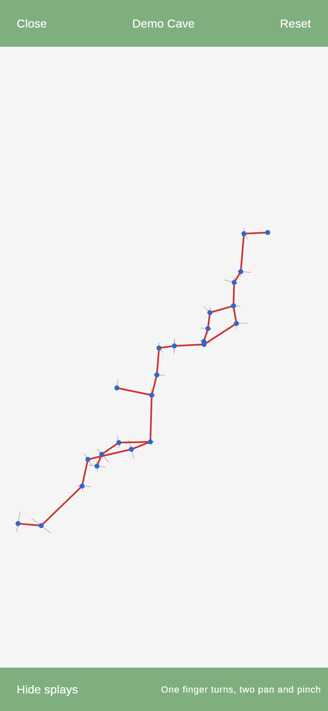
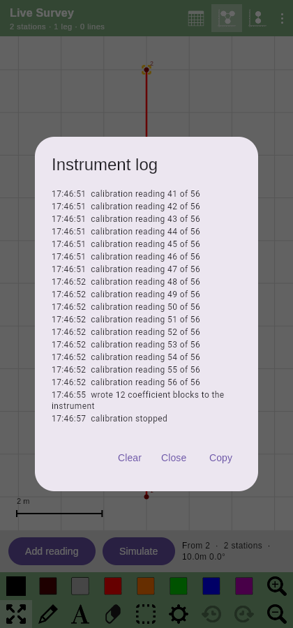

# SexyTopo on iOS — a Kotlin Multiplatform proof of concept

This directory is an **experiment**, not a product, and not a proposal to change the Android app
yet. It exists to answer one question with running code rather than argument:

> If SexyTopo's survey core were shared Kotlin instead of Android Java, would the same code
> actually drive an iOS app?

So far the answer is **yes for everything except the parts that need a Mac to check**. The survey
engine, the instrument protocols, the projection maths, the sketch model, the sketch *editor*, the
Survex and Therion exporters and the native file format are ported and covered by 793 shared tests,
each run on the JVM, on Kotlin/Wasm and on Kotlin/Native, and eight more that are JVM-only on
purpose: they check the hand-written ZIP writer against `java.util.zip`, which is an oracle that
exists on exactly one of the three targets. The UI
is written once in Compose Multiplatform and renders through Skia, which is what Compose uses on
iOS — and it drives the ported logic rather than reimplementing it, which is the part that actually
tests the claim.

**Try it now:** <https://paperclipmonkey.github.io/sexytopo/> - the whole app compiled to
WebAssembly, including in Safari on an iPhone. That is the browser build rather than the
native one, but the survey core, the sketch engine and the Compose UI in it are the same code
the iOS build compiles.

Nothing in the existing Android app has been touched. `kmp/` is a separate Gradle build alongside
it; everything except the Android host builds without an Android SDK at all, which is the clearest
demonstration that the core no longer depends on one.

---

## What is actually proven, and what is not

Being precise about this matters more than the demo looking good.

| Claim | Status | Evidence |
| --- | --- | --- |
| Survey model, projection maths and the extended-elevation unroll port to Kotlin | **Verified** | tests, on two targets |
| The survey engine builds stations from readings the way the app does | **Verified** | `SurveyUpdaterTest` (59 tests), triple-shot promotion and all three amalgamation algorithms |
| Instrument packets decode identically | **Verified** | byte-level tests for DistoX, DistoX-BLE, BRIC, SAP6, Cavway, FCL |
| The whole chain works end to end | **Verified** | `SurveyingEndToEndTest`: simulated instrument → packet decode → station promotion → JSON round-trip |
| Native JSON survey/sketch formats read and written compatibly | **Verified, for three of the four files** | round-trip tests against Android-shaped fixtures, including corrupt and old-format files. The data file and both sketches are read and written; `Name.metadata.json` is neither, so the cross-survey links it carries do not survive a trip through this port — see *What to expect that is missing* |
| Survex and Therion export byte-identically | **Verified** | golden tests asserting the full file, metadata block included |
| **PocketTopo's own binary `.top` imports** | **Verified** | the format's primitives against the Android app's own `PocketTopoFileTest`, the shot-ordering and repeat-averaging rules against its `PocketTopoImporterTest` fixtures byte for byte, and its real `CeiledUp.top` — 12 stations, 68 legs, 203 strokes — read identically on the JVM, Kotlin/Wasm and Kotlin/Native, and through the file chooser in a browser |
| A PocketTopo text export imports, drawing included | **Verified** | the Android app's own `FAKE_TEXT` fixture and its three assertions, on three targets, plus the four files that crash the Java |
| **Every export is reproducible** | **Verified** | the same survey **built twice** exports byte-identically in all twelve format-and-projection combinations. Built twice and not merely exported twice: one set of objects has one identity-hash order, so a hash-ordered exporter agrees with itself and the weaker test passes on everything. The stronger one failed on its first run and found finding 45 — the `.xvi` exporter had the very defect this port reports in the Android app's |
| **No export throws on a survey that has barely started** | **Verified** | every format on five degenerate shapes — nothing in it, one station and no legs, one splay that never became a station, a leg with nothing drawn, a drawing with one station — asserting each produces a non-empty file. It matters because the export screen builds its file inside a `remember` block, so a throw there is a throw *inside a composition*, which on the web is finding 11: no error, no blank page, the last frame stays up and the app looks frozen. All twelve pass today; this is a guard, and it is cheap only because `exportText` was lifted out of the composable, where nothing could ask it anything |
| **And this app's own format exports the whole survey** | **Verified** | `NATIVE` wrote `Name.data.json` and nothing else, so exporting handed somebody a centreline and kept the drawing — the importer's loss at the other end, and the worse half of it: a reader's failure loses somebody else's work, a writer's loses your own. One press of *Save files* now writes the data file and both sketches, which is exactly what the folder import reads back. `ExportNamingTest` names all three; `field.mjs` presses the button once and counts what comes out of the browser |
| **A survey folder imports, not only a loose file** | **Verified** | `action_file_import_directory`. A survey arrives as a zip far more often than as a file, and unzipping one leaves a *folder* named after the cave — which the import list, looking only at files, could not see. Root directories that pass `SurveyStorage.isSurveyDirectory` are offered and loaded through the same loader the library uses, so all four files come in. The app's own `surveys/` is left out, being the library already |
| **A survey brought in keeps its drawing** | **Verified** | a SexyTopo survey is four files and this importer takes one at a time, so it read the centreline and dropped both sketches in silence. It now looks for `Name.plan.json` and `Name.ext-elevation.json` beside the file that was picked — where they land when somebody AirDrops a survey or unzips one into the Files app. Three unit tests and a browser check, and the browser fixture had to be **given a drawing**, because the one it had could not express the loss |
| A Survex or Therion file from other software imports | **Verified** | round-trip tests through the ported exporters, plus a `.svx` written by hand — team, date, backsights, splays, station comments and leg comments — and `field.mjs` brings one into the browser build end to end |
| The `.th2` and `.xvi` a Therion user actually needs come out of the app | **Verified** | golden tests on the scrap file and the tracing image, and `field.mjs` picks the `.th2` chip on a 420-pixel screen, saves the file and checks it has an encoding line, a named plan scrap and the `##XTHERION##` block that points it at the `.xvi` |
| Therion can build what comes out, rather than five files and a config to write | **Verified** | golden test on the `.thconfig` and on the `input` lines; `field.mjs` saves the project file and the `.th` from a phone-sized screen and checks each names what the other saves under |
| Compass `.dat` exports byte-identically | **Verified** | a golden captured by *running* the Android app's own exporter, not by reading it — which caught a transcription slip on the first attempt |
| PocketTopo `.txt` exports the same survey data | **Verified** | its DATA section is golden against the Android app; its station sections deliberately diverge, because the Java's are not reproducible even against themselves |
| **The view can follow the survey as it grows** | **Verified** | the preference round-trips with every other one, and `field.mjs` turns *Follow the survey* on, promotes a station from three readings, and finds the active station's amber brackets within forty pixels of the middle of the sketch — an assertion about where the view ended up, not merely that the screen changed, which it would have anyway |
| **A station can be found by name, and the last leg taken back** | **Verified** | `FindStationTest` — names and comments both searched, a station the survey no longer holds has no position rather than a crash, and the last leg is the last one *taken* rather than the last in any walk of the tree — and `field.mjs` finds a station on a phone screen and checks the view moved, then adds a splay, takes it back from the drawing menu and checks only it went |
| **The plan says which end of the survey you are working at** | **Verified** | `CentrelineDisplayTest` and `DashedLineTest` — the mark follows the last reading *taken*, splay included, as the Java's own paint order does; a leg is matched by identity, because two shots down a straight passage read the same; a pitch is out of the plan's plane and in the extended elevation's; and a leg too short to dash draws nothing rather than one stub that would read as solid — plus `field.mjs` finds the app's magenta on the drawn plan, turns the mark off and checks every magenta pixel went, fades the rest of the cave and checks the drawing got lighter, then brings it back |
| **It fits a small phone** | **Mostly** | `field.mjs` ends by resizing to 375x667 — an iPhone SE — and checking the toolbar is still where it computes it to be and the canvas still takes a stroke. It then opens the one dialog certain to overflow that screen and checks the mechanism the other dialogs rely on: the card is sized to the window rather than clipped, a wheel scrolls its text, and the button below the text is on screen and closes it |
| **And at the size a keyboard leaves, which is the case itself** | **Verified, for the half that is layout** | then 667x375, the same phone turned over — the sketch still takes a stroke, and a dialog with a text field in it is measured to fit that height, typed into and confirmed from its own button. Then 375x375, which is what a keyboard actually leaves an iPhone SE: narrow *and* short at once, which sideways is not. A dialog 667 pixels wide has room the same dialog has not got in portrait, so the landscape pass was a stand-in and this is the shape. What neither tests is whether iOS reports the keyboard's height as a window inset at all; that is a device question, and it is the only part still open |
| **The table and the drawing are joined up, both ways** | **Verified** | `StationMenuTest` for each menu offering the views the other is not showing, `SurveyTableTest` for which row a station is found at and for which station a cell is about when the shot was booked backwards — and `field.mjs` taps both ends of one leg on a phone screen, checks they offer different menus, follows *show it on the plan* to a station that lands within forty pixels of the middle, then holds a station on the drawing and follows *show it in the table* back |
| **A reading can be corrected, annotated, reversed or unmade** | **Verified** | `LegActionsTest` and `SurveyUpdaterTest` — which actions each row offers and what they do: a leg with splays hanging off its far end is not offered the downgrade `SurveyUpdater` would throw over, the first reading of a survey is not offered a promotion there is no leg above for, a leg the survey no longer holds answers "no" instead of throwing, and a comment marks the survey unsaved, which the Android app's own dialogs do not — and `field.mjs` counts what the menu offers a splay and a leg on a phone screen, writes a note against a leg, checks the table gains the app's dagger, and turns the shot end for end and back again |
| **Any station can be reached from the sketch, not just the active one** | **Verified** | `StationMenuTest` for which actions a station offers — the origin has no incoming leg and no delete, cross-sections belong to the plan, a backsight is normalised the way the table normalises it — and `field.mjs` finds a station that is *not* the active one on the drawn plan, holds it, and checks that the menu moved the active station there without marking the paper |
| **A survey can be drawn up at a desk, not only in a cave** | **Verified** | reported from a MacBook: a trackpad pinch zoomed the browser page rather than the survey, and there was no Ctrl+Z. Plain scroll now pans, ctrl or cmd and scroll zooms about the pointer, Ctrl+Z undoes and Ctrl+Shift+Z or Ctrl+Y redoes — the conventions every desktop drawing tool uses. `desktop.mjs` drives a real wheel at 1280x800 and measures the cave: it grows on a pinch, comes back to the same scale on the way out, slides exactly a hundred pixels on a plain scroll without changing size, and a stroke drawn with the mouse comes back and goes again on the keys. The page-zoom half is asked of the browser rather than of the screen, because the obvious form of that check cannot fail — finding 82 |
| **The drawing can be moved without putting the pencil down** | **Verified** | `MultiTouchTest` for the pinch arithmetic and the corner geometry, and `field.mjs` finds the corner squares on the drawn page, drags one, and checks the plan moved, that no stroke was left behind, and that the next stroke still draws — with no toolbar round trip |
| A station being made can be felt rather than looked at | **Verified** | the callback fires once per station and not once per reading, the preference round-trips, and `field.mjs` turns it off through the settings screen and checks it stayed off |
| **The app can be told to stay dark, and remembers it** | **Verified** | `pref_theme` is a three-value list in the Android app — auto, light, dark — and this port had a session-only checkbox that started light on every run. In a cave that is the difference between a survey and fifteen minutes of no night vision. `AppPreferencesTest` covers the three values, the resolution against what the platform reports, and the round trip through the file; `field.mjs` sets Chromium to `prefers-color-scheme: dark` and watches *Automatic* follow it, then chooses **Dark** with the browser back on light, **reloads the page**, and checks the app comes back dark |
| **The mode the instrument is being held in is remembered** | **Verified** | the Android app reads `inputMode` out of `generalPrefs` on its way in; this port held it in a `var` that started at foresights every run, and the field bar only says anything when the mode is *not* foresights — so the state it came back in is the one that looks normal, and every leg after it is turned end for end with nothing in the numbers to show it. Now written down, along with the tool, the brush and the symbol, which `SketchPreferences` also keeps. `AppPreferencesTest` closes and reopens a `DemoState` over one store — the reading half as well as the writing half — and checks that a tool armed for a single touch is *not* restored; `field.mjs` taps the chips on a phone screen and watches the file follow, both ways round |
| **A lost instrument can be chased, and given up on** | **Verified** | a cave breaks Bluetooth constantly — the surveyor walks round a corner with the phone, the instrument sleeps, a cold battery sags — and every one of those cost a trip to the connection screen with cold hands. `ReconnectionPolicy` is ported from the Java with its scheduling taken out, so it can be driven by a clock a test controls: `ReconnectionPolicyTest` has the decisions, including that the window is measured from the *first* failure of a run so an instrument left at the last station stops costing battery on the way out. `ReconnectionTest` drives a fake radio through a drop, a recovery, an instrument that never comes back, and a second bad patch four hours later. `field.mjs` scrolls the settings dialog to the end, turns it on and reads the file |
| **The instrument's clock runs where the surveyor is** | **Verified** | it used to tick only while the connection or calibration dialog was open, so an attempt abandoned by closing the dialog never timed out and left the radio scanning, and a reconnection could never have happened at all — a surveyor waiting for an instrument to come back is drawing. One loop in `App`, keyed on the attached instrument, so it costs nothing on the demo cave. Finding 51 |
| **The drawing can be made big enough to read by head torch** | **Verified** | `preferences_sketching.xml`'s eight numbers — line widths, station size, the two font sizes, the symbol and text starting sizes — plus `pref_delete_path_fragments`, which decides whether the eraser takes the bit of a wall under your finger or the whole stroke. All nine were hard-coded here, and the eraser rule was worse than that: `SketchEditor.eraseAt` has taken the flag since the sketch was ported and nothing ever passed it. `SketchStyleTest` covers the file and the bounds; `DrawingSizeTest` renders the same survey at two leg widths through headless Skia and counts the red, because a number in a file is not a thicker line; `field.mjs` types 8 into the box on a phone screen and watches the plan go from 605 red pixels to 1852. Two upstream preferences that do nothing came out of reading this — finding 52 |
| **A bearing can be typed the way a compass reads it** | **Verified** | `pref_deg_mins_secs` and `pref_inc_deg_mins_secs`. A DistoX reports a decimal and nobody needs this; a sighting compass is graduated in minutes and reads 123° 30′, and converting that in your head at every station is how a survey acquires arithmetic errors nobody can find afterwards — which matters here because this port already went out of its way to support a compass and tape and then asked for a decimal nobody's instrument shows. `DegreesMinutesSecondsTest` has the conversion both ways, the rounding carry, and the case upstream gets wrong; `field.mjs` turns both switches on, types 123 and 30 into the three boxes on a phone screen, flips the inclination's sign with the +/- button, and checks the survey stored 123.5 and **-5.5** — the direction as well as the size |
| **A packet the app cannot read costs a shot, not the trip** | **Verified** | every byte from a radio reaches one method, on the main thread, and none of it is under anybody's control — a truncated notification, a firmware revision with a field more, a device whose advertised name matched a profile it does not really speak. On iOS a Kotlin exception raised inside a CoreBluetooth callback ends the process, and an app that dies takes the connection, the screen and the surveyor's confidence with it. `InstrumentSessionTest` attaches a decoder that throws and checks the link stays up, nothing becomes a reading, and the log says a packet was dropped — run against the unguarded version, where it fails. Finding 56 |
| **A scan that finds nothing says what it did find** | **Verified** | *"no BRIC5 found — is it switched on and in range?"* is the right question only when the answer might be no. An instrument on the table, switched on, advertising under a name the app does not match — a renamed BRIC, a firmware that drops the underscore, the wrong model picked on the connection screen — gives exactly the same silence, and sends the surveyor to check batteries that are fine. `GattSession` now remembers the named devices it turned down and the failure lists them, naming any that *are* instruments this app knows: **"no BRIC5 found - saw BRIC4_0123 (a BRIC4) instead"**. Four tests in `GattSessionTest`, including that nameless peripherals are not listed and that a car park does not fill the screen. Finding 57 |
| **A fabricated reading cannot reach a real survey** | **Verified** | *Simulate* sits ten millimetres from *Add reading* on the field bar, and `SurveySession.takeReading` **detaches whatever instrument is attached** and emits a made-up shot into the live survey. Pressed with a BRIC on the tripod that is two harms at once: a leg indistinguishable from a real one for ever afterwards, and a radio silently dropped while the surveyor goes on shooting. The button is now absent whenever a real instrument is attached, and `FieldControlsTest` asserts both the rule and the harm it prevents — that `takeReading` really does drop the profile. `pref_manual_controls` ported alongside it, with a browser check that the button leaves the bar. Finding 58 |
| The instrument log is kept, persisted and readable on the phone | **Verified** | `ActivityLogTest` for the bounded queues and the file format; `instrument.mjs` connects a fake DistoX-BLE, takes a calibration, and then reads the log back off the clipboard — count, timestamps and all |
| The desktop build keeps its surveys too | **Verified** | a survey written by one `SurveyLibrary` and read by a second over the same directory, in SexyTopo's own file layout, plus the three platform conventions for where that directory goes |
| **A real-sized cave works, not just a demo one** | **Verified** | `BigSurveyTest` builds a four-thousand-station passage — past where every tree walk in this port used to overflow the stack — and projects it to a plan and an extended elevation, builds its wireframe, counts its statistics, exports it to Survex and Therion and reads it back, on all three targets, along with SVG, `.xvi`, `.th2`, Compass and PocketTopo — and rubs out and undoes on a drawing of eight thousand strokes |
| **A real-sized cave draws, and draws linearly** | **Verified** | `CanvasSpeedTest` renders the plan of a four-thousand-station survey through the same headless Skia the demo PNGs use, and checks that eight times the cave costs about eight times the frame rather than sixty-four — the failure mode finding 18 was, in the drawing rather than in the export. The absolute times are a CPU rasteriser's and not a phone's, and the test says so |
| **The cave is the same size on a phone as on a desktop** | **Verified** | `DrawingDensityTest` renders the same plan twice through headless Skia — once at 1x, once at three times the size *and* three times the density, which is what a phone shows — and compares what fraction of each picture is centreline. Dp sizes give one picture at two resolutions and the same fraction; raw pixels give a cave drawn a third as thick. Measured both ways: **1.09 as it stands, 0.44 with finding 28 put back**. It counts only the red centreline, because the text on that canvas is in `sp` and scaled correctly even when the bug was live — counting all the ink made the first version of this test pass with the bug in |
| **The manual is in the app** | **Verified** | the guide is bundled byte-for-byte from `app/src/main/assets/guide/index.html` and read into Compose by `parseManual`, with no web view on any platform. `ManualContentTest` asserts the bundled copy is identical to the Android app's, parses it, and counts the headings, paragraphs and list items **against the file's own tags** — the check that caught a nested list silently costing eleven items — plus every link pointing at a section that exists and every character being one the bundled font can draw. `field.mjs` opens it from Help, reads it, scrolls it, taps a contents row and closes it |
| **All four of the app's input modes are offered** | **Verified** | `SurveyUpdaterTest` has the engine half. `field.mjs` has the half only a running app can show: it switches to *Splays Only* and enters three readings agreeing within tolerance — the exact recipe for a station in every other mode — then checks that no station appeared and all three are still splays. Run first against a chip deliberately wired to `FORWARD`, where it fails |
| **Every character the app types is one the bundled font can draw** | **Verified** | `FontCoverageTest` asks Skia — the same `FontMgr` that does the drawing — for the glyph of every character the UI types, in both bundled weights, and fails on glyph 0. It asserts the other direction too: the two marks the app draws by hand, "✓" and "⋮", must stay absent, so a drawn mark that could be typed shows up as a failing test. The app bundles its own font because Skia ships none on the web, which is what makes one check answer for every platform |
| Surveys save and load through a platform-free storage layer | **Verified** | a full round trip - naming, directories, autosave, listing - over an in-memory `FileStore`, on all three targets. The Android app's equivalent test is `@Ignore`d because `DocumentFile` cannot be mocked |
| The sketch editor — tools, viewport, hit-testing, undo — is platform-free | **Verified** | `shared/sketch/`, driven by the demo and tested on two targets |
| The BLE connection logic is platform-free | **Verified** | `GattLinkTest` and `GattSessionTest` — the profile matrix *and* the connection lifecycle; only callback plumbing is left in `iosMain` |
| The DistoX calibration solver reproduces the Java exactly | **Verified** | the Android app's own two 56-shot datasets, asserting the *iteration counts* (43, 75, 53) as well as the errors — reproduced on the JVM, Kotlin/Wasm **and Kotlin/Native** |
| The 3D view's camera and projection port off OpenGL | **Verified** | `Matrix4Test`, `Camera3DTest` and `ThreeDViewTest` — the Android `Matrix` routines the renderer uses, the camera on top of them including that the whole cave is on screen when the view opens and fills it on three shapes of screen, and the trackpad path (finding 98) that a pinch zooms it in and a scroll pans it, the right way round each; `field.mjs` opens it in the browser, counts what got drawn and turns it with a finger, and `desktop.mjs` pinches and scrolls it with a wheel |
| Shared Compose UI draws, and can be drawn on | **Verified** | `./gradlew :demo:renderDemoPng`; drawing/erasing/undo covered by tests |
| **The shared core has no JVM-only dependencies** | **Verified** | every shared test passes on **Kotlin/Wasm** as well as the JVM |
| **The same code compiles for iOS** | **Verified** | `:shared:compileKotlinIosSimulatorArm64` in CI on a macOS runner — `iosMain`, `CoreBluetoothTransport` included |
| **The ported test suite passes on Kotlin/Native** | **Verified** | `:shared:iosSimulatorArm64Test` — the same tests as the JVM and Wasm jobs, on the actual target rather than a proxy for it |
| **The shared Compose UI links as an iOS framework** | **Verified** | `:demo:linkDebugFrameworkIosSimulatorArm64` — Compose's own Native klibs, the bundled font and the toolbar PNGs, resolved into the static framework `iosApp/` links against |
| **The same code compiles for a real iPhone** | **Verified** | `:shared:compileKotlinIosArm64` and `:demo:linkDebugFrameworkIosArm64` — a separate Kotlin/Native target from the simulator, with its own platform libraries, so a green simulator build does not imply it |
| **The manual is packaged, not just written** | **Verified** | `Res.readBytes("files/manual.html")` — the call the running app makes — in a JVM test **and** in the iOS simulator test, because packaging is per-target and neither answers for the other. This is the app's first `composeResources/files/` resource; the fonts prove the mechanism on iOS but `files/` is a different directory from `font/`, and a packaging mistake compiles, links, launches and draws a cave perfectly before failing on the one screen that needs it. Both tests parse what comes back and count the thirteen sections, so a truncated or re-encoded resource fails too |
| **The iOS half of the app runs, not just compiles** | **Verified** | `:demo:iosSimulatorArm64Test` on a macOS runner: the Documents file store round-trips text, non-ASCII, nested directories and a whole survey; a file's exact bytes come back through the hand-written `NSData` copy the PocketTopo reader needs; the log's timestamps come out in the Android app's own format; the clipboard and the new-station haptic do not bring the app down |
| **The iOS *app* builds, not only the framework it links** | **Verified** | `xcodegen` then `xcodebuild` for the simulator on the macOS runner, so `project.yml`, `Info.plist`, `Assets.xcassets` and the two Swift files are *compiled* rather than merely written — all four were authored on Linux and none had been near a compiler. It is also the only thing that runs `actool`, which is the only real answer to whether an app icon drawn here with PIL is one iOS accepts: an alpha channel or a wrong size is rejected outright, and nothing on Linux says so |
| **Compose actually draws the survey on iOS, and is still alive afterwards** | **Verified** | CI boots a simulator, installs the app, launches it and photographs it — then **looks again twenty seconds later**, and scans the host's crash reports for this bundle. The second look and the scan are new, and they exist because a phone found a crash this job could not: an app that launches, draws, passes the photograph and *then* dies is what an uncaught throw dispatched to a background queue looks like, and a check that looks once cannot see anything that happens afterwards. See finding 54. The picture has to contain the app's own panel green — an app that crashed shows Springboard, one with no UI shows white — *and* enough distinct colours to rule out the launch screen, which is that same green on purpose. Measured on the runner: **2340 green pixels and 609 distinct colours** against thresholds of 500 and 40. The screenshot is uploaded as the `ios-simulator-screenshot` artifact on every run |
| The iOS app runs on a device | **Not verified** | needs Xcode, an Apple developer account and a physical phone. The app *bundle* is now built by CI, so what is left is signing and installing it |
| **The app can ask to connect to an instrument** | **Verified** | `instrument.mjs` in CI stands a stub where `navigator.bluetooth` would be and makes it behave like a DistoX-BLE: the profile's name prefix and UUIDs reach the browser API, the notification arrives as a frame, the decoder reads it, the acknowledgement goes back, and three readings make a station in a saved survey |
| **A calibration can be taken, solved and written back** | **Verified** | `instrument.mjs` puts the fake DistoX-BLE into calibration mode, feeds it the Android app's own 56-shot dataset over Web Bluetooth, and checks the coefficients reach the device as one framed BLE packet |
| `CoreBluetoothTransport` works | **Not verified** | it compiles, it now has a caller, and it has still never talked to a radio; the simulator has no Bluetooth stack, so this needs a real instrument |
| Web Bluetooth works against real hardware | **Not verified** | the chain is driven end to end against a fake instrument in CI; no real one has been near it |
| The whole app runs in a browser | **Verified** | a headless-Chromium smoke test in CI loads the page, draws a stroke and undoes it |
| The same UI builds and packages for **Android** | **Verified** | `:androidApp:assembleDebug` in CI; the APK is a build artifact |

**The honest summary:** the port compiles for iOS, its tests pass on Kotlin/Native, and the shared
Compose UI links as an iOS framework — all three checked on every push by a macOS runner, which
GitHub provides free on public repositories. The Mac that gated this project turned out to be a CI
job rather than a purchase.

What remains unverified is now much narrower, and all of it needs hardware rather than a toolchain:
the app running on a physical device, sketching latency under an Apple Pencil, and either transport
against a real instrument. The iOS *simulator* has no Bluetooth stack, so no amount of CI closes
that last one — but a stub standing where `navigator.bluetooth` goes does close everything either
side of the radio, from the profile's UUIDs to a station in a saved survey.

**"Expect to fix something on the first real build" was right**, and worth recording precisely,
because it is the calibration for everything else here. The first compile of `iosMain` found:

- two delegate properties whose anonymous types Kotlin refuses to infer;
- two pairs of Objective-C selectors that collapse onto one Kotlin signature and need
  `@ObjCSignatureOverride`;
- a missing `BetaInteropApi` opt-in, whose level is ERROR rather than warning.

It took three compile-fix cycles, because the conflicting-overload diagnostic *quotes the signature
the declaration collides with* rather than the one it is reporting — so the message names one
function while the line number points at the other, and reading the message gets you the wrong half
of the pair twice running.

---

## One UI, four platforms

`App()` is one composable, and it is a deliberate copy of SexyTopo's own sketch screen — the layout
of `activity_graph.xml`, the green panels from `colors.xml`, and the app's own toolbar artwork
carried across as Compose resources.

| At an iPhone 15 Pro's size | At a Pixel 8's | The same, dark |
| --- | --- | --- |
|  |  |  |

These are the shared composable rendered headlessly at each phone's dimensions, not photographs of
either phone — see the note under the gallery below. A genuine iOS screenshot, taken by CI from an
app running in a simulator, is attached to every run as `ios-simulator-screenshot`.

That copying is the point. A demo restyled to somebody's taste would prove that Compose can draw a
UI, which nobody doubts. A demo a SexyTopo user recognises on an iPhone — and can already use,
because the buttons are where their thumb expects — is an argument. So the centreline is red and
the splays are salmon, because that is what SexyTopo draws, not because it is what anybody would
choose from scratch.


There is one layout rather than a phone one and a tablet one, because the app has one: nine
weighted columns spread out on a tablet and square up on a phone by themselves. Two buttons are
drawn but greyed — the symbol and select tools, which the shared model supports and this demo has
no palette or station menu to drive. Showing them disabled keeps the toolbar honest in both
directions: it is the app's toolbar, and what the demo cannot do is visible rather than quietly
missing.

## What the demo does

- **Two surveys.** A generated demo cave, and a **live survey** you build yourself.
- **Live surveying.** "Take reading" makes the simulated instrument emit a real DistoX wire-format
  packet; the ported protocol decodes it; the ported engine promotes three agreeing readings into a
  station. That is the core interaction of the whole app, and only the radio is pretend.
- **Sketching**, driven entirely by the shared `SketchEditor`, `SketchViewport` and `SketchTool`.
  Draw, erase and move tools, the Android toolbar's eight brush colours, undo/redo. Strokes are
  captured in survey metres (never pixels) and simplified on release. Erasing splits a stroke
  rather than deleting it — rubbing out the middle of a passage wall leaves both ends — and it
  hit-tests through the same visibility rule the renderer uses, so you cannot rub out what is too
  small to see.
- **Cross-sections**, drawn on the plan where the surveyor parked them.
- **Moving the drawing without changing tool.** A touch that starts in one of the four faint corner
  squares pans the sketch; two fingers zoom it, whatever tool is selected. Both are the Android
  app's, and the corner squares are its own — except that it tests four and tints three; see
  findings 22 and 23.
- **The cave in 3D**, turned with a finger. The Android app draws this with OpenGL ES; here the
  projection is arithmetic and the drawing is the same 2D canvas as everything else, so it runs on
  iOS, Android, the desktop and the web from one file.
- **The active station**, in the app's amber corner brackets, and the select tool that moves them.
- **Export** to Survex `.svx`, a Therion project — `.thconfig`, `.th`, and a `.th2` scrap and
  `.xvi` tracing image for each drawing — Compass `.dat`, PocketTopo `.txt`, SVG, and the app's own
  JSON, the same bytes the Android app would read back.
- **Import** of a Survex `.svx`, Therion `.th`, PocketTopo `.txt` or PocketTopo's own binary
  `.top`, as well as the app's own files: the club's existing survey of the cave, opened here to be
  extended. Both PocketTopo readers bring the *drawing* in as well as the centreline.
- **Handing a survey over as one file.** *Share survey* on the export screen writes a zip of the
  four files a survey directory holds, which is what the Android app's share sheet sends and what
  the importer at the other end already knows how to read.
- **Writing a leg down rather than shooting it.** *Tools → Add a leg* takes a reading out of a
  paper book and makes the station straight away, with the far end named — for joining onto a
  station somebody else surveyed. Distinct from *Add reading* on the field bar, which stands in for
  the instrument and is held to the instrument's rules; both are in the Android app and finding 76
  is about having had only one of them.
- **An instrument log you can read underground**, kept as it happens and copied off the phone with
  one tap — because a DistoX that will not pair does it in a cave, with no signal and no console.
- **A buzz when a station is made**, so the surveyor can look at the rock instead of the phone.
  Under *Surveying*, and on by default — which is what the Android app's own settings screen shows,
  though not what it does; see finding 21.
- **Plan and extended elevation**, the latter exercising the cave-unrolling maths.
- **The survey table**, with backwards shots normalised back to the reading as taken, a dagger
  against anything carrying a comment, and every row a way into the app's leg menu.
- Light and dark, and a layout that collapses to one scrollable toolbar on a phone.

| Extended elevation | Live survey from the instrument |
| --- | --- |
|  |  |

| Survey table | Export |
| --- | --- |
|  |  |

The 3D view, and the log that answers "why will this thing not connect" when there is no console
within a hundred metres of vertical rock:

| The cave in 3D, on a phone | What the instrument did |
| --- | --- |
|  |  |

Every image above except the log is rendered headlessly by `./gradlew :demo:renderDemoPng` — the
same composable the iPhone hosts, through the same Skia renderer, with no display attached. The log
is a real screenshot from the browser test, taken after it has driven a whole calibration through a
fake DistoX-BLE.

None of them is a photograph of an iPhone, and the ones labelled with a phone's name are that
phone's *dimensions* rather than that phone. There is a real one: CI installs the app on a booted
simulator, launches it and photographs it on every push, and attaches the result as
`ios-simulator-screenshot`. It is not checked in here because a screenshot committed by a build is
a file that goes stale the moment anything changes and that nobody re-checks — but it is one click
away on any green run, and a check on it (the app's own green, and enough distinct colours to prove
it is past the launch screen) is what makes the run green in the first place.

---

## Building

Everything below works on Linux/macOS/Windows except where noted.

```bash
cd kmp

./gradlew :shared:jvmTest          # the ported test suite
./gradlew :shared:wasmJsNodeTest   # the same tests on a NON-JVM target
./gradlew :demo:jvmTest            # the UI's use of the shared editor
./gradlew :demo:compileKotlinWasmJs      # the UI compiled for a non-JVM target
./gradlew :demo:renderDemoPng            # render the shared UI to PNGs, no display needed
./gradlew :demo:run                      # the desktop app (needs a display; keeps its surveys)
./gradlew :demo:wasmJsBrowserDistribution  # the browser build — see "The browser target" below
./gradlew :androidApp:assembleDebug      # the Android app (needs an Android SDK)
```

### Running on Android

Needs an Android SDK, which is the only thing this build wants that the others do not:

```bash
export ANDROID_HOME=/path/to/android-sdk
cd kmp && ./gradlew :androidApp:installDebug   # or assembleDebug for just the APK
```

The Android-specific surface is one activity that calls `setContent { App() }`, a manifest and a
theme. It installs with its own application id, so it sits on a phone next to the real SexyTopo
rather than replacing it — which is how you would want to compare them.

### Building for iOS (no Mac needed)

Checking that this *builds* for iOS needs nothing but a push. The `ios` job in
`.github/workflows/kmp.yaml` runs on a `macos-latest` runner — free on public repositories — and
does the four things that used to be unanswerable here:

```bash
./gradlew :shared:compileKotlinIosSimulatorArm64        # iosMain, CoreBluetoothTransport included
./gradlew :shared:iosSimulatorArm64Test                 # the ported suite, on Kotlin/Native
./gradlew :demo:linkDebugFrameworkIosSimulatorArm64     # the framework iosApp/ links against
./gradlew :shared:compileKotlinIosArm64 \
          :demo:linkDebugFrameworkIosArm64              # the phone, which is not the simulator
```

Run those locally if you have a Mac; otherwise read them off the last CI run. Two of them are worth
a second look. `iosSimulatorArm64Test` is the same suite the JVM and Wasm jobs run, executing on the
actual target rather than on a target chosen because it also lacks `java.*`. And the last pair
exists because `iosArm64` and `iosSimulatorArm64` are separate Kotlin/Native targets with separate
platform libraries — device UIKit and CoreBluetooth are not the simulator's — so a green simulator
build is not evidence that the thing somebody carries underground compiles.

### Running on iOS (needs macOS + Xcode)

**Before any of this, try `./gradlew :demo:run`.** The desktop build is the same `App()` composable
the iPhone hosts, it needs no SDK and no simulator, and it now keeps its surveys between runs — so
it is the cheapest way to see whether the thing is worth putting on a phone at all.

Putting it on a simulator or a phone is where a Mac becomes unavoidable. The Xcode project is
**generated rather than committed**, because it was authored on Linux where a hand-written
`.pbxproj` cannot be opened or validated:

```bash
brew install xcodegen
cd kmp/iosApp && xcodegen && open iosApp.xcodeproj
```

The build runs `./gradlew :demo:embedAndSignAppleFrameworkForXcode` as a pre-build phase, which
compiles the Kotlin/Native framework and embeds it. `kmp/iosApp/project.yml` and the README section
below it describe a fully manual alternative if you would rather install nothing.

The iOS-specific surface is small and every file in it is one screen long:
`demo/src/iosMain/` holds thirteen — `MainViewController.kt` is one function, and the rest are the
`actual` halves of things a phone has and a browser does not: the Documents file store, the
clipboard, the file picker, keeping the screen awake, the date and the timestamp, the haptic, the
two exports (a text file and a zip), the storage-durability answer and the instrument transports. `iosApp/` holds two Swift
files. `shared/src/iosMain/` holds one more, `CoreBluetoothTransport.kt`, for when you want real
instruments. Everything else — the whole survey engine, every importer and exporter, the sketch
editor, the calibration solver, the 3D camera and the entire user interface — is the same code the
Android and browser builds run.

#### Onto your own phone, step by step

Everything above is checked by CI. This part is not, because no CI runner has a phone plugged into
it — so it is written out in full, including the three places it is known to go wrong.

1. **Install the tools.** Xcode from the App Store — the whole thing, not just the Command Line
   Tools. Launch it once and let it install its additional components. Then:
   ```bash
   brew install xcodegen temurin@21
   # Kotlin/Native needs the full Xcode, not the Command Line Tools. If you have ever installed
   # the CLT on their own, xcode-select is probably still pointing at them, and the build fails
   # with "xcrun: error: unable to find utility" or a linker that cannot find the iOS SDK.
   sudo xcode-select -s /Applications/Xcode.app/Contents/Developer
   sudo xcodebuild -license accept
   ```
2. **Generate and open the project.**
   ```bash
   git clone https://github.com/paperclipmonkey/sexytopo.git
   cd sexytopo/kmp/iosApp && xcodegen && open iosApp.xcodeproj
   ```
   XcodeGen reads `project.yml` and writes `iosApp.xcodeproj` beside it. Open the **project**,
   not a workspace; there is no workspace.

   The build needs the network the first time: Gradle fetches Kotlin/Native's compiler and the
   Compose and Skia artifacts, which is a few hundred megabytes.
3. **Set a signing team.** Select the `iosApp` target → *Signing & Capabilities* → tick *Automatically
   manage signing* and choose your team. A free Apple ID works: add it under *Xcode → Settings →
   Accounts*, and it appears as *(Personal Team)*.
4. **Change the bundle identifier** to something nobody else has used — `org.hwyl.sexytopo.kmpdemo`
   is in this repository, so somebody may already have registered it. `uk.co.yourname.sexytopo` will
   do. Xcode will tell you, in red, if the one you picked is taken.
5. **Turn on Developer Mode on the phone.** iOS 16 and later hide it until you ask: *Settings →
   Privacy & Security → Developer Mode → on*, then restart the phone and confirm after it comes
   back. The toggle only appears once the phone has been plugged into a Mac running Xcode, so if it
   is not there, do step 6 first and come back. Without this the phone accepts the app and refuses
   to launch it, with a message about the developer being untrusted that looks like step 7's
   problem but is not.
6. **Plug the phone in** with a USB cable and unlock it. The first time, the phone asks whether to
   *Trust This Computer* — say yes. Pick it from the device menu at the top of the Xcode window
   (next to the scheme), and press ⌘R.

   The first build compiles Kotlin/Native and links Skia. Expect **five to fifteen minutes** on a
   modern Mac, with Xcode's progress bar apparently stuck on "Compile Kotlin Framework" for most of
   it — that is Gradle working, and the Xcode log pane (⌘9, then the build) shows what it is doing.
   Later builds are seconds unless Kotlin changes.

   The iPhone needs **iOS 15 or later**, which is anything from an iPhone 6s onwards.
7. **Trust the developer on the phone.** *Settings → General → VPN & Device Management → your Apple
   ID → Trust*. Until you do, the app installs and refuses to launch.

**If you would rather not install XcodeGen**, the same project can be made by hand. Everything below
is what `project.yml` says, typed into Xcode's own interface instead — which is also the honest
reason the spec is committed rather than the `.xcodeproj`: this list is short enough to check by
eye, a `.pbxproj` written on a machine with no Xcode is not.

1. *File → New → Project → iOS → App*. Interface **SwiftUI**, Language **Swift**. Save it
   **outside** the repository: a new project saved on top of `kmp/iosApp` collides with the files
   already there.
2. Delete the `ContentView.swift` and `…App.swift` that Xcode generated. Then *File → Add Files*,
   **untick** *Copy items if needed*, and add all four of `kmp/iosApp/iosApp/iOSApp.swift`,
   `ContentView.swift`, `Info.plist` and `Assets.xcassets`.
3. In the target's *Build Settings*, set: **Info.plist File** to the one you just added and
   **Generate Info.plist File** to *No*; **Primary App Icon Set Name** to `AppIcon`; **User Script
   Sandboxing** to *No*; **Framework Search Paths** to the absolute path of
   `kmp/demo/build/xcode-frameworks/$(CONFIGURATION)/$(SDK_NAME)`; **Other Linker Flags** to
   `-framework SexyTopoDemo`; and the deployment target to **iOS 15**.
4. In *Build Phases*, add a **Run Script** phase, drag it **above** *Compile Sources*, untick *Based
   on dependency analysis*, and give it:
   ```bash
   cd /absolute/path/to/sexytopo/kmp
   if [ -z "${JAVA_HOME:-}" ] && [ -x /usr/libexec/java_home ]; then
     JAVA_HOME="$(/usr/libexec/java_home -v 21 2>/dev/null || /usr/libexec/java_home 2>/dev/null)"
     export JAVA_HOME
   fi
   ./gradlew :demo:embedAndSignAppleFrameworkForXcode
   ```

Then carry on from step 3 above. This path has not been run here either — there is no Xcode on the
machine this was written on — but every value in it is copied from the spec XcodeGen would have
used, and the whole point of listing them is that you can compare the two.

Four things go wrong, in roughly this order of likelihood:

- **The app builds, runs, and then dies a moment later — often on the first thing you tap, which
  makes it look as though a button is broken.** Compose Multiplatform's own
  `androidx.compose.ui.uikit.PlistSanityCheck` calls `error()` unless `Info.plist` has
  `CADisableMinimumFrameDurationOnPhone` set to `<true/>`. The committed plist has it; a
  hand-built project with *Generate Info.plist File* left on will not, and the key is not one
  Apple's templates add. It is checked on a low-priority background queue, so the throw lands
  whenever that queue next gets CPU rather than at launch — which is why it reads as a crash in
  whatever you happened to be doing. See finding 54.
- **"Unable to locate a Java Runtime"** in the build log. Xcode runs script phases with a stripped
  environment and no login shell, so a JDK installed by Homebrew or SDKMAN is not on `PATH`. The
  pre-build script already asks `/usr/libexec/java_home` for one; if you installed a JDK somewhere
  that does not answer to it, set `JAVA_HOME` explicitly in that script phase.
- **"Sandbox: ... deny file-write"**. `ENABLE_USER_SCRIPT_SANDBOXING` is set to `NO` in
  `project.yml`, which is what allows Gradle to run at all. If you built the project by hand rather
  than with XcodeGen, set it yourself in *Build Settings*.
- **The app expires after seven days.** That is a free Apple ID, not a bug. Re-run ⌘R to reinstall,
  or use a paid developer account, which lasts a year. Worth knowing before a weekend underground:
  build it the day before, not a week before.
- **`xcrun: error: unable to find utility`, or a linker that cannot find the iOS SDK.** `xcode-select`
  is pointing at the Command Line Tools rather than at Xcode; see step 1.

One cosmetic thing, and one honest caveat about it:

- **The icon and the launch screen compile, and have still never been *looked at*.**
  `iosApp/iosApp/Assets.xcassets` holds a 1024×1024 icon — a cave centreline drawn on a pale panel, in the
  app's own colours — and a colour called `LaunchBackground` that `UILaunchScreen` names, so the
  first moment shows the panel green rather than white. Both were written on Linux, where there is
  no Xcode to compile an asset catalogue.

  CI now builds the whole Xcode project on a macOS runner, so `actool` has compiled the catalogue
  and accepted it: the icon is not rejected for an alpha channel or a wrong size, and the colour
  set parses. `IosAssetsTest` checks the same rules here in a second, so a later edit that breaks
  one fails on any machine rather than six minutes into somebody else's build.

  What nobody has done is *look* at either. A build that succeeds says the icon is well-formed, not
  that it is any good at 60 pixels on a home screen. If you dislike it, delete
  `iosApp/iosApp/Assets.xcassets` and rebuild: nothing else refers to it.

#### Before you demo it: what has and has not been run

Be precise about this, because it is the difference between a demo that surprises you and one that
does not.

**Checked on every push, on a macOS runner:** the shared code compiles for the phone (`iosArm64`,
a different target from the simulator with its own platform libraries); the whole ported test suite
passes on Kotlin/Native; the Compose UI links as an iOS framework; the iOS half of the app —
`DocumentsFileStore`, a survey saved and reopened, a file's exact bytes through the `NSData` copy
the PocketTopo reader needs, the date, the log's timestamps, the clipboard and the new-station
haptic — *runs* in a simulator; the Xcode project builds, `actool` and all; and then the app is
installed on a booted simulator, launched, and **photographed**. The screenshot is attached to
every run as `ios-simulator-screenshot`, and a check on it is what makes it evidence rather than
decoration: it has to hold the app's own panel green *and* enough distinct colours to prove the
launch screen is not all that is on the glass. The last run: 2340 green pixels, 609 colours.

**Never run on a device.** A simulator is a different thing from a phone: no touchscreen, no
Bluetooth, no Apple Pencil, and an Apple Silicon Mac's own GPU rather than a phone's. Nobody has
pressed ⌘R with a cable attached before you. What that leaves genuinely unknown is the *feel* —
latency under a finger, the two-finger gestures, whether a stroke keeps up — rather than whether it
comes up at all, which is now a picture rather than a hope.

**Never near a radio:** `CoreBluetoothTransport`. The simulator has no Bluetooth stack, so CI
cannot exercise it, and no instrument has been near a phone running this. *Instrument* will ask for
Bluetooth permission and start scanning; whether a DistoX-BLE actually appears is genuinely unknown.
Everything above the radio — the profiles, the decoders, the acknowledgement handshake, the
calibration — is driven end to end against a fake instrument in CI, so if the radio works the rest
should follow.

**Unmeasured:** sketching latency under a finger or an Apple Pencil, on a phone. The engine
underneath it *has* been measured, at sizes a real cave reaches: with eight thousand strokes on the
drawing, a tap costs about two milliseconds to resolve and an erase about the same, both linear in
the number of strokes. What is left unknown is the rendering, which is Skia's and not this port's.

#### What you can do on the phone

Everything in this list is walked end to end by `field.mjs` on a 420-pixel screen on every push,
and the iOS file handling underneath it runs in a simulator on the macOS runner:

- **Record a trip.** Name a survey, type readings off the instrument's display, and watch three
  that agree promote to a station under the app's own tolerance rules. All four of
  `action_bar.xml`'s modes are here — *Forward*, *Backsight*, *Fore + back* and *Splays Only*, the
  last of which stops anything promoting at all, for a run of splays round a chamber — and they
  mean what they mean in the app, with the field bar saying which is on.
- **Fix a mistake.** Tap a table row to correct a reading, delete it, or promote a splay to a
  station. A correction keeps the destination station, so it cannot silently take the rest of the
  cave with it.
- **Name the junction, and measure the passage.** Stations take a name, a comment and the
  extended-elevation direction that decides which way a branch unrolls — and four tape
  measurements, left, right, up and down, which become ordinary splays. That is how a survey is
  booked when there is no instrument in the party, and it is what lets a cross-section be drawn
  from a hand-booked survey.
- **Know which way is north.** The plan carries the app's own north arrow, above the scale bar, and
  *Show north* takes it off again for anyone who wants the corner of the screen back. It had one in
  the exported SVG and not on the screen, which is the kind of gap no test finds because nothing is
  *wrong* — something is simply absent. It does not yet swing with the phone; on a plan north is
  up, so it is right rather than approximate, and what is missing is the sensor.
- **Find the switch you are after.** The drawing menu is the app's own, and this port reaches more
  from it than the app does — a nine-column toolbar has no room left — so at eighteen rows it was
  taller than an iPhone SE. It is now what `drawing.xml` always said it was: seven things that
  *do* something on the menu, and the twelve toggles in a dialog under that file's own two group
  names, *Shown* and *Behaviour*. The dialog applies as you tick, because "show grid" is a question
  you answer by looking, and it stays open, because nobody changes only one.

  The overflow menu went the same way an hour later, and for the same reason: flat, it was fourteen
  rows plus one per saved survey, and on an SE the last of them was drawn half off the bottom edge.
  It is `action_bar.xml`'s own five now — File, View, Instrument, Settings, About — with the saved
  surveys inside File where the app's own *Open* is.
- **Give the drawing the whole screen.** *Full screen*, in Settings, takes the app bar away and
  leaves a slim handle in its place. It matters most turned sideways, which is how a wide passage
  gets drawn: on a phone in landscape the app's own chrome is about half the height, and the app
  bar is the part somebody mid-stroke has no use for. The handle is there because hiding the app
  bar hides the only route back to the menu that turned it on — `action_fullscreen`, off by
  default as `isImmersiveModeOn` is.
- **Take the clutter off.** *Show cross-sections* hides them when the plan is busy — and stops
  them being tapped while hidden, which is the app's own rule and the half a port forgets. *Pinch
  to zoom* turns the two-fingered zoom off for anyone drawing with a stylus, where a second contact
  is usually the side of a hand; one preference over the drawing, a cross-section and the 3D view,
  as it is in the app.
- **Sketch it**, in plan and extended elevation, each with its own strokes and its own undo
  history — write on it (*sump*, *boulder choke*, *continues*), stamp any of the nineteen UIS
  symbols, and drop a cross-section at a station, drawn from that station's own splays.
- **Overrule the app.** A cross-section's bearing is a guess and its position is wherever your
  finger landed. *Re-aim a cross-section* swings it round its station until it cuts the passage
  square; *Move a cross-section* slides it, drawing and all, off the centreline it is sitting on.
  Both preview under the finger, and what is previewed is what is committed.
- **Join the wall up.** *Snap to lines*, in the drawing menu, makes a new stroke start and finish
  exactly on the end of a nearby one. A passage wall is drawn as a series of strokes, and a wall
  with gaps in it is one no tracing tool downstream can close. Off by default, as in the app.
- **Let the view follow you.** *Follow the survey* puts the active station back in the middle each
  time a new one is made, at the zoom you chose — `buttonAutoRecentre`, and off by default as it is
  in the app. Worth knowing why it is worth turning on: without it the view re-fits the *whole cave*
  as the survey grows, so by the fiftieth station the working end is a few pixels across and you are
  pinching in after every leg.
- **Find a station.** *Find a station…* searches names **and comments** — stations are called 1, 2,
  3, and what a surveyor remembers is "the one where the draught was" — and takes the view to the
  one you pick without changing the zoom you chose. A survey of any size does not fit on a phone
  screen, and pinching out until the whole cave fits is exactly the zoom at which the labels are too
  small to read.
- **Take back the last leg.** *Delete the last leg* removes the shot just recorded, named so you can
  see it is the one you mean. The Android app does this without asking; this port asks, because the
  sketch has an undo stack and the *survey* does not, in either app — and on the Android drawing
  menu it sits one row from a display toggle.
- **See which end of the survey you are working at.** On a plan that has grown past a screenful,
  every red line looks like every other one. Three of the app's answers are here: the leg just
  taken is drawn in its magenta; *Fade all but the working end* drops everything that does not hang
  off the working station to a fifth alpha, without moving the view; and a leg that does not lie in
  the plane being drawn — a pitch on a plan — is dashed rather than left as a stub indistinguishable
  from a short crawl. A stamped stream comes out blue whatever the brush is set to, which is the
  app's own rule and the convention of every published cave survey.
- **Go between the table and the drawing, either way.** A tap on a station's name in the table
  opens *that station's* menu rather than the leg's — the Android app's
  `table_station_selected.xml`, which differs from the sketch's in exactly two ways: cross-sections
  are a thing you draw, so only the sketch's menu offers them, and `menu_navigate` offers the two
  views you are *not* looking at. From the table that is the plan and the elevation; from the
  drawing it is the table, which lands on the leg that arrived at the station — the row with its
  own reading on it and its splays underneath.

  Both directions matter and they answer opposite questions. Scan the table, spot the reading that
  looks wrong, tap the station, see where it actually is. Or look at the plan, see a passage
  heading somewhere it should not, hold the station and read the numbers that put it there. Which
  end of a leg a cell is about depends on whether the shot was booked backwards, and the port asks
  the same question of the column that `TableActivity` does.
- **Correct, annotate or unmake a reading.** Every row of the table, and the incoming leg on any
  station's menu, offers what the Android app's leg menu offers: edit the numbers, write a comment
  on it, reverse a shot booked the wrong way round, make a splay into a station or fold it into the
  leg above, take a station back down to the splay it came from, or delete it. Three of those —
  reverse, downgrade and promote — had been in the ported engine since the beginning with nothing
  in the app able to ask for them. A leg or station carrying a comment is marked in the table with
  the app's own dagger, and the comment comes out in the Survex and Therion files, so a note made
  underground reaches whoever draws the cave up.
- **Get at any station, not just the active one.** Hold a station on the sketch and its menu comes
  up, whatever tool is in hand: start the next leg here, name and comment and measure it, draw or
  open or delete its cross-section, edit or reverse or delete the leg that got here, or delete the
  station and the passage beyond it. Before this the only station a surveyor could name was the
  *active* one, through the chip on the field bar — fine while the survey is being pushed forward,
  and useless the moment somebody wants to go back and write "sump" on a junction they passed
  twenty minutes ago.
- **Move the drawing without putting the pencil down.** A touch that starts in any of the four
  faint corner squares pans the sketch instead of marking it, and two fingers zoom it, whatever
  tool is selected — the app's own hot corners and its `ScaleGestureDetector`, which this port had
  been missing. Moving the paper is the most frequent thing anybody does to a sketch, and doing it
  through the toolbar costs two taps each time. *Surveying* turns the corners off, and turns on the
  app's other escape, a two-fingered drag; the defaults are the Android app's, corners on and two
  fingers off.
- **Calibrate the instrument.** *Calibrate* runs the app's own procedure: fourteen directions,
  each rolled through four positions, fifty-six shots in all, then Beat Heeb's solver and the
  coefficients written back to the device. An uncalibrated DistoX can be several degrees out, and a
  survey is a chain of bearings, so the error accumulates along the passage — the cave comes back
  the wrong shape and nothing in the numbers says so. The run is saved as it is taken, in the
  Android app's own JSON format, so a flat battery twenty minutes into fifty-six shots does not
  mean starting again. Without an instrument the simulated one replays a real 56-shot calibration,
  so the whole chain can be seen working.
- **Draw the passage.** Tap a cross-section and it opens into its own screen — the same canvas,
  tools, viewport and undo stack as the plan, over the section's own world: the station at the
  origin and its splays around it. A star of splays is not a passage; the outline drawn round it,
  joining the wall shots and closing the gaps where nobody took one, is what makes it one. *Cancel*
  really does discard, because the editing happens in a copy.
- **Read who wrote it.** *About* carries the Android app's own text: Rich Smith and the eight
  named contributors, the people thanked — Beat Heeb among them, whose calibration solver is ported
  line for line — where to get the real app, and the GPL-3.0 notice. This port had none of it,
  which meant it was distributing several thousand lines of somebody else's GPL code with the
  authors nowhere a user could see them, and the GPL asks an interactive program to show its legal
  notices. A last paragraph is this port's own and says what this build is not: not the app from
  the Play Store, not supported by its author, and never connected to an instrument.
- **Say who was there.** Trip details records the date, the team and their roles, the instrument,
  and the copyright and licence terms, and every exporter writes them.
- **Match the tolerances to the instrument.** The defaults assume a DistoX; a compass and tape
  needs looser ones, and without that nothing ever promotes to a station. *Surveying* sets them,
  and they persist.
- **Try an instrument.** *Instrument* offers the seven BLE families the port carries profiles for.
  On iOS that is CoreBluetooth; in Chrome, including on Android, it is Web Bluetooth. Neither has
  met real hardware — see the table above — but the acknowledgement handshake four of these
  instruments need is implemented and tested, which is the part that fails silently.
- **Take it home.** Survex, Compass, PocketTopo, or the native format — which is the *whole*
  survey, data file and both sketches, so what comes out is what the import at the other end
  reads back — or a Therion *project* rather
  than a pile of files: the `.thconfig` Therion actually compiles, the `.th` centreline naming both
  scraps, and a `.th2` and an `.xvi` for each drawing, each named after the drawing it holds so the
  plan and the elevation are not the same file. Nothing to write by hand between saving them and
  running `therion` — or the drawing itself as SVG, which is the whole plan or extended elevation with its passage walls, centreline, splays,
  station labels, symbols and cross-sections, openable in Inkscape or any browser. The SVG carries
  a legend below the drawing: title, date, who was there, surveyed length and vertical range, the
  copyright line, a scale bar and — in plan, where it means something — a north arrow. A drawing
  without those is a picture rather than a survey, and no club will take it. Dated from the phone's
  own clock, to the clipboard or to a real file with the right extension. On iOS the files land in
  the Files app under *On My iPhone → SexyTopo KMP*, because `UIFileSharingEnabled` is set.
- **Bring one back in.** Put a `.data.json` in the app's folder — on iOS that is Files, under *On
  My iPhone* — and *Import* offers it. It never overwrites a survey already in the library, which
  matters when a colleague sends you their copy of a cave you are also surveying.
- **See how big it is.** *Statistics* is the app's own panel — length, depth, stations, legs,
  splays, shortest and longest shot — which is what a surveyor asks for underground rather than
  afterwards.
- **Lose nothing.** Every change is written immediately, the survey is there after a restart, and
  the app opens with no signal at all. In a browser the app also asks for persistent storage on
  startup, because `localStorage` is otherwise storage the browser may reclaim; if it is refused,
  the export screen says so rather than letting you assume the trip is safe.

#### On a smaller phone

The screenshots in this README are from a 420x900 screen. An iPhone SE is 375x667, and three
things in this app went past that limit. The drawing menu reached eighteen rows — 864 pixels of
popup, on a 667-pixel screen — and has been split: the seven items that *do* something stay on the
menu, and the twelve toggles moved into a dialog of their own under `drawing.xml`'s own two group
names. The overflow menu went the same way and for the same reason, back to `action_bar.xml`'s own
File / View / Instrument / Settings / About, with the saved surveys inside File; flat, it was
fourteen rows before a single survey was saved, and the last of them was drawn half off the bottom
of the screen. And the station dialog — a name, a comment, four passage measurements and the elevation direction — is
most of a screen before a keyboard takes a third of what is left. Material 3 scrolls a dropdown
that does not fit and *clips* a dialog that does not, so the three dialogs with several fields in
them were made scrollable: the station dialog, the reading dialog and the edit-reading dialog.

Say plainly what that is worth. `field.mjs` finishes at 375x667: it checks the app still draws and
still takes a stroke there, and then puts up the one dialog guaranteed to overflow that screen —
the About box, a screenful and a half of text — and checks the *mechanism*. The card is sized to
the window rather than running off the bottom of it; a wheel over the text moves the text; and the
button below the text is still on screen and still closes the dialog. That is the half that was
reasoned rather than run, and it is run now.

The keyboard itself is still not run — a headless browser has not got one — but half of that case
is now covered, and it is the half that fails silently. A keyboard's effect on layout is that the
window gets shorter, and an iPhone SE turned over is 667x375: about what a portrait phone has left
once a third of it is keypad. So `field.mjs` finishes there too, draws a stroke, and opens a dialog
*with a text field in it* — measuring that the card fits those 375 pixels, then typing a name into
it and confirming from its own button.

Sideways is only half a stand-in, though, and it took saying it out loud to see why: a phone turned
over is 667 pixels *wide*, and a dialog with 667 pixels to lay out in has room the same dialog has
not got in portrait. What a keyboard actually leaves is **375 by 375** — narrow and short at once,
which is neither of the two windows this file had run. So it runs a third, and it is the shape
itself rather than a stand-in for it: the same dialog, opened, measured, typed into and confirmed
in the window a surveyor really has while typing a station name.

What that does not answer is whether iOS reports the keyboard's height as a window inset in the
first place, which is plumbing rather than layout and which only a device can settle. Said plainly
because a check that covers half a case is worse than none if it is read as covering all of it. If
a dialog does come up short on your phone, the fix is one modifier and the four that have it show
where it goes.

#### What to expect that is missing

Honest limits, so nothing is a surprise in a cave:

- **No instrument has been near it.** The app can now ask to connect — *Instrument* lists the
  device families, and iOS uses CoreBluetooth while Chrome uses Web Bluetooth — and the whole chain
  from profile to saved station is driven against a *fake* instrument in CI. No real one has been
  tried on either platform, and the iOS simulator has no Bluetooth stack, so it cannot be. Expect to
  type readings, which is what *Add reading* is for and which behaves identically.
- **A cross-section holds only lines.** It can be placed, re-aimed, moved and drawn into, but its
  own editor keeps paths and drops symbols and labels on commit — which is what the Android app's
  editor does too, so this matches rather than diverges.
- **Browser storage can still be reclaimed.** The build asks for persistent storage at startup, but
  a browser may refuse — Chrome grants it silently only to a site you have engaged with or
  installed to the home screen. When it refuses, the export screen says so. On iOS this does not
  arise: files in the app's own container stay there.
- **The original DistoX and DistoX2 will never work here.** They speak Bluetooth Classic RFCOMM,
  which iOS has no public API for and no browser implements. That is permanent, and not a gap this
  project can close.
- **This is a port, not the app.** Use it beside a notebook, not instead of one.

---

## How it maps to the Android app

| Android app (Java) | Here (Kotlin) | Notes |
| --- | --- | --- |
| `model/graph/*`, `model/survey/*` | `shared/model/` | Straight translation |
| `model/graph/Projection2D` | `shared/model/graph/Projection2D.kt` | Including the load-bearing y-flip |
| `control/util/Space{2,3}DUtils`, `Space3DTransformer(ForElevation)` | `shared/math/` | The extended-elevation unroll |
| `control/util/SurveyUpdater`, `amalgamation/*`, `StationNamer` | `shared/survey/` | Triple-shot promotion, all three amalgamation algorithms, real default tolerances |
| `model/sketch/*` | `shared/model/sketch/` | Needed no translation — see below |
| `model/sketch/Symbol` + 19 vector drawables | `shared/model/sketch/Symbol.kt` | **Generated** from the drawables; artwork drawn by `math/SvgPath.kt`, arcs included |
| `io/thirdparty/therion/Th2Exporter` | `shared/io/export/Th2.kt` | The scrap file, its cross-section anchors and the `##XTHERION##` block |
| `io/thirdparty/xvi/*` | `shared/io/export/Xvi.kt`, `XviGlyphs.kt`, `XviSymbolPaths.kt` | The glyph font and the symbol polylines are **generated** from the Java, as `Symbol` and `Colour` were |
| `io/thirdparty/svg/SvgExporter` | `shared/io/export/Svg.kt`, `SvgLegend.kt` | Deterministic where the Java's `HashMap` order is not; legend laid out with the Java's own arithmetic, ISO dates instead of a locale's |
| `control/util/SurveyStats`, `StatsActivity` | `shared/survey/SurveyStats.kt`, `demo/.../StatsDialog.kt` | Including the two pieces of arithmetic that look like mistakes |
| `model/sketch/Colour` (150 values) | `shared/model/sketch/Colour.kt` | **Generated** from the Java enum so values cannot drift |
| `comms/distox/*`, `distoxble/`, `bric4/`, `cavwayx1/`, `sap6/`, `fcl/` | `shared/comms/` | Protocol only, no transport |
| `control/calibration/*`, `model/calibration/*` | `shared/calibration/` | Beat Heeb's solver; results returned rather than left in statics |
| `DistoXCalibrationActivity` | `shared/calibration/CalibrationRun.kt`, `demo/.../CalibrationDialog.kt` | The 56 positions, the assessment, and the write-back |
| the `*Manager` classes' device knowledge | `shared/comms/InstrumentProfile.kt` | The BLE device matrix, as data |
| Nordic `BleManager` subclasses | `shared/iosMain/.../CoreBluetoothTransport.kt` | The whole iOS Bluetooth surface |
| `control/io/basic/*JsonTranslater` | `shared/io/` | Same tags, same tolerant two-pass load; the calibration file is interchangeable both ways |
| `control/graph/GraphView` — tools, viewport, hit-testing, snap-to-lines | `shared/sketch/` | Ported; the demo drives it |
| `GraphActivity.handleAutoRecentre`, `SketchPreferences.Toggle.AUTO_RECENTRE` | `demo/.../App.kt`, `CanvasController.centreOn` | Driven by a counter the canvas watches, because the viewport belongs to the canvas and the station-created event does not |
| `action_find_station`, `StationSelectorDialog`, `buttonDeleteLastLeg` | `demo/.../FindStation.kt` | The list is shown rather than autocompleted, and comments are searched as well as names |
| `GraphView.drawLegs`, `drawStations`, `drawDashedLine`, `isAttachedToActive` | `shared/sketch/DashedLine.kt`, `demo/.../SurveyCanvas.kt` (`SceneSegment`) | The facts about a leg are settled when the survey is projected, not inside the draw loop |
| `control/util/CohenSutherlandAlgorithm`, `GraphView.isLineOnCanvas` | `shared/sketch/Clipping.kt`, `demo/.../SurveyCanvas.kt` | The half of the algorithm the Java uses — the test, not the clip; and the same test extended to stations, which the Java does not cull |
| `GraphView.dpToPixels` on every drawn size | `demo/.../SurveyCanvas.kt` (`CanvasSizes`), `ThreeDView.kt` | Finding 28: a plain number in a `DrawScope` is a physical pixel, so the whole drawing was a third of its size on a phone |
| `Sketch.addSymbolDetail`'s blue-water override | `shared/sketch/SymbolColour.kt` | A rule about a preference, kept out of the generated `Symbol` enum |
| `res/menu/context_leg.xml`, `ContextMenuManager.configureMenuVisibility`, `SurveyEditorActivity`'s leg handlers | `demo/.../LegActions.kt`, `SurveyUpdater.can{Downgrade,PromoteToAbove}Leg` | An action that cannot work is left out rather than shown greyed out or answered with a toast |
| `res/menu/table_station_selected.xml`, `TableActivity.onCellClicked` | `demo/.../SurveyTableView.kt`, `StationMenu.kt` (`fromTable`) | One dialog reached two ways; the jump is left as a request for the sketch to pick up, because the viewport belongs to a canvas that does not exist yet |
| `menu_navigate` (`action_jump_to_table`) | `demo/.../SurveyTableView.kt` (`rowIndexFor`), `DemoState.showInTable` | The row a station is found at is the leg that arrived at it, which is also the row its splays sit under |
| `values/about_text.xml`, `openAboutDialog` | `demo/.../AboutDialog.kt` | Verbatim but for the bullet character, plus a paragraph saying what this build is and is not |
| `TableRowAdapter`'s `COMMENT_MARKER` | `demo/.../SurveyTableView.kt` | The dagger goes on the station the row *shows*, which for a backsight is not the one the leg starts at |
| `res/menu/context_station.xml`, `ContextMenuManager`, `GraphView.LongPressListener` | `demo/.../StationMenu.kt`, `SurveyCanvas.detectLongPress` | A dialog rather than a menu anchored at the finger; the links submenu is out, since nothing here draws a neighbouring survey |
| `GraphView.isModalMoveSelection`, `didEventHitHotCorner`, `ScaleListener` | `shared/sketch/MultiTouch.kt`, `SketchViewport.kt`, `demo/.../SurveyCanvas.kt` | Pan and zoom without leaving the tool; the fourth hot corner is drawn as well as tested |
| `GraphView.handle{Move,Rotate}CrossSection` | `demo/.../CrossSectionDrag.kt` | One value drives the preview *and* the commit, so they cannot disagree |
| `CrossSectionActivity`, `CrossSectionView` | `demo/.../CrossSectionEditor.kt` | The same canvas over the section's own world; `SurveyScene.forCrossSection` is the whole difference |
| `control/graph/GraphView` — drawing and touch plumbing | `demo/.../SurveyCanvas.kt` | **Rewritten**, not ported |
| `control/threed/SurveyRenderer` — the camera | `shared/math/Camera3D.kt`, `Matrix4.kt` | Including `android.opengl.Matrix`, which exists nowhere else |
| `control/threed/*`, `ThreeDViewActivity` | `demo/.../ThreeDView.kt` | The GL half **rewritten** as a 2D canvas: no shaders, no vertex buffers, and it runs on all four targets |
| `GuideActivity`, `assets/guide/index.html` | `shared/manual/Manual.kt`, `demo/.../ManualView.kt`, `demo/src/commonMain/composeResources/files/manual.html` | The `WebView` **replaced** by a reader: the guide is bundled byte-for-byte and drawn as Compose, so there is no platform web view on any of the four targets. `parseManual` throws on a tag it does not draw, and the counts are checked against the file's own tags |
| `res/layout/activity_graph.xml` | `demo/.../App.kt`, `SketchToolbar.kt` | The 9x2 toolbar, copied |
| `res/values/colors.xml` (+ `values-night`) | `demo/.../SexyTopoTheme.kt` | The app's own palette |
| `res/drawable-hdpi/*.png` | `demo/src/commonMain/composeResources/drawable/` | The app's own icons |
| `res/menu/action_bar.xml`'s submenus | `demo/.../App.kt` (`MenuPage`) | File, View, Instrument, Settings and About, one page at a time — Material 3 has no nested `DropdownMenu`, so the one menu swaps its contents |
| `res/menu/drawing.xml` | `demo/.../SketchToolbar.kt`, `DemoState.BEHAVIOUR_TOGGLES`/`DISPLAY_TOGGLES` | Every checkable item on it except the neighbouring-survey one, in the menu's own three groups: the actions stay on the popup, the twelve toggles are a dialog. Hiding cross-sections stops them being tapped as well as drawn |
| `SketchPreferences.Toggle` | `demo/.../AppPreferences.kt` | All twelve persisted, which five of them were not until the menu was split |
| `action_fullscreen`, `GeneralPreferences.isImmersiveModeOn` | `demo/.../App.kt` (`FullScreenHandle`) | Hides the app's own bar rather than the system's, which is not this port's to hide; a drawn handle brings it back |
| `GraphView.drawCompass` | `demo/.../SurveyCanvas.kt` (`drawNorthArrow`) | The arrow, plan-only, at a heading of zero — which is *correct* on a plan; the magnetometer that would turn it is not ported |
| `model/sketch/Sketch`'s twin history stacks | `shared/sketch/SketchEditor.kt` | `DeletedDetail` becomes a sealed type |
| `control/io/thirdparty/{survex,therion,survextherion}` | `shared/io/export/` | Golden-tested, metadata block included |
| `ThconfigExporter`, `SurvexTherionUtil.getInputText` | `shared/io/export/SurvexTherion.kt` | The project file Therion actually compiles, and the `input` lines that pull the scraps into the `.th` |
| `DoubleSketchFileExporter`, `PLAN_SUFFIX`/`EE_SUFFIX` | `demo/.../ExportView.kt` (`fileNameFor`) | One file per drawing rather than per survey, for the three formats that have one of each |
| `PocketTopoFile`, `PocketTopoImporter` | `shared/io/imports/PocketTopoFile.kt`, `PocketTopoImport.kt` | A cursor over a byte array rather than an `InputStream`; the calendar arithmetic `new Date()` used to do, written out |
| `PocketTopoTxtImporter` | `shared/io/imports/PocketTopoTxtImport.kt` | The only import that brings a drawing in too; four crashes in the Java are fixed rather than reproduced |
| `SurvexImporter`, `TherionImporter`, `SurvexTherionImporter`, `SexyTopoVersion` | `shared/io/imports/` | Round-tripped against the exporters above; fixes a station-comment bug found doing so |
| `NewStationNotificationService` | `demo/.../Haptics.kt`, `AppPreferences.kt` | A haptic rather than a timed buzz on iOS, which has no public API for one |
| `control/Log`, `SystemLogActivity` | `shared/log/`, `shared/io/LogJson.kt`, `demo/.../LogDialog.kt` | Instances rather than statics, so it can be tested; the file format is the Android app's, `isError` written as a string and all |
| `model/table/LRUD` | `shared/survey/Lrud.kt` | |
| `model/survey/Trip` | `shared/model/survey/Trip.kt` | `java.util.Date` becomes a zoneless `SurveyDate` |
| `control/util/GraphToListTranslator` | `demo/.../SurveyTableView.kt` | Including as-taken normalisation |
| `SexyTopoActivity` and the Android UI shell | `androidApp/.../MainActivity.kt` | One `setContent { App() }` |

---

## Findings worth recording

These are the things that would actually shape a real port.

1. **The sketch model needed no translation at all.** Paths are already lists of the app's own
   `Coord2D` in survey metres and colours its own packed RGB ints — there is not a single
   `android.graphics` type in the sketch data. Only the *renderer* is platform-specific, which is
   why `GraphView` was the one thing that had to be rewritten rather than ported.

2. **Storage is where Android leaks into the domain.** `Survey` holds a `DocumentFile` and derives
   `equals`/`hashCode` from a `content://` URI, and the *file format itself* stores cross-survey
   links as those URIs. A port needs a platform-neutral link scheme plus a migration — which the
   Android app would benefit from anyway, since those links already break when a survey folder
   moves. This port carries an opaque `location` string instead.

3. **`kotlin.math.round` is not Java's rounding.** It is ties-to-even (it maps to `Math.rint`),
   while Java's `Formatter` — and therefore every number the Android app has ever written to a
   Therion or Survex file — is HALF_UP. `round(2.5)` gives 2, not 3. Any port must use
   `floor(x + 0.5)`; there is a test pinning it.

4. **The web target has no system fonts.** Skia on Wasm ships none, so *every* text draw throws and
   the whole page renders blank. Bisected by rendering a pure-drawing canvas (worked) against a
   single `Text` (threw). The app now bundles Liberation Sans, which also makes text render
   identically on every platform.

5. **An iOS port can drop a bug rather than carry it.** `Bric4Manager` cannot tell which of BRIC's
   three indication characteristics delivered a packet, so it cycles blindly through the roles and
   its own comment admits the desync risk. CoreBluetooth reports the characteristic on every
   callback, so routing by UUID makes that failure mode impossible.

6. **The instrument layer really does split cleanly.** ~2,450 lines of protocol logic are shared and
   byte-tested; the platform transport is ~230 lines of pure callback plumbing, with its decisions
   pulled out into a tested `GattLink`. That was the feasibility study's central claim about this
   layer and it holds up.

7. **Extracting the untestable code found bugs in it immediately, twice.** The first pass moved
   the profile matching out and exposed the UUID bug below. A later review of what was left found
   six more — a second `connect()` leaking a scanning central manager, a callback reporting a
   connection after the surveyor disconnected, Bluetooth being toggled silently reconnecting an
   app that had been disconnected, a connection reported before the subscriptions were confirmed
   (so a failed subscribe gave a "connected" instrument that recorded nothing), a missing
   characteristic producing silence rather than an error, and no timeout at all. Every one was a
   *lifecycle* question rather than a Bluetooth question, which is why they could all move to
   `GattSession` in `commonMain` and get a test each. The lesson generalises: when a file cannot
   be compiled, the useful move is not to review it harder but to make it smaller.

   Five of the six are fixed outright. The sixth, the timeout, is fixed only as policy: the rule is
   in `GattSession.tick` and tested, but nothing calls `CoreBluetoothTransport.checkTimeout`, so on
   iOS an instrument that is off or out of range still hangs the connection attempt. Driving it
   needs a run loop, which needs a host, which needs a Mac.

   And making the file smaller did not make it correct. A later review of the ~200 lines that remain
   found two errors that would stop it compiling at all — anonymous delegate types, and two pairs of
   Objective-C selectors that collapse onto one Kotlin signature — plus a missing `BetaInteropApi`
   opt-in, a failed scan that never stopped the radio, and a `disconnect()` that never reported
   itself.

   Then a macOS runner was added and the compiler had its say, which is the part worth keeping. It
   confirmed every one of those diagnoses, and it also showed that reading had got the *fixes* wrong
   twice: `@ObjCSignatureOverride` had been reasoned onto one half of each colliding pair, from the
   protocol's declaration order, and both times it was the wrong half. Three cycles of ninety
   seconds each settled what several hours of careful reading could not.

   So the lesson has two halves, and the second only arrived once there was a compiler to supply it:
   **make the untestable file smaller, and then go and test it anyway.** Small enough to review is
   not the same as verified. What made that possible here was noticing that GitHub gives public
   repositories free macOS runners — the Mac this project had been treating as a blocker was a
   nine-line CI job all along.

8. **The specific bug worth quoting.** The first
   `CoreBluetoothTransport` compared `CBUUID.UUIDString` against the profile's 128-bit UUIDs as
   plain strings. Assigned-number UUIDs — which is what BRIC4 and BRIC5 use for *all four* of their
   characteristics — have a 16-bit short form, and CoreBluetooth reports whichever width the UUID
   actually has, so none of BRIC's characteristics would have matched: the instrument would pair
   and then do nothing. Android's `UUID.toString()` is always 128-bit, which is why the original
   never had to think about it. Nobody would have found this without a Mac, a BRIC and a cave.

9. **The Java loader silently turns corruption into data loss.** A leg naming a station missing
   from the file becomes a *splay* if you resolve the name leniently, which detaches every station
   beyond it with no error — the port did exactly this until a review caught it. Saving a sketch
   also dropped every cross-section. Both are the worst failure mode a survey app has: the file
   still opens, and what is missing is a branch of the cave. Anything reimplementing this format
   should start from the tests in `SurveyLoaderFidelityTest`.

10. **The app's own reference calibrations would fail its own test.** Both 56-shot datasets in the
   Android app's test suite fit at about 0.60, and `DistoXCalibrationActivity.MAX_ERROR` — the
   threshold for a good calibration — is 0.50. So the data the algorithm is verified against is
   data the app would tell a surveyor to take again. The port reproduces the deltas to six figures,
   so this is not a translation error: either the threshold is optimistic or those two calibrations
   are mediocre, and nothing in the app says which. Worth settling before anybody reads much into
   the number.

11. **A throw inside a Compose composition is invisible on the web.** The cross-section editor
   appeared to do nothing at all: the tool ran, the hit test found the section, the state was set,
   the composition took the right branch — and the screen went on showing the plan. It was throwing
   during composition (`Survey.getSketch` rejects `CROSS_SECTION`, which the editor passes on
   purpose), and on Kotlin/Wasm that neither raises a page error nor blanks the screen; the last
   rendered frame simply stays up and stops updating. On Android the same mistake is a stack trace
   in logcat. Anything debugging a Compose Multiplatform web app should assume "the UI did nothing"
   means "something threw", and bisect by logging rather than by watching.

12. **Station comments grow four columns every time a survey round-trips through Survex.**
   `SurvexTherionImporter.parsePassageData` splits a passage row on the *first* run of whitespace
   and keeps everything after it as the comment. A row is `station left right up down comment`, so
   a station commented "junction" comes back in as `-	-	-	-	junction` — this app writes the
   four LRUD columns as hyphens, having no LRUD to put there — and exporting again writes *that*
   as the comment, so the next round adds four more. Two exports and two imports and the comment is
   unreadable. The port takes the sixth column onward instead, which is the only reading that
   round-trips, and is therefore a deliberate divergence rather than a translation of what the Java
   does. It is round-trip corruption of a surveyor's own notes, so it is worth fixing upstream too.

13. **The 3D view's gestures and its fit are both worth changing.** Two divergences, both in
   `ThreeDView.kt` and both deliberate. `SurveyView3D` pans with one finger and rotates with two —
   and reaching the rotate needs both fingers moving together *without* changing their spacing,
   which is also how a pinch starts, so the gesture the whole view exists for is the hardest one to
   perform. The first thing anybody does with a 3D view is drag it to spin it, so here one finger
   turns and two pan and pinch. Separately, `SurveyRenderer.buildGeometry` sets the camera distance
   to the longest side of the bounding box times 1.5, which ignores the shape of the screen: the
   field of view is *vertical*, so a portrait phone's horizontal one is much narrower and a cave
   fitted to the height hangs off both sides. Measuring what the cave actually projects to — three
   half-extents in the camera's own frame, then the distance at which two of them fit the frustum —
   is both correct and, on a phone, about twice as close.

14. **`PocketTopoTxtImporter` has four crash paths on files it should read or refuse.** All four
   are exceptions rather than wrong answers, and an import that crashes takes the app down with a
   file the surveyor then cannot get in at all. `parseDataAndUpdateSurvey` guards on
   `fields.length < 3` and then reads `fields[3]` and `fields[4]`. `getSection` calls
   `matcher.find()` without checking the result and then `matcher.group(1)`, so a file exported
   before anything was drawn — no PLAN block — raises `IllegalStateException`.
   `getOffsetForNamedStation` reads `tokens[2]` unguarded. And the offset fallback, reached when the
   origin station is not named in the drawing, calls `.minus(...)` on the offset it has just failed
   to find and looks up a projected position that can be absent too. The port refuses those files
   instead, and has a test for each.

15. **The `.top` reader trusts four bytes of a corrupt file with an allocation.** Every count in a
   PocketTopo file — trips, shots, references, points in a polygon — is read as a 32-bit integer
   and handed straight to `new ArrayList<>(count)`, then looped that many times. A truncated or
   mangled file is therefore an `OutOfMemoryError` or a very long wait rather than an error message.
   The port checks each count against the bytes that are actually left, which is a bound that costs
   nothing and cannot be wrong. Its string reader has the same shape of problem: the 7-bit length
   prefix is decoded in a loop with no width limit, so a run of high-bit bytes shifts past the width
   of an `int` and yields a small plausible length rather than an error.

16. **The two PocketTopo importers disagree about splays, and the text one is wrong.** The binary
   reader attaches legs directly and its comment says why — "to avoid triple-shot detection creating
   unwanted auto-named stations during import". The text reader hands every splay to
   `SurveyUpdater.update`, which applies exactly that rule. So a surveyor who shot three careful
   splays off one station — a passage wall measured properly — gains a station that is not in the
   file, auto-named, with the rest of the import hanging off it. Two importers in the same package,
   one of which documents the trap the other falls into.

17. **Every walk of the survey tree overflows the stack on a real cave.** The Java recurses once
   per station — `Space3DTransformer`, `SurveyTools.traverseStations`, `getAllStations`,
   `collectStationsWithComments`, the `extend` commands, `setExtendedElevationDirectionOfSubtree`.
   A cave is not a bushy tree: a passage is a *chain*, so the recursion is as deep as the survey is
   long. Somewhere between one and three thousand stations, on a desktop JVM with a generous stack,
   it falls over — and the first thing that touches it is the plan view, so opening a club's survey
   crashes before anything is drawn. A phone's stack is smaller, and Kotlin/Wasm's smaller still.
   Every one of them is a loop here, and there is a four-thousand-station test on all three targets.
   Worth fixing upstream: it is the difference between an app for a weekend's surveying and one for
   a cave.

18. **Exporting a large survey was quadratic.** `chronologicalEntries` ordered the legs with
   `indexOfFirst` inside the sort key — a scan of the whole record per leg. At thirty thousand
   stations a Survex export took **eighteen seconds** on a desktop; indexing the record once first
   brings it to **114 milliseconds**, and the output is byte-identical. Ported from
   `GraphToListTranslator.toChronoListOfSurveyListEntries`, which has the same `indexOf`.

19. **A survey read from a file can contain a cycle, and walking one has to stop.** The formats
   name a leg's far end, and nothing in them forbids two stations of the same name — which collapse
   on load into a leg pointing at its own source. The recursion met that as a stack overflow; a
   plain loop meets it by never finishing, which is worse, because `checkSurveyIntegrity` is the
   thing that would report the file as broken and it begins by walking the tree. `getAllStations`
   now remembers where it has been.

20. **A Compose chip eats the drag that would scroll the row it is in.** Not a finding about the
   Android app — about this port, and about Compose. The export screen offers eight formats, which
   do not fit across a phone, so they sat in a horizontally scrolling row. A drag that *begins on a
   chip* moves that row about thirty pixels and then stops, however far the finger goes; a drag
   that begins in the gap between two chips scrolls it normally. A finger lands on a chip far more
   often than in a gap, so in practice half the export formats could not be reached at all. Wrapping
   the chips fixes it and needs no gesture. Worth knowing before putting a scrolling row of
   `FilterChip`s anywhere a finger has to drag it.

21. **The vibrate-on-new-station setting says on and behaves as off.** `preferences_general.xml`
   declares `android:defaultValue="true"` for `pref_vibrate_on_new_station`, so the checkbox on the
   settings screen appears ticked on a fresh install. But nothing in the app calls
   `PreferenceManager.setDefaultValues`, and a `defaultValue` is not written to `SharedPreferences`
   merely by being displayed — so the key is absent, and `NewStationNotificationService` reads it
   with `getBoolean(key, false)`, which returns false. The app therefore tells a new user that it
   will buzz when a station is made, and does not, until they toggle the box off and on again. This
   port takes the settings screen at its word and defaults it on. (While reading that class: its
   `onStartCommand` assigns the receiver to a *local* variable that shadows the field, so `onDestroy`
   unregisters a null and the receiver is never removed. Harmless — `LocalBroadcastManager` ignores
   a null — but it is a leak.)

22. **The Android sketch has a live control it never draws.** `GraphView.didEventHitHotCorner`
   tests all four corners of the view; `drawHotCorners` tints three of them — top-left, top-right,
   bottom-right. The bottom-left corner therefore pans the drawing while nothing on screen says it
   is anything at all, which from the surveyor's side is the app losing a stroke. This port draws
   all four, which is a smaller change than making the fourth inert and is what the touch handler
   already does.

23. **Pinch-to-zoom is not a tool, and treating it as one costs two taps per pan.** In the Android
   app the `ScaleGestureDetector` is consulted *before* the tool switch, so two fingers zoom
   whatever is selected; the hot corners and the two-finger drag do the same for panning. This port
   had put pan and zoom inside the pan tool, so moving the drawing while drawing it meant MOVE,
   drag, DRAW again — two toolbar taps for the single most frequent thing anybody does to a sketch,
   on a phone, in a wet oversuit. It is not a bug anything would report as one: every individual
   feature works. Compose has no ready-made detector for "only once there are two fingers"
   (`detectTransformGestures` fires for one), so the canvas now watches the pointers itself and
   consumes only once it has taken the gesture over, which is what lets the tool's own detector go
   on working untouched the rest of the time.

24. **A dialog opened while the finger is still down is dismissed by that finger coming off.** The
   station menu is reached by a long press, so on Android the menu appears under a finger that has
   not yet lifted — which is fine there, because the view that detected the press has captured the
   touch. In Compose the dialog goes up as a new layer immediately, the release lands on its scrim,
   and the menu closes again. It looks like the app *nearly* having the feature: hold, and the menu
   is there; let go, and it is gone. And it only happens when the press is somewhere the dialog
   does not cover — near the bottom of the screen, which is exactly where the stations at the
   working end of a survey are, so the first place anybody tries is the place it fails. The menu
   here therefore opens on release rather than on the hold. Worth knowing before anybody wires a
   long press to a dialog on this stack.

25. **A settings screen that builds its result from the switches it shows resets the ones it does
   not.** This port's own bug, caught by ordering a browser check so that a preference set from the
   drawing menu had to survive a visit to the settings screen. `AppPreferences` is a data class, so
   `AppPreferences(buzzOnNewStation = …, hotCorners = …, twoFingerMove = …)` compiles perfectly and
   silently returns every other preference to its default: turning *Follow the survey* on halfway
   down a passage and then loosening a tolerance turned it off again, with nothing on screen to say
   so. A `copy` of what came in is the fix, and the general lesson is that a constructor call with
   named arguments looks exactly like a partial update and is not one.

26. **A ported engine can be complete and still unreachable, and the tests will not notice.**
   `reverseLeg`, `downgradeLeg` and `promoteToAboveLeg` were ported early, along with the Java's own
   tests for them, and passed on every target for months. Nothing in the app could ask for any of
   them: the leg dialog offered edit, upgrade and delete, and the README had already claimed
   "reverse" in a sentence about the station menu, because the dialog it opens *is* the leg dialog
   and nobody had counted its buttons. A unit-tested function with no caller is indistinguishable
   from a working feature in every report the build produces. What found it was reading the Android
   app's `context_leg.xml` against the port's own dialog, item by item — which is the only method
   that works, and is worth doing for every menu rather than trusting the test count.

27. **A dialog laid out from the data cannot be clicked by coordinate.** Adding two buttons to the
   leg menu moved *Edit reading* onto *Splay comment*, so the browser check went on typing "2.75"
   into a comment field and reporting that the correction had not been saved — a true failure with
   a misleading cause, which is the expensive kind. Finding 25 was the same shape. The fix is the
   same one both times: find the row rather than counting pixels from the top of the screen. A menu
   whose length depends on what the survey holds — a leg is offered a reverse and a splay is not,
   and a leg with a cave hanging off its far end loses its downgrade — has no fixed coordinates to
   hard-code, and the check that locates its rows can then *assert on how many there are*, which is
   the thing actually worth checking.

28. **A number in a `DrawScope` is a physical pixel, and the checks run where that does not
   show.** Found while measuring the dashes: `DASHED_LINE_INTERVAL_DP` was being handed to the
   drawing code as a plain `4f`, where the Android app puts every one of these through
   `dpToPixels`. Looking for company found the whole canvas doing it — leg and splay widths,
   station dots, cross-section marks, the grid, the scale bar, the eraser's reach ring, and the
   same again in the 3D view. On a phone at three device pixels to the dp that is a cave drawn at a
   third of its size: a hairline centreline and pinhead stations, with the station *names* beside
   them the size they should be, because those are measured in `sp` and Compose does scale that.
   The touch tolerances were all converted properly, which is what kept it hidden — the app would
   have felt right and looked wrong. And nothing here could have caught it: the browser the checks
   run in is at one device pixel to the dp, where every one of these numbers is its own conversion,
   so the fix changes not a single pixel of any evidence in this repository. It was the one change
   on this branch verified by reading rather than by running — until finding 37, where it turned
   out `ImageComposeScene` takes a `Density` and a phone is only a number. It has a test now.

29. **The thing that looked like the bottleneck was not, and the measurement said so.** With the
   whole of a four-thousand-station survey on screen — the view the app opens on — a frame took
   about 170 ms in the headless renderer. Twelve thousand separate `drawLine` calls looked like the
   obvious culprit, and the Android app already batches its dashes through `Canvas.drawLines`, so
   gathering the segments into one `drawPoints(PointMode.Lines)` per colour looked like the obvious
   fix. Measured, it was **no faster at all** — the cost is rasterising twelve thousand antialiased
   round-capped segments, not the calls that ask for them — so it was taken out again rather than
   kept as complexity that pays nothing. What *did* pay was the cull the Java has and this port did
   not: zoomed into one passage, 16.6 ms a frame becomes 14. Two cautions about those numbers, both
   in the test: `ImageComposeScene` rasterises on the **CPU** where a phone uses its GPU, so none of
   them are a phone's; and the ratio that matters is the one that says the draw path is *linear* in
   the size of the survey — 500 stations to 4,000 costs 22.6 ms to 183.8, which is 8.1 times for
   eight times the cave. That is the property worth a test, and it is the one that would have
   caught finding 18 in the drawing rather than in the export.

   The other half of that measurement is a saving the Java has not got. `drawStations` walks every
   station in the survey, and a station is not only a dot — if the names are showing, each one
   *measures a piece of text*, which is far more work than the circle. Culling those the same way
   took the zoomed-in frame from 14 ms to **9.3**, a bigger saving than the legs. The margin has to
   allow for the name, which is drawn up and to the right of the dot: cull on the dot alone and
   labels flicker at the edge as the drawing is dragged.

   And a third measurement, which said *don't*. The drawing itself is not culled, and it looks
   exactly like it should be: thousands of strokes, each mapped into screen coordinates and built
   into a path every frame whether or not any of it is showing. Eight thousand of them cost **67 ms
   a frame** with all of them on screen and **0.4 ms** with almost none — inside the noise.
   Preparing a stroke is cheap; what cost the time was rasterising it, and rasterising is what Skia
   already skips. Two of the three guesses about where the time went were wrong, which is the whole
   argument for the test existing. The 67 ms is left as it is on purpose: it is rasterising strokes
   that are genuinely on screen, so no cull touches it, and drawing less of the drawing is a
   decision about what a surveyor sees rather than a performance fix.

30. **The same lesson, twice more, and then a guard for it.** Finding 27 was a dialog laid out
   from the data that could not be clicked by coordinate. The drawing menu then did it again in a
   worse way: at eighteen rows it grew taller than the room above the toolbar, so Compose
   repositioned the whole popup to fit the screen, *every* row moved, and ten checks failed with
   messages about cross-sections and hot corners and none about menus. The fix is the same one —
   find the menu's own surface and divide it by the rows it is known to have.

   Then a third time, and this one is the clearest of the three. The export screen's format chips
   are a `FlowRow`, and adding the `.thconfig` reflowed them from three rows to four. The check
   that had been clicking "second row, middle chip" now clicked *Tracing .xvi* — and went on
   passing, against the wrong format, until the filename it asserted disagreed; Save file moved
   fifty pixels down at the same time and landed on a chip. So the chips are found now as well: a
   chip is the only thing drawn on that screen's background, so its edge is a long horizontal run
   of not-the-background, and the runs on a row's top edge are the chips.

   Which promptly found *twice* as many chips as there are, and is worth recording because it is
   the same mistake in the finding: the first version grouped rows by looking for a gap between
   them, and a row shows its chips at its top edge and again at its bottom edge, with nothing in
   between unless one of them happens to be the selected one. Assuming the shape of what you are
   looking for is what all four of these have in common.

   The other repeat was cheaper to fix and had cost more: four separate times, a pixel helper has
   passed `page.evaluate` a name that is not in scope out here. The callback destructures the
   arguments under its own names, so nothing checks the two against each other, and the error
   arrives when the helper is first *called* — which on the slow path is minutes in and reports
   itself as whatever check happened to be running. `field.mjs` now reads its own source before it
   launches a browser and refuses to start if any of those names is undeclared. Written after the
   fourth time, which is three times later than it should have been.

31. **A pixel threshold tuned on one glyph reports a working feature as broken.** The check that
   the table gains a dagger against a commented leg counted pixels darker than 120 and found the
   cell unchanged — 66 before, 65 after — so the check failed while a screenshot of the same moment
   showed "† 5.420" perfectly legibly. A dagger at 12sp is one hairline stem and a crossbar, and at
   that size almost every pixel of it is antialiased grey somewhere above the threshold that "5.420"
   had comfortably cleared. Summing *how much darker than the paper* each pixel is, rather than
   counting the ones past a cliff, measures thin ink and thick ink alike. Worth remembering because
   the failure looked exactly like the feature being missing, and the cheapest way to tell the two
   apart was to take the screenshot and look at it.

32. **A preference that is not stored anywhere is not a preference.** Five of the drawing menu's
   toggles — the splays, the sketch, the labels, the grid and the snapping — were `mutableStateOf`
   on the app's state object rather than fields of `AppPreferences`, so a surveyor who turned the
   splays off got them back on the next run. Every one of them is a persisted
   `SketchPreferences.Toggle` in the Android app.

   What hid it is worth more than the bug. They *worked*: the menu ticked, the drawing changed, and
   every check that exercised one passed, because each turned it on and off again within the run.
   Nothing about reading `state.showSplays = !state.showSplays` suggests a missing file write; the
   line looks exactly like the six toggles beside it that do persist, which reach the same value
   through `state.preferences`. It was only found by going through `drawing.xml` group by group to
   split the menu — which is to say, by comparing against the original rather than by testing what
   was here. The check that would have caught it is now in `field.mjs`: turn the grid off and look
   in storage for it.

33. **An export nobody could use, and nothing said so.** The port wrote a `.th`, both `.th2`
   scraps and both `.xvi` tracing images, every one of them golden-tested against the Android app
   byte for byte. It was still not a Therion export. Therion does not compile a `.th`; it compiles
   a *project*, and the project file — the `.thconfig` — was not written at all. Nor did the `.th`
   carry the `input` lines naming its scraps, because it had been written when this port had no
   `.th2` exporter and the comment saying so outlived the thing it described. So a surveyor got
   five correct files, no way to build them, and a centreline with no cave on it if they wrote the
   config themselves.

   Underneath it, a worse one: the `.th2` and the `.xvi` are one file *per drawing*, and this port
   named them after the survey. Exporting the plan and then the elevation wrote `Swildons.th2`
   twice. The Android app has a whole class for this — `DoubleSketchFileExporter`, which puts
   `PLAN_SUFFIX` or `EE_SUFFIX` in the name — and the port had reimplemented the exporters without
   it. Two files that are the same format of the same cave are indistinguishable once written, so
   the surveyor's evidence that something went wrong is a drawing that is not the one they exported.

   The lesson is about what a golden test is worth. Each file was right; the *set* was wrong, and a
   test that asserts one file at a time cannot see that. What found it was reading the Java's
   `TherionExporter.run` — the method that decides which files there are — rather than the classes
   that write them.

34. **The same mistake, in the other menu, half an hour later.** Adding *About* took the overflow
   menu to fourteen rows plus one per saved survey. Fourteen rows is 672 pixels; an iPhone SE is
   667. So the last row — the licence and the authors, added precisely so a user could see them —
   was drawn half off the bottom edge, on the device this whole port exists for.

   It was not *unreachable*: Compose scrolls a popup that does not fit, so it could be scrolled to.
   That is what made it a bug rather than a crash, and it is why the browser check did not catch it
   the way it caught the drawing menu — the row arithmetic simply pointed at the wrong item and
   opened *Import a survey* instead, and the screenshot beside the failure is what said so.

   The fix is the one the drawing menu got, from the same source: `action_bar.xml` is seven
   top-level items with submenus, and this port had flattened them. It is five rows now — File,
   View, Instrument, Settings, About — with the saved surveys inside File where the app's own Open
   is. Twice in one sitting the answer to "this menu is too tall" was in the file being ported
   from, and twice I had flattened it away first.

35. **The Xcode project was the half nothing had ever compiled.** CI built Kotlin five ways —
   simulator, Kotlin/Native tests, the Compose framework, the device target, the platform code in a
   simulator — and never once opened the Xcode project. But `project.yml`, `Info.plist`,
   `Assets.xcassets` and the two Swift files were all written on Linux by somebody who could not
   run Xcode, and every one of them is a way to produce an app that builds and is wrong: a
   catalogue that ships no icon, a `UIColorName` matching no colour set, a plist key misspelt.
   `xcodegen` plus `xcodebuild` is one CI step and it compiles all of it, `actool` included.

   It passed first time, which is the boring outcome and the right one. It also surfaced the only
   thing in that build worth repeating: `libicu.icudtl_dat.o` inside Compose's own framework is
   built for iOS-simulator 17.2 while this project declares a minimum of 15.0, so the linker warns.
   The name is the reassuring part — `icudtl_dat` is ICU's *data* table compiled to an object file,
   so it references no API and the warning is about provenance rather than behaviour. Worth saying
   out loud anyway: **nobody has run this on anything older than the runner's simulator**, so 15.0
   is a declared minimum rather than a tested one.

36. **The picture was the check that was missing.** Everything about iOS here was inference. The
   framework links, so Compose is probably fine. The platform code passes, so the file store is
   fine. The Xcode project builds, so the app is probably fine. None of it drew a cave, and drawing
   a cave on iOS is the entire question this branch exists to answer.

   `xcrun simctl` does it in five lines: boot, install, launch, wait, screenshot. What took the
   thought was making it a *check* rather than a photograph, because a photograph nobody looks at
   proves nothing on the run where it matters. The app's panel green is the obvious test — a crash
   shows Springboard and an empty Compose canvas shows white, and neither has any of it.

   Except the launch screen is that same green, chosen on purpose to make the first moment look
   like the app starting. So an app that hung before its first frame would pass a green-only check
   looking *exactly* like a working one — the one failure mode most worth catching, invisible to
   the obvious test. Hence the second condition: a drawn survey is hundreds of distinct colours
   and a launch screen is two. Measured, both ways, against a real frame and a synthetic launch
   screen, before it was ever pushed.

37. **"Only a phone can check this" was wrong, and the first test I wrote for it was vacuous.**
   Finding 28 — every drawn size on the canvas a raw pixel rather than a dp, so at three device
   pixels to the dp the cave came out a third of its size — was found by reading and fixed by
   reading, and I recorded that only a phone could confirm it, because the browser CI runs at one
   device pixel to the dp and cannot see the difference. That was a failure of imagination.
   `ImageComposeScene` takes a `Density`, and a phone is only a number: render the same survey at
   1x and at three times the size *and* three times the density, and the second is what a 3x
   screen shows. If the sizes are dp the two are one picture at two resolutions and the same
   *proportion* of each is ink; if they are raw pixels the second is drawn a third as thick.

   Then the interesting part. The test passed — and passed just as happily with finding 28 put
   back, which is the only reason I found out it was worthless. It counted every dark pixel, and
   most of what is on that canvas is *text*: station names, the scale bar, the compass. Text is in
   `sp`, which scaled correctly the whole time finding 28 was live. So the measurement was
   dominated by the half that was never broken, and the ratio fell only from 0.98 to 0.77 —
   inside any threshold loose enough to tolerate antialiasing.

   Counting only the red centreline, the thing actually drawn from a dp, separates them properly:
   1.11 as the code stands, 0.44 with the bug reintroduced. The 1.11 is antialiasing and it errs
   honestly — a 2.5px line spends much of its width in half-covered edge pixels too pale to count,
   while at 7.5px the line is mostly solid core, so the fraction rises slightly with density.

   Two lessons, and the second is the one I keep relearning: a test that has never been seen to
   fail is not evidence, it is decoration. Every check on this branch that claims to catch
   something was run against the bug it names before it was pushed — this one twice, because the
   first version of it was a lie I told myself in good faith.

38. **The lesson I drew from a real bug was wrong, and it cost the app its typography.** Early on
   this port shipped "✓" beside every checked menu item and every one came out an empty box: the
   app bundles Liberation Sans, because Skia ships no system fonts on the web and text otherwise
   does not draw at all, and Liberation Sans has no Dingbats. That much was true, and the tick is
   drawn by hand to this day for a good reason.

   The rule I wrote down from it was *distrust any glyph outside Latin-1*, and I put it in three
   code comments, in a test, and in every decision after it. So the About box got "-" for its
   bullets, the submenu rows got ">" for their chevrons, and each carried a comment stating as
   fact that the bundled font had no bullet and no chevron.

   It has both. Asked directly — `FontMgr.default.makeFromFile(...).getUTF32Glyphs(...)`, which is
   the same Skia that does the drawing — Liberation Sans resolves "•" to glyph 2030, "›" to 2043
   and "→" to 2118 in *both* weights, and 57 of the 112 characters of General Punctuation
   besides. Only "✓" and "⋮" come back as glyph 0, which is exactly the two the app draws.

   What made this stick was that the test I wrote to enforce it asserted `code > 0xFF`, which is
   wrong in both directions at once: it passes the control characters, which no font has a glyph
   for, and fails "•", which this one does. It never disagreed with the code because it was the
   same guess written twice. It now asks the font, and so does `FontCoverageTest`, which asserts
   both halves — every character the app types resolves, and every mark the app draws does not —
   so the next person to wonder gets an answer instead of an anecdote.

   The bullets and chevrons are back. Every browser check still passes, and the menu and the
   About box were photographed to be sure the glyphs *render* and not merely resolve.

39. **The manual, and why it is not a web view.** `GuideActivity` puts a 23 KB HTML guide in a
   `WebView`. This README listed that as blocked on a decision — a web view is a *platform* view,
   so it is a `WKWebView` behind a UIKit interop on iOS, an iframe positioned over the Compose
   canvas on the web, and nothing at all on the desktop — against reading the HTML and drawing it
   as Compose, which is one implementation but drifts the first time upstream edits the guide.

   The guide is eight tags wide: `h1`–`h3`, `p`, `ul`, `ol`, `li`, `strong`, `em`, `code`, `a`.
   Three platform views for that is the wrong trade, so it is parsed — and the drift is paid for
   rather than hoped away. `parseManual` **throws** on any tag it was not written for, naming it,
   and `ManualContentTest` parses the shipped file on every build. Upstream adding a table breaks
   this build; it does not quietly lose a section.

   Which is exactly the failure I then shipped anyway, in a form the throw could not catch. The
   reader parsed the whole guide without complaint and produced **69 list items where the file has
   79**: the guide nests one list inside another, under *Import*, and the inner `</ul>` was taken
   for the end of the outer one, so the eleven items after it vanished. Every tag was a known tag.
   The guard was for tags, and the loss was in an *arrangement* of tags.

   What caught it was counting — and what makes the count worth anything is that it counts against
   the file's own tags rather than against a number I wrote down: `<p` opens against paragraphs,
   `<li` against items, the three heading tags against headings. All three are now exact. The same
   pass had produced 109 blank paragraphs from the guide's own indentation, which the count also
   named.

   Two other things fell out of doing it. The manual is the app's first screen made of nothing but
   text, and every character in it — the arrow among them — is checked against the bundled font by
   the machinery from finding 38. And restoring `help_menu` put *Manual* and *About* where
   `action_bar.xml` has always had them, which exposed that the overflow menu resized between
   pages: 164 pixels on the top page, 112 on Help, so a submenu shrank under the finger that had
   just opened it. One width, and it stopped.

40. **A feature withheld on a misreading of its own name.** `action_bar.xml` offers four input
   modes and this port offered three. The fourth, `CALIBRATION_CHECK`, was ported into the engine
   and tested there, then deliberately kept out of the UI with a comment explaining that it holds
   readings taken against a known baseline and so is useless on a build that cannot talk to a
   DistoX.

   `strings.xml` calls it **Splays Only**. What it does is stop readings promoting to stations at
   all — and wanting that has nothing to do with instruments. A surveyor taking a run of splays
   round a chamber does not want three that happen to agree planting a station in the middle of the
   floor. I had read the enum's name, not the string the user sees, and written a paragraph of
   confident reasoning on top of it.

   Adding it back turned up the same structural fault a third time. Three chips filled the reading
   dialog's width exactly and they sat in a `Row`, which clips rather than wraps — so the fourth
   would have been off the edge of the card with nothing to say it was there. Findings 30 and 34
   again, and the fix is the same shape: `FlowRow`.

   It also broke five coordinates in `field.mjs` at once, which is the more useful half. Four chips
   wrap onto two rows, so the card grew fifty pixels — and a *centred* card that grows moves both
   its edges, so every field shifted up while every button shifted down. `FIELD_DISTANCE` landed on
   the bottom edge of its own box. They are offsets now: from the card's top edge for everything
   above the chips, from its bottom edge for the buttons. Both survive the card changing height,
   which is what a dialog does whenever anything is added to it — and something is added to a
   dialog rather often.

41. **Every check in this file was written for one screen size, and it showed the moment there was
   a second.** Adding a landscape pass — an iPhone SE turned over is 667x375, which is roughly the
   height a portrait phone has left when a keyboard takes a third, so it covers the layout half of
   the case this README had been calling untestable — broke four things at once, and none of them
   was the app.

   The overflow button was `[box.width - 16, 26]` evaluated *once*, at load, on the 420-wide
   layout. The submenu tap was a bare `312`, and the delete cross on a saved survey a bare `392`;
   both are the 420-wide layout's numbers. And all three dialog helpers decided "this row is the
   card" by counting more than **half the screen width** of card colour — which works until the
   screen is 667 wide and the card, which Material does not stretch, is 330. Half of 667 is 334.
   The dialog was open, on screen, entirely usable, and its own detector reported it missing by
   four pixels.

   The repair in each case was to measure from something that moves with the layout rather than
   from the origin: the current width for the button and the menu, and an absolute run of 200
   pixels of card colour for the card. That last one is the general lesson — *half the screen* was
   never the property being tested. The property is "there is a card here", and a card is a size,
   not a fraction.

42. **A survey imported without its drawing, and every check said it worked.** A SexyTopo survey is
   four files — `Name.data.json`, two sketches and a version stamp — and this port's importer takes
   one file at a time. So a survey handed over by somebody else parsed the centreline through
   `SurveyJson` and never looked for the sketches beside it. The drawings were dropped in silence.

   That is the worst shape a bug can have. It succeeds, it reports success, and what goes missing is
   the part nobody can reconstruct from what is left: the numbers are a minute a station, the
   drawing is the whole trip.

   `SurveyStorage` has read all four files for as long as it has existed; it was only the
   *loose-file* path that did not. And the reason nothing caught it is worth more than the fix. The
   browser check's import fixture was a survey of two stations, one leg and **no drawing**. It
   imported perfectly. The check was real and the assertion was real; the fixture simply could not
   express the failure. It has a drawing in it now.

   The same missing idea cost a second bug alongside it. Deciding "is this a survey?" by *any* file
   ending `.json` offered `Swildons.plan.json` in the import list beside `Swildons.data.json` — so
   the app invited you to import a drawing as a centreline. Both come from treating a survey as a
   file rather than as a *set* of files, which is finding 33 in another costume: a Therion export
   of five individually perfect files that together could not be built.

   Following that thought one step further found a third: a survey almost never arrives as a loose
   file. It arrives as a **zip**, and unzipping one in the Files app leaves a folder named after
   the cave with the four files inside — which the import list, looking only at files, could not
   see at all. The app would show an empty list beside a survey sitting right there. Root
   directories that pass `SurveyStorage.isSurveyDirectory` are offered now, and loaded through the
   library's own loader, which has read all four files since the day it was written.

   And then the mirror of the first one, which is the worst of the four: `NATIVE` **export** wrote
   `Name.data.json` and nothing else. Having taught the app to read a complete survey, it could
   still only write an incomplete one — and that half is worse, because a reader's failure loses
   somebody else's work while a writer's loses your own. One press of *Save files* now writes the
   data file and both sketches, which is precisely what the folder import reads back.

   Four bugs, one missing idea, found in an hour by asking the same question in four places. None
   of them was subtle once the question was asked; all four had passing tests over them.

   And then a fifth, committed by the fix for the first. Reading the sketches beside the data file,
   I wrapped the parse in a `runCatching` that threw the failure away — so a survey whose plan file
   was *present and damaged* imported with an empty plan and said nothing, and a caver would
   conclude the sender had never drawn anything. That is the same silent loss, one level down,
   introduced by the commit that fixed it. Absent and unreadable are different things and only the
   second is worth a word; the library has a warning channel for it now, separate from the one that
   means "could not save", because a save worth retrying and a damaged file are different advice.

   And a sixth, in the fix for the fifth, caught by asking one more question of it: *when does this
   stop being true?* A warning set once and never cleared would have sat in the app bar long after
   the surveyor had opened a different cave — a true sentence about the wrong survey, which is a
   worse kind of wrong than no sentence at all. It is cleared where a different survey becomes the
   one on screen. That single line is the only thing in this stretch without a test of its own:
   every path to it goes through the real filesystem store, which nothing else here writes to on
   purpose, and inventing a test that scribbles in a user's application-support directory would be
   a worse trade than saying this sentence.

   Sweeping the rest of the port for the same shape — a `runCatching` whose failure goes nowhere —
   turned up one more, and a difference from the Java worth passing on. `SketchJson` parses every
   stroke, symbol, label and cross-section inside its own guard, so one damaged mark costs one mark
   and the rest of the drawing survives. `SketchJsonTranslater.populateSketch` does not: its loop
   over paths sits *inside* a single `try`, so one bad stroke throws out of the loop,
   `setPathDetails` is never reached, and **the whole plan is lost**. (Its symbols loop has an inner
   try and behaves like this port's; its paths, labels and cross-sections do not.)

   Being more forgiving is only an improvement if it is not also quieter, and it was: the Java logs
   each of those failures and this said nothing, so a drawing that arrived three strokes short
   looked exactly like a drawing that was drawn three strokes short. The reader counts what it
   dropped now, and both the importer and the library say so.

   Saying it on **open** matters more than saying it on import, which is not the order I came to
   it in. This app saves on every change, so a survey opened three strokes short is written back
   without them the moment anything is edited: the damaged file was at least still damaged, and
   after that it is tidily, permanently short. The warning is what lets a surveyor copy the file
   somewhere before touching the survey.

   The fifth answer was not a bug but a false claim of mine. Asking the same question of the fourth
   file — `Name.metadata.json` — found that this port does not read or write it *at all*, while the
   pull request said the cross-survey links it carries "are read and written". They are not. The
   claim is corrected rather than the code, because the obvious fix is worse than the loss: that
   file also holds `active-station`, which the Android loader reads *after* the data file, so
   carrying it through untouched would silently override the station a surveyor had just been
   working at. What the round trip loses is now written down exactly.

43. **One damaged stroke loses the whole plan.** Upstream, and found by sweeping this port for
   discarded failures rather than by looking for it. `SketchJsonTranslater.populateSketch` reads
   the paths like this:

   ```java
   try {
       JSONArray pathsArray = json.getJSONArray(PATHS_TAG);
       List<PathDetail> pathDetails = new ArrayList<>();
       for (JSONObject object : IoUtils.toList(pathsArray)) {
           pathDetails.add(toPathDetail(object));   // throws
       }
       sketch.setPathDetails(pathDetails);          // never reached
   } catch (Exception e) {
       Log.e(R.string.file_load_sketch_paths_error, e);
   }
   ```

   The `try` is outside the loop, so one stroke that will not parse throws past
   `setPathDetails` and the sketch keeps the empty list it started with. Not that stroke — every
   stroke. The same shape reads the labels and the cross-sections. The *symbols* loop, twenty lines
   away, has an inner `try` per element and loses only the bad one, which is the giveaway that the
   other three are an oversight rather than a decision.

   It is logged, so the evidence exists on a phone nobody is looking at; on screen a surveyor gets
   a plan with the centreline and no drawing on it, and no reason given. The fix is to move the
   `try` inside the loop in the three places, as the symbols loop already does.

44. **The document's strongest sentence had nothing checking it.** This README's central claim is a
   table of rows marked **Verified**, and most of them back that word with the name of a test.
   Nothing read those names. A test renamed, deleted, or never written would leave the citation
   pointing at nothing, and it would be invisible in both directions: nothing here reads the README,
   and nothing in the README reads the tests.

   `ReadmeReferencesTest` checks them now — every backticked name ending in Test must be a class
   that exists, in this port or in the Android app, whose fixtures several of these claims are
   measured against. It cannot check that a test *asserts* what the row claims; no regex will. What
   it catches is the citation that has quietly stopped pointing at anything, which is the failure
   that actually happens.

   It is strict enough that this very paragraph tripped it: a backticked placeholder standing in
   for a test name read as a citation of a test called exactly that, and the check failed on prose
   about itself. Which is the correct behaviour and the reason the sentence above is worded the way
   it is — there is no way for the document to name a test it does not have.

   Its first run reported `PocketTopoImporterTest` as missing, which was the check being wrong
   rather than the README: that is a real Java test in `app/`, and being able to cite the original's
   own fixtures is the point of crediting it. Widening the search to both trees is the fix; the
   version that only looked in `kmp/` would have been a check that failed on correct documents,
   which is worse than no check at all.

45. **The port shipped the bug it reported.** `PocketTopoTxtExporter` and `SvgExporter` being
   unreproducible is one of this branch's findings about the Android app: `Space` keys its station
   and leg maps on `Station` and `Leg`, neither of which overrides `hashCode`, so iteration follows
   identity hash codes and the same survey exports differently the next time it is built. Both were
   repaired here, one exporter at a time, by choosing a defined order.

   The `.xvi` exporter was written later and walks `space.legMap.values` directly, so it inherited
   exactly the defect the README credits this port with fixing. Two exports of the same survey came
   out with the shot lines in different orders.

   What found it was writing the test badly first. Asserting that exporting *twice* gives the same
   file passes trivially: one set of objects has one identity-hash order, so a hash-ordered
   exporter agrees with itself all day. Rebuilding the survey between the two exports is the actual
   property — fresh objects, fresh hashes — and it is how the original's unreproducibility was
   found in the first place. The weak version passed on all twelve formats; the strong one failed
   on its first run.

   The fix is one word in the right place: `Space` holds `LinkedHashMap`s now, so insertion order —
   the order the survey was walked, which is the order it was surveyed — is the order everything
   reads. Repairing it at the source rather than in the exporter fixes it for every reader of a
   `Space`, including the ones nobody has written yet, which is exactly what the two one-at-a-time
   repairs did not do.

   The rest of that sweep came back clean: all four file stores sort their listings, the SVG
   legend's symbol set is a `LinkedHashSet`, and the remaining sets are membership checks that
   never reach a file. `Space` was the only one.

46. **A warning that cries wolf is worse than no warning, and I nearly shipped one.** Counting the
   marks a damaged drawing loses (finding 42's tail) meant deciding what counts as lost — and the
   cross-section is a trap. It names the station it was cut at, and deleting a station does *not*
   delete the drawing at it, neither here nor in the Android app, deliberately: the drawing is the
   surveyor's work and not a view of the graph.

   So a perfectly good sketch file can hold a cross-section whose station is gone. The reader skips
   it *by design* — `toCrossSectionDetail` returns null when the survey has no station by that name
   — and my counter could not tell that from a mark that would not parse. The result would have
   been "1 mark of the drawing could not be read" on **every open, forever**, of a survey whose
   only sin was that somebody deleted a station after drawing at it.

   An orphan is not damage, and the two are told apart now: a cross-section that names a station
   the survey does not have is skipped in silence, and one that names no station at all, or fails
   to parse, is counted. Found by asking what the new warning would say about ordinary use rather
   than about the case it was written for.

47. **A station called "sump 2" makes a Survex file that will not read, and nothing says so.**
   Upstream. `Station.FORBIDDEN_CHARS` is `\n` and `\r` and nothing else — this port matches it
   exactly — and `RenameStationForm.validate` checks three things: not blank, not `-`, unique.
   A space is accepted.

   `SurvexExporter` then writes station names into whitespace-separated columns, so that leg comes
   out as

   ```
   1	sump 2	5.000	10.00	0.00
   ```

   which is six fields where `*data normal from to tape compass clino` wants five. Survex will not
   read it. A **semicolon** is worse than a space: it begins a comment in Survex, so `sump;2` throws
   the whole reading away and the file still parses — a leg quietly gone rather than an error. A tab
   inside a name shifts the columns of a tab-separated file. Therion separates its columns the same
   way.

   Nothing warns, at either end. The export screen shows a file that looks plausible; the failure
   happens on somebody's laptop, hours later, after the trip.

   This port refuses those names when a station is renamed, and says which character and why —
   the one place a divergence is worth it, because the alternative is losing a trip's numbers in
   silence. It does *not* rewrite an imported name: this app cannot repair somebody else's file by
   refusing to open it, and a station silently renamed on export is a station nobody can match back
   to their notes. So it stops the problem being made rather than pretending it cannot exist.

48. **A preference that is only a `var` is not a preference, and dark mode was one.**
   This port's own. `DemoState.darkMode` was a `mutableStateOf(false)` flipped straight from a
   checkbox on the menu, so it came back light on every run — and the Android app it was copied
   from has `pref_theme`, a three-value `ListPreference` (auto, light, dark) applied through
   `AppCompatDelegate.setDefaultNightMode`, defaulting to *auto*.

   Two things were wrong and only one of them looks like a bug. The obvious one is that the
   setting went nowhere — which is finding 32 again, in a sixth place, for the same reason: the
   value was reached through `DemoState` rather than through `AppPreferences`, so nothing about
   `state.darkMode = !state.darkMode` suggests a missing file write. Finding 32 was five toggles
   found by comparing the menu against `drawing.xml`; this one survived that sweep because it is
   not on that menu. **A value held on the state object and a value held in the preferences file
   are indistinguishable at every call site**, so the only reliable way to find these is to ask
   of each setting, one at a time, whether closing the app would lose it — which is what turned
   this one up. `darkMode` is now a computed property with no setter, so the shape that caused
   it twice cannot recur here a third time.

   The less obvious one is that a checkbox was the wrong control. *Automatic* on a phone answers
   "is it evening"; it has never been asked "am I underground", and a cave is dark at noon. A
   two-state toggle can be set to dark, but there is then no way back to following the phone —
   and the surveyor who wants that is the one who leaves the app open on the walk out.

   Why it matters more here than the wording suggests: a phone is the brightest object in a cave,
   the OS kills a backgrounded app while it is in a pocket between stations, and the surveyor
   reopening it got a full-brightness white page in the face — after which their dark adaptation
   is gone for a quarter of an hour, on the trip where seeing the passage is the job.

   The check that would have caught it is the one now in `field.mjs`, and it is the reload that
   gives it teeth: choosing Dark and measuring the screen passes with the bug live. It has to
   close the page and come back.

49. **Asking finding 48's question of every setting found four more, and one of them changes what
   the numbers mean.** Finding 48 ended by saying that the only reliable way to find a lost
   setting is to go through them one at a time and ask whether closing the app would lose it. Done
   properly, that question found four: `inputMode`, and the three `SketchPreferences` string keys
   `pref_sketch_sketch_tool`, `pref_sketch_brush_colour` and `pref_sketch_symbol`. All four are
   persisted in the Android app. All four were plain `var`s here.

   Three of them are conveniences — reopening on the eraser rather than the pan tool, or on black
   rather than the blue you were drawing a stream in. **`inputMode` is not.** It decides whether a
   shot is read from the current station towards the next one or standing at the next one looking
   back, and `SurveyUpdater` reverses the leg before hanging it on the tree when it is
   `BACKWARD`. A surveyor working back out of a passage on backsights, whose phone is killed in a
   pocket between stations — which is the ordinary case, not the unlucky one — reopened the app on
   foresights.

   What makes it worse than a lost preference is the direction the failure points. This port's own
   field bar shows the mode **only when it is not FORWARD**, which is the right design and exactly
   the wrong thing here: the state the app wrongly came back in is the state that displays
   nothing. The surveyor sees a normal screen, carries on, and every leg from there is a hundred
   and eighty degrees out. Nothing in the readings can show it: a backsight and a foresight down
   the same passage are both perfectly ordinary numbers.

   Two smaller things fell out of doing it properly:

   - **Not every tool is worth restoring.** Five of the eleven are armed for one gesture or one
     tap — a pinch, a hot-corner pan, the three cross-section drags. An app that opened with *the
     next touch drops a cross-section* still armed would drop one under the surveyor's first
     touch. So only the toolbar's own six come back. The Android app has the same hole and does
     not fall into it, because its `setSelectedSketchTool` is only reached from its toolbar
     handler; this port sets the tool directly for the cross-section gestures, so the rule had to
     be written down rather than assumed.
   - **`SketchPreferences` reads its three through `valueOf`, which throws.** A file naming a tool
     that a later version dropped would throw on the way into the sketch screen rather than fall
     back. Small, and upstream, and not worth a report on its own — but nothing about a preference
     should be able to stop the app opening a survey, so this port reads all four by name with a
     fallback.

   The test is the shape that matters more than the finding. Checking that a value reached the
   file is the half that was never in doubt; `AppPreferencesTest` builds a second `DemoState` over
   the same in-memory store, which is the reading half as well — the thing a surveyor actually
   does when the OS kills the app in their pocket. Run against the `var` put back, it fails.

50. **A callback wired up once, and the object holding it rebuilt every time a survey is
   opened.** This port's own, and the one that has been broken for longest without anyone
   noticing. `DemoState.loadSettings` sets `session.onStationCreated = ::noteStationCreated`, and
   it runs once, when the app opens. Every route to a survey the surveyor actually cares about —
   *New*, *Open*, *Import*, and deleting the open one — goes through `adopt`, which builds a
   **fresh** `SurveySession`. A fresh session has no callback.

   So the buzz when a station is made worked on the demo cave and stopped the moment somebody
   made a survey of their own, which is every real use of the app. And so did *Follow the survey*,
   because the counter it watches is incremented by the same callback: the view stops re-centring
   at exactly the point the surveyor starts needing it to.

   Two things about how it hid:

   - **It is invisible in a diff.** `loadSettings` and `adopt` are two hundred lines apart and
     neither mentions the other. Nothing about `session = SurveySession(survey)` says that four
     things hanging off the old session have just been dropped. This is the third finding in a row
     — with 48 and 49 — whose whole cause is that a *connection* between two objects is not
     visible where either of them is written.
   - **The browser check passed anyway.** `field.mjs` has a check that the active station lands
     within forty pixels of the middle of the screen after a leg goes in, deliberately written to
     assert *where the view ended up* rather than that the screen changed. It has been green
     through every run with this defect live — because the canvas fits the whole survey to the
     screen when it is not following, and on a small survey that puts the newest station near the
     middle anyway. A check can assert exactly the right thing and still not discriminate, if the
     fixture is small enough that both behaviours look alike. Same lesson as finding 42, from the
     opposite direction: there the fixture could not express the failure, here it cannot
     distinguish the fix.

   The test that does discriminate takes two lines and is at the level the bug lives at: make a
   survey through `DemoState`, take three readings, and count the stations the *app* noticed. It
   fails against the code as it was.

51. **A clock that only ran while its own dialog was open.** This port's own, found while wiring
   up the reconnection policy and worth writing down separately, because it is the reason the
   policy could not have worked whatever the policy said.

   `SurveySession.tick` ages out a connection attempt — `GattSession.tick` is what turns *waiting*
   into "the instrument is off or out of range" — and it was driven by a `LaunchedEffect` inside
   the connection dialog and another inside the calibration dialog. Which means: a surveyor who
   pressed Connect and then closed the dialog left an attempt that could never time out, with the
   radio scanning until they went back and looked. On an iPhone that is a battery cost on the one
   device with the survey on it.

   And it makes auto-reconnect impossible by construction. A surveyor waiting for an instrument to
   come back is **drawing**, not sitting on the connection screen. A retry loop that only runs on
   a screen nobody is looking at is a retry loop that never runs.

   The general shape, which is worth more than the instance: **work that has to happen while the
   app is *doing* something must not be owned by the screen that configures it.** One loop in
   `App`, keyed on whether an instrument is attached, costs nothing when there is not one and runs
   everywhere when there is.

52. **Two sketching preferences that do nothing, and four more that show one number and use
   another.** Upstream, found by reading `preferences_sketching.xml` against
   `GeneralPreferences` in order to port the group.

   **`pref_survey_text_tool_font_size` is inert.** The settings screen writes that key.
   `GeneralPreferences.getTextStartingSizeSp`, which is what `GraphView` asks for when the text
   tool places a label, reads **`pref_survey_text_tool_font_size_sp`** — a different key, with an
   `_sp` on the end. Nothing writes that one. So the preference can be set to anything and the app
   goes on using 16, and the screen offers 50 as its default, which is more than three times the
   number actually used. Grepped both spellings across `app/src`: the screen's appears once, in the
   XML; the getter's appears once, in the Java. They never meet.

   **`pref_label_font_size_sp` is unreachable**, in the other direction: `getLabelFontSizeSp` reads
   it — it is the size of the text a surveyor writes on the sketch — and it is on no preference
   screen at all, so it can never be anything but 12.

   And four preferences show a default the code does not use, because nothing calls
   `PreferenceManager.setDefaultValues` and the getter's own fallback wins on a fresh install:

   | Preference | The screen says | The app uses |
   | --- | --- | --- |
   | `pref_station_label_font_size_sp` | 8 | 10 |
   | `pref_legend_font_size_sp` | 8 | 10 |
   | `pref_survey_symbol_size` | 35 | 25 |
   | `pref_anti_alias` | unticked | **on** |

   The last is the same defect as `pref_vibrate_on_new_station`, which this document already
   records: the box shows unticked while the behaviour is on, and toggling it twice is what makes
   the screen tell the truth. Which is the point worth making — this is not four coincidences, it
   is one missing call, and every preference on that screen has it.

   This port takes the values the app **draws with** in every case, because those are what a
   surveyor is actually looking at, and `SketchStyleTest` asserts each of the four against the
   getter rather than against the XML so the divergence is written down where somebody changing it
   will meet it.

53. **A rule the engine implemented and the app never offered.** This port's own, and the mildest
   of the recent run, but the same shape as finding 40 and worth counting because of that.
   `SketchEditor.eraseAt` has taken a `deletePathFragments` flag since the sketch was ported — it
   is what decides whether rubbing out the middle of a passage wall leaves both ends or deletes the
   whole stroke — and it is `pref_delete_path_fragments` on the Android sketching screen. The
   canvas never passed it. So the port had the *behaviour*, correctly, and not the *choice*.

   The general form: **a defaulted parameter is where a feature goes to hide.**
   `eraseAt(..., deletePathFragments: Boolean = true, ...)` reads at the call site as though the
   caller has considered it and chosen the default; nothing marks the difference between a default
   that was decided and one that was never thought about. Which is findings 48 and 49 again in a
   third disguise — those hid behind a `var` that looked like a stored one, this behind a parameter
   that looked like a passed one — and the same question finds all three: *what would a surveyor
   have to do to change this, and can they?*

54. **The first time this ran on a real phone, it crashed on something no test here could have
   caught.** Reported from a device: *"On iOS I get an error when clicking on the menu in the top
   right"*, with a disassembly whose only readable frames were `kotlin#error` inlined at
   `Preconditions.kt:145` and `PlistSanityCheck.uikit.kt`.

   `PlistSanityCheck` is Compose Multiplatform's, not this port's. It reads
   `CADisableMinimumFrameDurationOnPhone` out of `Info.plist` and calls `error()` when the key is
   missing or false — the message says so, and the key was simply absent here.

   Three things about it are worth keeping:

   - **The symptom named the wrong thing.** The check runs inside
     `dispatch_async(dispatch_get_global_queue(DISPATCH_QUEUE_PRIORITY_LOW, ...))`. A low-priority
     global queue does not get CPU while the main thread is busy drawing a first frame, so the
     throw lands later — at the next quiet moment, which is *after* a tap. The overflow menu had
     nothing to do with it, and a whole afternoon could have gone into the menu code.
   - **Nothing in this repository mentioned the key.** `IosAssetsTest` already checked the plist,
     and checked the right things — the Bluetooth usage description, the file-sharing pair — all
     of them requirements of *Apple's*. This is a requirement of a **dependency**, and the general
     form is worth writing down: **a manifest can satisfy the platform and still fail the
     framework**, and the framework's requirements are not discoverable from the platform's
     documentation. The fix for the class, not the instance, is that a plist check should be
     derived from what the app's dependencies demand and not only from what iOS demands.
   - **It is the first thing real hardware found, and CI did not see it — and I do not know why.**
     This bullet said, until it was checked, that the check is gated to devices and so cannot fire
     on a simulator. That was invented. `ComposeHostingViewController.viewDidLoad` calls
     `PlistSanityCheck.performIfNeeded()` unconditionally whenever
     `enforceStrictPlistSanityCheck` is set, which it is by default, and nothing in either that
     call site or the check itself mentions a simulator. So CI's simulator run *should* have died
     the same way, and it did not.

     The honest state of it: I have a mechanism for the symptom on the phone — the throw is
     `dispatch_async`'d to `DISPATCH_QUEUE_PRIORITY_LOW`, so it lands whenever that queue next gets
     CPU — and no verified explanation for why the same build survived twenty-five seconds on a
     CI simulator. The most likely candidate is that the low-priority block was simply starved on
     a runner that was busy booting, installing and launching, and that the screenshot was taken
     of an app that had not died *yet*; **CI never looks at it again.** That is a hole in the check
     whatever the answer, and it is now closed — the run takes a second look later, and scans the
     host's crash reports for this bundle.

     Which leaves the lesson pointing somewhere better than where I first put it. It is not
     *"only a phone can find this"*: it is **a check that looks once cannot see anything that
     happens afterwards**, and tonight's bug happens afterwards by construction. The device found
     it first because a person kept using the app; CI stopped watching after one photograph.

   The key is also correct on merit, which is the smaller half: without it iOS caps the display
   link at 60 Hz, so the sketch would pan at half the rate a 120 Hz iPhone can manage.
   `IosAssetsTest` now asserts the key is present **and true** — a key set to `false` fails
   Compose's `boolValue != true` in exactly the same way as a missing one — and both failure modes
   were run against the test before it was written down.

55. **Half a degree, in the wrong direction, and no way to type the right one.** Upstream, found
   porting degrees-and-minutes entry and confirmed by *running* the Java rather than reading it.

   `EditLegForm.getInclination` builds a signed angle out of three fields:

   ```java
   float sign = degrees < 0 ? -1.0f : 1.0f;
   return degrees + sign * (minutes / 60f + seconds / 3600f);
   ```

   with a comment saying minutes and seconds are always positive and take their direction from the
   degrees. That is right for every input but one. A shot **less than a degree below horizontal**
   has degrees `-0`, and `Float.parseFloat("-0")` is negative zero, and `-0.0f < 0` is **false** by
   IEEE 754. Compiled and run: `parsed=-0.0 sign=1.0 result=0.5`. So 0° 30′ *down* is stored as
   0° 30′ *up* — and since the minutes field is documented as always positive, **there is no other
   way to express that angle in that mode at all.**

   Why it is worth a line rather than a shrug. Half a degree is nothing; half a degree *the wrong
   way* is a metre of depth over two hundred, and nearly-horizontal shots are not a corner case —
   they are what a level passage is made of. Nothing in the numbers afterwards says which was
   meant, because a shot half a degree up and one half a degree down are both perfectly ordinary
   readings.

   The fix is one line and it is the same lesson as `withSignFlipped`, which this port already had
   for the decimal field: **take the sign from the text, not from the parsed number.** A minus sign
   is a character a surveyor typed; a float cannot carry it once the magnitude is zero.
   `DegreesMinutesSeconds` does that, and its `Parts` keeps `negative` as its own flag rather than
   signing the degrees, so the same value survives being written back into the box.

56. **The one place foreign data meets the main thread.** This port's own, and the reason for
   looking was finding 54: a phone had just shown that an uncaught throw on a background queue
   ends the app, so the question worth asking was where else one could come from.

   Every byte from an instrument arrives at `SurveySession`'s `onFrame`, on the platform's
   callback thread, and is handed straight to a decoder. Those decoders are careful — each one
   checks the length before it reads, and `Sap6Protocol.decode`'s `require` is unreachable because
   `Sap6Decoder` guards it — but *careful against the protocol as documented* is the most that can
   be said, and the instruments this port has never met are precisely the ones likely to send
   something the documentation does not cover.

   The asymmetry is the point. **A packet that cannot be read costs one shot; a crash costs the
   connection, the screen, and the surveyor's confidence in the thing holding their trip** — in a
   cave, with cold hands, at the far end. The survey is written on every change, so nothing already
   recorded is lost either way; what differs is everything after. So a throw here is now a line in
   the log the surveyor can already read and copy off the phone, which is the whole reason that
   log exists, and the tick that drives the connection state machine is wrapped for the same
   reason.

   The rest of the sweep found nothing to fix, which is worth saying rather than padding: the two
   `!!` in the UI are both guarded by the condition that made them non-null; the loaders already
   return null and report rather than throwing; `Survey`'s tree walk already carries a `seen` set,
   so the cycle of finding 19 is a refusal rather than a hang; and the iOS actuals hold no forced
   unwrap of an Objective-C nullable — which matters more than it sounds, because an Objective-C
   exception on Kotlin/Native is not catchable at all, so the only defence against those is not
   provoking them.

57. **A diagnosis that sends you to check the batteries.** This port's own, and found by asking
   what would happen when somebody first points this at a real instrument — which, as of tonight,
   is a question with a date on it.

   The connection attempt scans, ignores every peripheral whose advertised name does not match the
   selected profile's prefix, and eventually times out with *"no BRIC5 found — is it switched on
   and in range?"*. That message is correct for one cause and misleading for several others, and
   the others are more likely on a first attempt: a renamed unit (BRIC firmware lets you), a
   model selected that is one prefix away from the one on the table, a firmware that spells its
   name differently from `InstrumentType`'s table. All of them look identical from the app: a
   silent scan and a wrong question at the end of it.

   The instrument this port is about to meet is a **BRIC5**, and the BRIC4 and BRIC5 differ by
   exactly one character of advertised name and share a driver in the Android app — `InstrumentType`
   maps both to `Bric4Communicator`, which this port mirrors as `BRIC5 = BRIC4.copy(...)`. So the
   most probable first failure is the one the old message described worst.

   The scan now keeps the names it turned down and the failure lists them, running them back
   through `InstrumentProfile.forAdvertisedName` — the same matcher the connection screen uses —
   so a known instrument is named as one: *"no BRIC5 found - saw BRIC4_0123 (a BRIC4) instead"*.
   Bounded at six, and nameless peripherals are skipped, because most of a BLE scan is a car park.

   The general form is the one worth keeping: **a failure message is a hypothesis, and a hypothesis
   that fits only one cause is worse than none when it fits the wrong one confidently.** The
   message did not say "I found nothing" — it said "your instrument is off or far away", which is
   a claim about the world the app had not checked.

58. **A button that fabricates a survey, ten millimetres from the one that records it.** This
   port's own, and found while porting `pref_manual_controls` — which is to say, found by reading
   the field bar with the question *"what does each of these do if the surveyor has a real
   instrument connected?"*

   `SurveySession.takeReading` is three lines:

   ```kotlin
   if (transport !== simulator) useSimulator()
   connect()
   simulator.emitNextShot()
   ```

   The first line **detaches whatever is attached**. So *Simulate*, pressed with a BRIC4 on the
   tripod, does two things at once and neither is recoverable: it puts a made-up leg into the live
   survey, indistinguishable from a real one for ever afterwards, and it silently disconnects the
   instrument, so the surveyor carries on shooting into nothing. It is on the field bar next to
   *Add reading*, on a phone, in a wet bag, with cold hands.

   Nothing was wrong with the *function*: it is the demo's own affordance and it does exactly what
   it says. What was wrong is that it was on screen at a moment when it could only do harm. The
   button now appears only when no real instrument is attached — which is the only time it was
   ever for.

   Two things worth keeping from it:

   - **The test asserts the harm, not just the rule.** It is easy to write "the button is hidden
     when a profile is attached" and prove nothing about why that matters.
     `takingASimulatedReadingReallyDoesAbandonTheInstrument` attaches a profile, calls
     `takeReading`, and asserts the profile is *gone* — so if somebody later makes the simulator
     non-destructive, the test that justifies the hiding fails and asks to be reconsidered.
   - **It was found by porting something adjacent.** `pref_manual_controls` is a small preference
     about screen space. Asking what it should hide meant asking what each button on that bar is
     for, and the answer for one of them was "nothing good, here". That is the third time on this
     branch that reading upstream to port a small thing turned up a larger one — see findings 40
     and 53.

59. **Seventeen options the exporter took and the app never offered.** The shared `SvgExporter`
   has honoured every switch on `preferences_export_svg.xml` since it was ported — background,
   grid, sketch, symbols, cross-sections, centreline, splays, stations, legend, north arrow,
   scale bar, team, copyright, tagline and three stroke widths — and every caller in the app
   passed `Options.DEFAULT`. So the feature was complete, tested, and unreachable: the same shape
   as findings 48, 49 and 53, and the reason it kept happening is the same one. The thing that
   went nowhere was reached through a *default parameter*, so nothing about the code drew
   attention to the fact that nobody set it.

   Why it matters more than a settings screen usually does: an SVG is what the survey looks like
   to everybody who was not on the trip, and what it must contain depends entirely on where it is
   going. A drawing headed for Inkscape to be composed with three other trips wants no legend, no
   grid and a transparent page. A drawing headed for a club newsletter wants all of it. The same
   file cannot be both, and asking the recipient to delete what they do not want is how a survey
   gets redrawn by hand.

   The options are now a dialog on the export screen — the Android app asks thirteen of them at
   the moment of export and keeps the other four on a settings screen nobody exporting a file is
   looking at, which is one question split over two places — and they are saved, so the surveyor
   who sets them up at home does not set them again at the entrance.

   While porting it, a claim this port had written down turned out to be wrong, and it is worth
   recording *how* it was wrong. `Svg.kt` documented "two deliberate departures" from the Java on
   `whiteBackground` and `showGrid`, both of which `SvgExportOptions` declares `false`. Those
   field initialisers belong to a **no-argument constructor nothing calls**: every options object
   the Android app builds comes from `getOrLoadOptions` or the export dialog, and both fill all
   thirteen fields from `GeneralPreferences`, whose own fallbacks are `"white"` and `true`. The
   port's defaults matched the app's behaviour all along; the documentation had read a dead
   initialiser as the behaviour. It is now corrected, and it is the second time on this branch
   that a confident sentence about upstream turned out to describe code that never runs.

   The genuine disagreement is elsewhere, and the Android app has it with itself:
   `preferences_export_svg.xml` gives the grid `android:defaultValue="false"`, so its settings
   screen shows the box unticked, while `isExportSvgGridEnabled` reads the key with a fallback of
   `true`. Nothing calls `PreferenceManager.setDefaultValues`, so on a fresh install the key is
   absent, the fallback wins, and the file has a grid in it — the screen says one thing, the
   export dialog shows another, and the drawing does a third. This port follows the behaviour, as
   it does for the vibration preference.

   One departure of its own: a stroke width is clamped to at least 1. The Android app parses
   whatever the text box stored and hands it over, so typing `0` produces an SVG whose centreline
   is drawn invisibly — which looks, to the surveyor, exactly like an export that lost the survey.

   And one addition, recorded here because a silent extra is the same problem as a silent
   omission. The port's options carry a seventeenth field, `showSketch`, and the dialog offers it;
   the Android app has sixteen `pref_export_svg_*` keys and none of them is that. Its exporter
   walks `sketch.getPathDetails()` unconditionally, so an SVG from the Android app always carries
   the passage walls. Both default to drawing them, so nothing differs unless the box is unticked
   — and unticking it is the one thing somebody exporting a *centreline* for another package to
   draw over actually wants, which is why it is here. Found by sweeping every `android:key` in
   `preferences_*.xml` against this port rather than the other way round; sweeping one direction
   only finds what is missing, never what has been added.

60. **An instrument saying why, in a vocabulary nobody has.** Found the way the best ones here
   have been: somebody used the app. A BRIC4 connected, beeped high-low at every shot, and sent
   nothing but errors. Everything under that worked — the radio, the routing by characteristic,
   the decoder, the error table — and what the app did with it was print the instrument's own word
   for each code into a log four taps away behind the overflow menu:

   ```
   instrument: magnetometer 1 high magnitude
   instrument: azimuth calculation problem
   instrument: accelerometer 1 high magnitude
   ```

   Every line is a true statement about a sensor and no help at all to somebody in a passage
   wondering whether the app is broken. The Android app does the same thing — `Bric4Manager`
   toasts `Bric4Error.description` — so this is a port of a defect rather than one of its own,
   which is why it took a real instrument to notice.

   `ShotTrouble` is the translation, and it is in `shared` rather than in the UI on purpose: the
   mapping from a code to a cause is a fact about the instrument, the same on every platform, and
   a thing worth having a test for. It is shown on the field bar, where somebody waiting for a
   reading is already looking, and it clears the moment a shot gets through — a warning left up
   after the problem is fixed is worse than none, because next time nobody reads it.

   Two things the mapping has to get right, and both came from the real session:

   - **Several codes arrive together and only one of them says what to do.** A distrusted
     magnetometer makes the azimuth calculation that uses it fail too, so a refusal reports both,
     and often an accelerometer complaint as well. Reporting all of them is what the log already
     does. `ShotTrouble.order` picks the magnetic one, because a surveyor told to hold the
     instrument stiller will hold it stiller and it will refuse again.
   - **The instrument sends numbers and the app was dropping them.** Every BRIC error carries two
     floats, and `InstrumentPacket.DeviceFailure` has carried them since the decoder was ported;
     nothing ever read them. They are the same values the instrument prints on its own screen -
     `Mag1 Low: 0.8235` - and they are the only thing on the app's screen that *moves while the
     surveyor does*. That is what makes them worth showing: the advice is "walk outside", and a
     line that reads *magnetometer 1 high magnitude* before and after the walk says nothing about
     whether walking helped. The number does. They are shown as the instrument sent them and
     labelled as the instrument's own, because this port does not know what scale they are on and
     guessing at that on screen would be inventing a fact.
   - **The advice has to name the cheap test.** "Something magnetic is nearby" and "your
     calibration is stale" need opposite actions, and the app cannot tell them apart — but the
     surveyor can, by walking outside. A steel-framed building weakens the field enough to fail
     on its own, which is exactly what a bench test looks like. So the advice is: move the phone
     away; then go outdoors; and only then the calibration menu — which is on the **instrument**,
     because `InstrumentFamily.BRIC4` is declared with an empty command set and this app cannot
     calibrate a BRIC at all. The calibration screen now says so before Start is pressed rather
     than after.

61. **Three taps to type one word, and the third of them is the expensive one.** Reported from a
   real iPhone: writing a label on the sketch worked, but only "after a period of time", with a
   page of UIKit log to go with it. Almost all of that log is Apple's - `TUIPredictionViewCell`
   constraint warnings from the keyboard's predictive bar, RunningBoard chatter that every debug
   build produces - and there is not a single Kotlin frame in the stack it prints. So the app was
   not at fault, and it was not crashing. It was still slow.

   What was avoidable is when the wait *starts*. Every text dialog in this port opened with
   nothing focused, so the sequence was: tap the tool, tap the paper, tap the box, wait for iOS to
   start the keyboard's process and load its layout, type. `rememberOpeningFocus` asks for focus
   as the dialog appears, so that work begins while the surveyor's finger is still moving rather
   than after it has landed a second time. Underground the difference is bigger than it sounds: a
   surveyor who cannot tell whether a tap registered taps again, and the second tap dismisses the
   field the first one focused.

   It is applied to the dialogs whose whole purpose is typing - the label, the survey name, a leg
   comment - and deliberately **not** to *Find a station*, which is a list as much as a field: the
   commonest way to use it is to tap the station you want, and a keyboard raised on open covers
   the list you came to read.

   A second thing the same report turned up, and the one that actually cost the evening: the
   instrument dialog said *"Your phone will ask which one to pair with"*, in `commonMain`, on
   every platform. On iOS that is simply untrue. A BLE instrument is not a paired accessory — it
   never appears under Settings > Bluetooth, there is no chooser, and there is nothing to pair;
   CoreBluetooth scans for the advertised name and connects. Somebody with a BRIC4 switched on
   beside them, hunting through Settings because the app told them their phone would ask, is
   looking for something that will never be there. On the web the sentence is right, because Web
   Bluetooth *requires* a chooser — a page may not enumerate devices. Two platforms, two facts, so
   it is an `expect fun howConnectingWorks()` now: the seam where a platform fact belongs.

   That last exclusion was not a design decision made in advance. It was made because focusing
   *Find* broke a browser check, and the way it broke is the finding: a Material `OutlinedTextField`
   floats its label onto its own border when it gains focus, so a focused box contributes a row of
   writing above the list, `rows[0]` stopped being a station, the tap landed in the text box, and
   the failure surfaced two hundred lines later as *"the reading dialog is not open"*. The check
   had a silent dependency on a label not moving. It is written down beside it now.

62. **The same hole again, in the format where a name is load-bearing.** Found by sweeping every
   `android:key` in `res/xml/preferences_*.xml` against the port rather than by using the app —
   which is what turned up finding 59 as well, and is worth recording as a method: a list of
   upstream's own keys is a list of promises, and the ones nothing in this port mentions are the
   ones it has quietly not kept.

   `preferences_export_therion.xml` has ten. Seven of them — the scrap suffixes, the cross-section
   suffixes and the three content toggles — were already parameters of `Th2Exporter.Options` with
   upstream's own defaults, and every caller passed the defaults. The other three were not
   represented anywhere: `pref_therion_plan_suffix`, `pref_therion_ee_suffix` and
   `pref_therion_xvi_folder`.

   Those three are the ones that matter most, because of what a Therion export *is*. It is not one
   file: a `.th` of centreline, a `.thconfig` that builds it, and per drawing a `.th2` scrap and
   the `.xvi` background image the scrap is traced over — and every one of them names the others.
   A surveyor joining these files to a project that already holds twenty trips, laid out the way
   that project lays things out, needs the names to match; a surveyor who keeps images in an
   `xvi/` folder needs the scrap to say so, because a scrap naming an image that is not where it
   says opens in xtherion with a missing-file complaint and no background at all — which, for a
   file whose whole purpose is to be traced over, is the same as not exporting it.

   The naming rule was the interesting part to port. Upstream writes it across two files —
   `TherionExporter.buildExtension` composes an extension string and `SurveyFile.withExtension`
   consumes it — and carries the awkward case between them by prepending a `"|"` marker that is
   stripped three files away. There is nothing to port about the marker; what has to be preserved
   is that the rule has three answers about one dot, because a surveyor might reasonably type any
   of `.plan`, `P.` or `P` and the first gives `Name.plan.th2` while the other two both give
   `NameP.th2`. It is one tested function now, and the dialog shows the resulting filenames live
   above the boxes that decide them, because a three-branch rule is much easier to check by
   looking than by reading.

   One check worth its own line: `aChosenSuffixNamesEveryTherionFileTheSameWay` asserts the `.th`'s
   own `input` lines, not just the filename. A suffix that reached the `.th2` and the `.xvi` but
   not the `.th` would produce a project whose files point at names nothing wrote — which compiles
   to a centreline and no drawing, and is invisible until Therion runs on somebody's laptop.

63. **A measurement that lands on the wrong station, and looks right afterwards.** The last of the
   unported preference groups: `pref_lrud_fields` puts four passage-size boxes beside the reading,
   so a compass-and-tape surveyor books the whole station in one dialog instead of going back to
   one they have already walked away from. Small, and the port had LRUD entry only as a separate
   dialog on the station.

   The porting was five minutes. What took the time is the rule underneath it, which is the kind
   of bug this whole branch is about.

   A reading that promotes moves the active station to the far end of the shot. So a passage size
   attached *after* the leg goes in lands on the station the reading just created — putting the
   walls of this chamber around the next one. And nothing afterwards says so: they are ordinary
   splays either way, on a station that really exists, at a bearing that really was measured.
   There is no error, no warning and no impossible number. It comes out as a drawing that is
   subtly the wrong shape, on a trip nobody can identify later.

   Upstream gets this right and does it visibly: `LegDialogs` calls
   `survey.setActiveStation(fromStation)` before its four `createLrudIfPresent` calls and
   `setActiveStation(newToStation)` after them, purely so the LRUDs are computed against the
   station the surveyor was standing at. Reading that shuffle is what made the hazard obvious.

   Two things came out of it worth keeping:

   - **The rule moved out of the composable.** It was going to live in the field bar's `onAdd`
     lambda, where nothing could test it. `addTypedReading` is an ordinary function now, and
     `thePassageIsMeasuredWhereTheSurveyorIsStanding` sets a repeat count of one so the reading
     promotes immediately — the only case where the bug is visible — and asserts the splays are on
     the old station *and* that the new one has none. Run against the defect reintroduced, it
     fails; that was checked rather than assumed.
   - **The browser check asserts the same thing through the app.** It types the passage size into
     the third reading of three, which is the one that promotes, and then compares splay counts
     per station name across the save: exactly one station gained four, and it is not the station
     the reading created.

64. **Two settings the surveyor could not keep, and one they could not reach.** The end of the
   preference sweep, and it turned up three different failures of the same kind.

   `pref_calibration_algorithm` was a chip on the calibration screen held in that screen's own
   state, so it reset to *Linear* every time the screen opened. Finding 49's shape again, and this
   is the worst place on the branch for it: recalibrating an X310 is fifty-six shots, and the cost
   of forgetting to move a chip before pressing Solve is all of them. It also had two values where
   upstream has three, and the missing one is the useful one — *Auto* asks the instrument, because
   the right answer is a property of the device: `DistoX.prefersNonLinearCalibration` says yes for
   the X310 and the DistoX-BLE and no for the A3 and for anything it does not recognise. That
   table is on `InstrumentProfile` now, beside the rest of the device matrix.

   `pref_lrud_direction` is stranger. The Android app **reads it and declares it nowhere**:
   `GeneralPreferences.getLrudMode` has exactly one caller, and the key appears in no
   `preferences_*.xml`, so on Android the value is always `"survey"` and the choice exists in the
   code without existing for anybody. It decides whether left and right are measured square to the
   passage — bisecting the corner at a bend — or square to the leg you are about to shoot, which
   is a real disagreement between surveyors. It is offered here.

   And offering it is what made the third one matter. `LrudMode.SHOT` indexed the first connected
   onward leg directly — `getConnectedOnwardLegs()[0]`, unguarded, exactly as upstream has it —
   and this port had a test asserting the `IndexOutOfBoundsException`, on the reasoning that it
   was faithful. It was faithful and it was safe, but only because nothing could select `SHOT`.
   Making the setting reachable makes the throw reachable, and reachable at the worst moment: the
   port books passage size at the station the surveyor is standing at, which at the working end of
   a survey is a station with nothing beyond it. The first person to choose the setting and
   measure a wall would have met it, and on Kotlin/Native an uncaught throw is not an exception,
   it is the process ending. So `SHOT` falls back to the passage bearing at a dead end, and the
   test that asserted the throw now asserts the fallback and says why it changed.

   There is a smaller lesson in the UI, in two parts, and both were found by the checks rather than
   by looking. The LRUD direction went in as two chips, because a choice between two conventions is
   what chips are for. Then the second chip's right edge turned out to land seventeen pixels inside
   the band the browser checks scan to *find the switches in this dialog*, against a threshold of
   ten — so it would have been counted as a switch, shifting every negative index in `field.mjs` by
   one and quietly turning off whichever setting the checks meant to touch. That exact failure has
   happened on this branch before and took four hundred lines to surface. It is a switch now, which
   is what every other row there is.

   And then, as a switch, it was the eleventh setting on *Surveying* — and eleven do not fit on a
   420-by-900 screen at once. `switchRows()` finds switches by scanning the pixels that are
   actually drawn, so *"the last switch but five"* silently became a switch that was off the bottom
   of the card. The check said `wanted switch -6 but the dialog shows 5`, which is the good version
   of that failure: a finder that counts what it can see cannot pretend to have tapped something it
   could not.

   The fix is not a bigger scroll. Eleven settings in one card is not a screen anybody can use with
   cold hands, and it is not the shape upstream has either: `preferences_main.xml` splits its
   settings across eight screens, one of which is *Manual data entry*. So the five that belong to
   it — the hand-typed reading, the passage-size boxes, the wall direction and the two
   degrees-and-minutes switches — are their own dialog now, as *Sketching* already was. The port
   had merged them, and the merge is what outgrew the phone.

65. **A shot the instrument never took.** Found by asking one question of the BRIC decoder while
   somebody was pointing a real BRIC4 at a wall: *what completes a shot?*

   The answer is the errors characteristic. A BRIC sends measurement, then metadata, then errors,
   and an all-zero errors frame means "that one was fine" — so that is the frame this decoder
   turned into an `InstrumentPacket.Measurement`, built from whatever was last in its measurement
   slot. Which is right when the three frames arrive in order, and wrong in two ways that are
   ordinary events on a real Bluetooth link rather than hypotheticals:

   - **An all-clear with nothing to clear.** If the subscriptions complete out of order, or the
     first measurement indication is dropped, the measurement slot still holds `NO_MEASUREMENT` —
     a leg of all zeros. A zero distance is a *legal* `Leg`, so what reaches the survey is not an
     error but a **record**: a 0.00 m splay at the surveyor's feet, indistinguishable ever
     afterwards from a wall they really measured.
   - **The same shot three times.** A repeated all-clear re-emitted the previous measurement. This
     is the worse one, because of what the app does with three readings: one real shot plus two
     fabricated repeats of itself *agree perfectly*, so they promote to a station under the
     triple-shot rule. The entire point of shooting three times is that three independent readings
     have to agree, and a station built from one reading counted three times has been cross-checked
     against nothing. Nothing in the survey afterwards says which station it was.

   The fix is four lines — a measurement is emitted only when one is waiting — and the value is
   all in having asked. It is also the third bug on this branch of the same species: a wrong number
   that is *plausible*, recorded silently, in a file somebody will trust. The other two are the
   LRUD landing on the station the reading created (finding 63) and the backsight stored the wrong
   way round. None of them throws, none of them logs, and all three come back from the cave as a
   drawing that is quietly the wrong shape.

   The Android app has the same hole and reaches it by a different road: `Bric4Manager` cannot tell
   the three characteristics apart at all and cycles blindly through the roles, so a dropped
   indication desynchronises the cycle instead. Its own comment admits the risk.

66. **The one thing a cave cannot tell you, and the dead preference that now tells it.** Written
   for a situation that has not happened yet and would be undiagnosable if it did: the instrument
   is shooting, and the survey stays empty.

   From the surveyor's side that looks exactly like a radio that never connected — and the two need
   opposite things done about them. Nothing in the app distinguished them, because a frame that
   decodes to *no packets* was logged nowhere. There is a line for a shot, a line for a refusal and
   a line for a decoder that threw, and no line anywhere for "something arrived and meant nothing".
   That last case is the interesting one: it is what a firmware revision with an extra field looks
   like, or a device whose advertised name matched a profile it does not really speak.

   `traceFrames` writes every frame as it arrives — the characteristic, the length and the bytes —
   and says so when one yields nothing. It is behind `pref_developer_mode`, which is a joke worth
   making explicit: upstream declares that key, gives it a preference screen of its own, and reads
   it in exactly no places (see the note on preferences nobody can reach). Here it does one thing,
   and it is the thing you cannot work out afterwards from a survey with no legs in it.

   Off by default, because the log holds a hundred lines and a surveyor reading it in a cave wants
   the sentences rather than the hex. It reaches the *live* session as well as the next one, since
   the only moment anybody turns it on is with a misbehaving instrument already connected.

67. **The drawing you make inside a cross-section was invisible on the plan.** This port's own, and
   the largest missing *drawing* behaviour found on the branch. `GraphView.drawCrossSection` calls
   `drawCrossSectionSubSketch`, which is one line — `getSketch().scale(xsScale).translate(
   centreOnSurvey)` — and this port had nothing corresponding to it: the canvas drew the splay
   star and the marker dot and never read `CrossSectionDetail.sketch` at all.

   What that costs is the feature's entire point. A surveyor drops a section at a station, taps it,
   draws the shape of the passage inside it, goes back to the plan — and sees the same star of
   splays that was there before. The drawing is saved, it round-trips through the file, it exports
   to Therion and SVG, and it reopens correctly in the editor. There is simply nothing on the plan
   to say so, and the only reasonable conclusion from looking at the plan is that it did not save.
   The natural second move is to draw it again.

   How it hid: every check over cross-sections was about *the model or the file* — that the drawing
   is stored, that it survives a restart, that it reaches the exporters — and every one of them
   passed. None asked what the plan looks like afterwards, which is the one question a surveyor
   asks. `CrossSectionOnThePlanTest` renders the plan through headless Skia with a box drawn inside
   a section in a colour nothing else on the canvas uses, and counts it: **0 pixels before, and the
   paired case proves the colour is absent until the section is drawn in**. A scene assembled
   correctly and never drawn passes any test written one layer up.

   Only the paths are drawn, because this port's section editor offers move, draw and erase and no
   way to place a symbol or a label — so `symbolDetails` and `textDetails` in a section's sketch
   are always empty. Worth writing down for whoever changes that: `SymbolDetail.scale` grows a
   symbol *in place* rather than moving it, which is deliberate and right for the plan's own
   sizing and wrong for this transform. Upstream has the same semantics, so upstream has that bug
   waiting wherever a symbol can be stamped inside a section.

68. **A station was a filled dot where the Android app draws a cross.** Found by the second half of
   the same sweep as 67 — every `draw*` method in `GraphView` read against `SurveyCanvas.kt` — and
   the one that had been *written down* rather than missed. `SketchStyle.stationRadiusDp` carried
   the KDoc "Half of `stationDiameterDp`: the port draws a filled dot where the Java draws a
   cross", which records the divergence and gives no reason for it, and a divergence with no reason
   is a defect that has been looked at and left.

   There is a good reason for the cross and none for the dot. A station is a *position*, and a
   cross says where it is while a blob covers it: at the default ten dp a filled dot hides the ends
   of every leg meeting there, which on a plan is exactly the junction a surveyor is trying to
   read. It is also what every published cave survey uses, and what the app this copies looks like.
   `GraphView.drawStationCross` is four lines; the port now draws the same two lines at the same
   `STATION_STROKE_WIDTH_DP`, and the amber corner brackets round the active station — already
   ported, geometry and all — now scale off `pref_station_diameter` as the Java's do rather than
   off the 10dp default constant, so enlarging your stations for cold hands no longer leaves the
   brackets stranded inside the cross they are meant to frame.

   How it hid is the interesting half, because there *was* a test. `DrawingSizeTest` asked whether
   a bigger station setting drew a bigger station, and it passed — a disc grows when you enlarge it
   just as a cross does. The shapes only disagree about *how*: quadruple the diameter and a cross,
   two arms at an unchanged stroke width, draws about four times the ink, while a disc draws about
   sixteen times it. Asked that way the old drawing fails at **17.2x** and the new one passes, with
   no threshold in between that a plausible-but-wrong shape could slip through. The counting is
   done in the station's own `0x8B0000` rather than in all the red on the page, so the legs are not
   a constant sitting in both numbers — the same test asked through a fog is a weaker test.

69. **A cross-section on the plan had no frame, no handle and nothing joining it to its station.**
   The rest of that sweep, and the largest of the three. `GraphView.drawCrossSection` draws four
   things this port did not: a rounded border round the section in the app bar's own green
   (`drawCrossSectionBorder`), a drag bar along its top with three grip marks
   (`drawCrossSectionHandle`), a dashed line back to the station the section was taken at
   (`drawDashedLine`), and the clipping that stops that line at the border rather than running it
   across whatever is drawn inside (`clipSegmentToRectBoundary`).

   Without them a section is a star of lines floating on the drawing. Nothing says how far it
   extends, nothing says it can be moved — and the one that actually costs you underground, nothing
   says which station it belongs to. Drop two sections in the same chamber and the plan stops being
   readable. The border is the section's bounding box — splays, sub-sketch, and a forced minimum of
   a metre either way so an empty one is still big enough to tap — scaled about its centre by the
   sketch's cross-section scale and padded by a twentieth of its shorter side, clamped into 4..16dp.
   All of that arithmetic was already ported, in `boundsOf(CrossSectionDetail)`; only the drawing
   was missing.

   `pref_legacy_cross_sections` arrives with it, which is why it is one finding and not two. The
   Android app kept the old bare drawing behind that setting when it gained the frame, and the port
   could not offer the setting while it only had the thing the setting turns *off*. It now draws
   both, defaults off as `GeneralPreferences.isLegacyCrossSectionsOn` does, and honours the rest of
   what the setting's own summary promises: legacy sections cannot be tapped open, which joins the
   two ways of being untouchable the port already had.

   The star inside the frame went back to being splays at the same time, which is the rest of the
   same divergence. `GraphView` draws a section's shots through `drawLegs` - the routine that draws
   every other segment on the page - so they get the splay colour, the splay width, the *Show
   splays* toggle and the dashing that marks a shot as foreshortened. This port drew them silver,
   at its own 1.2dp, always visible and never dashed. That was a reasonable substitute while a
   section had nothing else to mark it out, and it is redundant now: the frame does that job, which
   is exactly why the Android app can afford to draw the star in ordinary colours. On a plan the
   difference is worth having - the up-and-down shots come out dashed, which is what says they are
   foreshortened rather than short. The centre goes back to the station cross the Java marks it
   with, because that is what it is: the station the section was taken at, drawn where the section
   was put.

   Checked by rendering: the frame's green is a colour nothing else on a plan uses, so
   `CrossSectionOnThePlanTest` counts it and requires it present by default and **exactly zero**
   under the legacy setting — a setting that changes nothing being the defect this branch has hit
   more often than any other. `clipSegmentToRectBoundary` gets its own check because it is the one
   piece that is arithmetic rather than drawing, and both its edge cases are silent: a station
   already inside the frame gets no connector at all, and one on a line that never enters gets its
   unclipped end back.

   The star is checked three ways at once, because any one of them alone is a coincidence: it adds
   splay-coloured ink a plan without a section does not have, turning the splays off takes all of
   that ink away, and the frame stays either way - which is what says the missing pixels were the
   star. Asked for the exact colour, that check found **zero** salmon in a picture plainly full of
   splays: a one-dp line that does not land on a pixel centre is drawn as two half-covered rows, so
   a plan can contain splays and not one pixel of their colour. Counting the colour's *shape* - red
   at full strength, green and blue equal and about half - is what a check of a drawn thing has to
   do.

70. **Nothing on the plan said which stations carried a section, or a note.** The end of the
   `GraphView` sweep, and the last of what `drawStations` does that this port did not. Three marks
   sit to the right of a station in the Android app - the name, an icon for a comment, an icon for
   a linked survey - and the Java draws a fourth *on* the station: `drawCrossSectionIndicator`, a
   line a metre long lying in the section's own plane with an arrowhead along the bearing.

   The indicator matters more than it sounds, because a section is drawn wherever it was dragged
   to, which may be right across the chamber. With no mark at the station there is no way to see
   which stations have been sectioned short of tapping each one in turn, and no way at all to see
   which way a section faces.

   Its direction is where a port goes wrong quietly, because the Java's arithmetic looks like a
   mistake: it takes the cosine and sine of a *compass bearing* and uses them as x and y. That is
   deliberate and it is the whole trick - a bearing of `a` is the screen direction `(sin a, -cos a)`,
   so `(cos a, sin a)` is that turned a right angle, which is the plane the section was cut in.
   Copy it as written and the mark lies across the passage; "fix" it and it lies along the passage,
   which is exactly backwards and looks entirely plausible. So the check is the one a surveyor
   would make: point the passage north and the mark has to come out wide and flat, point it east
   and the same mark has to come out tall and thin. Made as written the check passes; made the
   plausible way the north-south passage's mark measures **1 pixel by 27**, which is the mark
   pointing the wrong way by exactly ninety degrees.

   That check also had to be *made* able to fail, twice over. Its first version put the section
   beside its station, which widened `SurveyScene.bounds`, changed the opening zoom, and made the
   two renders differ by the whole survey shifted a few pixels - a difference, and not the one
   being measured. Dropping the section exactly on its own station holds the bounds still. And the
   indicator had to be isolated from the frame, the connector and the star: it is drawn from
   `drawStations` and they are drawn from `drawSketch`, so turning the sketch off leaves the
   indicator and nothing else. That is the Java's own arrangement, and it means a surveyor who
   hides the sketch to clear the page can still see which stations are sectioned - reproduced
   rather than tidied.

   A comment is the smaller mark and the plainer defect. It is where a surveyor writes "sump, not
   passed" or "loose, do not climb"; this port stored it, exported it and showed it in the table,
   and put nothing on the drawing, which is the half you look at underground. It is drawn here as
   three strokes making a page with writing on it rather than as the Java's bitmap, because the
   port ships no icon assets. The origin's label gains the survey's name in brackets at the same
   time, which on one survey is a curiosity and the moment two are open is the only thing on the
   page saying which cave you are looking at. Both are checked by rendering the plan twice and
   differencing: **zero** pixels differ with the marks removed.

   One browser check failed on this, and was right to: it asserted that hiding cross-sections left
   the window round one of them completely empty, and the indicator put sixteen units of ink back
   into the corner of it against the section's own two and a half thousand. That is the arrowhead's
   tip, and it is correct - `drawStations` reads the sketch directly, so only `drawCrossSections`
   is behind the toggle, and clearing the sections off the page to read the passage walls still
   leaves the stations saying which of them are sectioned. The check now asserts that essentially
   all of the section's ink goes rather than that the window is bare, which is the claim it was
   always making, and the toggle behaviour is asserted outright rather than left to the incidental
   geometry of one window. Loosening a check to let a change through is the failure mode here; the
   distinction is that the window being *empty* was never the thing being defended.

   The link icon for a connected survey is the one mark still missing, and it stays missing for the
   reason cross-survey links do - see the deferred list.

71. **A format this port could write and could not read.** Found by the broadest sweep yet: every
   one of the Android app's 200 classes, checked for whether this port has the behaviour. Most of
   the sixty-four with no counterpart are Android plumbing that a Compose app does not need -
   activities, BLE managers, adapters - but two are real, and the first is the worse kind of gap.

   The app **exports** a Therion tracing image, `.xvi`, and could not **import** one. A format the
   app emits and cannot take back is one where its own export does not round-trip: send a Therion
   project to somebody, get it back, and the drawing is gone without a word.

   The half that costs a trip is not the loose file, though - it is the project. A Therion project
   is a `.th` for the centreline and an `.xvi` per drawing beside it, and `TherionImporter` in the
   Android app reads all of them. This port read the `.th` and stopped, so importing somebody's
   Therion project gave you the numbers and threw away the drawing. That is exactly finding 60
   again - *bring the drawings in with the survey, not just the centreline* - in a second format,
   which is the argument for sweeping a dimension rather than fixing what gets reported.

   The tracing files are matched by *name* rather than by a fixed suffix, because the suffix is the
   surveyor's to choose: this port writes `Name.plan.xvi` by default, the Android app writes
   `Nameplan`, and somebody who typed `P` and `EE` into the Therion settings gets those. So anything
   called `Name*.xvi` is a tracing of this survey and what follows the name decides which drawing it
   is - which also lets a lone `Name.xvi` in as the plan.

   Checked as a **round trip**, which is only possible because both halves now live in one
   codebase: export a drawing, read the file back, and every stroke has to land where it started.
   That catches the scale, the sign of y, the token order and the brace scanning at once - and the
   sign of y is the one that fails quietly, because getting it wrong in one half draws the cave
   mirrored about its own centreline, which looks like a perfectly plausible cave. Without the
   wiring the check reports **0 strokes where 2 were drawn**.

   Three smaller things came out of writing it. A `.th` alone still imports with empty drawings and
   no warning, because a survey handed over as its centreline is ordinary. A tracing image on its
   own imports as a drawing with no centreline under it - which nearly did not work, because
   `import` refuses a survey with no legs (a Therion file that is all `scrap` parses into one), and
   an `.xvi` has no centreline *by definition*; it is now let through when it brought a drawing, and
   an empty one is still refused. And where the Android importer throws on a malformed entry -
   failing the whole import on one bad line - this skips it, so ninety-nine good strokes and one bad
   one arrive as ninety-nine strokes.

   The test for that last one failed first time, on the test rather than the code: the "unknown
   colour" it used was `chartreuse`, and SexyTopo's palette is the full 144-name CSS list. An
   unknown colour has to be a word that really is not one.

72. **A survey could be received as one file and never sent as one.** The second real gap from the
   class sweep, and the same asymmetry as 71 pointing the other way. `SurveyZipSharer` in the
   Android app builds a zip of the survey's files and hands it to the share sheet. This port had
   the receiving half - the importer's own comment says a survey "arrives as a zip, and unzipping
   it" - and no way to make one. Handing a survey to a caving partner meant exporting three files
   and hoping all three arrived.

   The obstacle was real rather than an oversight: `java.util.zip` exists on the JVM and on neither
   Kotlin/Native nor Kotlin/Wasm, so a shared implementation is either a dependency on every
   platform or written out longhand. It is written out longhand, in about a hundred lines, and
   every entry is **stored rather than deflated**. A survey is three small text files; compression
   would save a few kilobytes and cost a DEFLATE implementation on three platforms. `STORED` is
   part of the format rather than a way round it, and every unzipper reads it.

   Hand-assembled headers are exactly the code that passes its author's own reader and fails
   everybody else's - an offset off by one, a field written big-endian, a size counted before the
   name rather than after. So the oracle is deliberately **not** a matching reader written
   alongside: it is `java.util.zip.ZipInputStream`, and the checksum is compared against
   `java.util.zip.CRC32`. That is the one thing a JVM test can do that a common test cannot, and it
   is the whole reason this test lives there while the code it tests is shared.

   Three decisions in it are worth their own checks. Entries carry a **fixed timestamp** rather
   than the clock, so the same survey zips to the same bytes - the alternative is the unreproducible
   archive this document already reports about the Android app's PocketTopo exporter, which nobody
   can diff or test; a test asserts it so a later "improvement" has to argue. The **UTF-8 name flag**
   is set, so a cave called `Šumava` keeps its name rather than arriving as mojibake under a name
   that no longer matches the one inside the data file. And an empty entry is still a valid archive,
   because a survey with no drawing is an ordinary survey.

   **Then the writer was deliberately broken, five ways, to find out which of those claims the
   tests were actually making.** Two of the five went straight through a green suite:

   - The UTF-8 flag set to zero. Seven tests passed. `java.util.zip` decodes entry names as UTF-8
     whatever the flag says, so the `Šumava` test was checking a reader's default, not the byte
     that makes Windows Explorer and the older tools agree with it. Without the flag that cave
     arrives as `┼aumava`, which is precisely the failure the test was written for.
   - The end-of-archive record claiming two files instead of three. Seven tests passed.
     `ZipInputStream` never reads that record - it walks the local headers front to back - and
     `ZipFile` reads the central directory to its end rather than counting entries out of it. So
     both recovered all three files from an archive whose own summary said two. `unzip` and
     Explorer trust the count, hand over two files, and lose the drawing.

   Both now have assertions that read the bytes directly rather than through a library that is
   forgiving about them, and both mutations fail. The other three - a wrong CRC, a central
   directory offset off by one, a wrong directory size - were already caught, the offset by exactly
   one test, which is the `ZipFile` one added because `ZipInputStream` alone reads only the front
   half of the artefact. The general lesson is the one this exercise keeps producing in different
   costumes: **a tolerant oracle turns an untested claim into a passing test.** Both of these
   defects would have shipped, and both would have surfaced on somebody else's computer.

   The button that does it is on **a row of its own**, below the per-format actions rather than
   among them, because it is not one of them: the buttons above write whatever format the chips are
   set to, and this one always writes this app's own three files. Putting it in the format row also
   broke a browser check that finds *Options* by counting buttons from the left, which is a fair
   complaint from the harness about the layout rather than a problem with the harness.

   One thing this found about the environment rather than the code:
   `compileKotlinIosSimulatorArm64` is **SKIPPED** on Linux rather than run, so the iOS half of a
   new seam is never compiled here. The `NSData` construction in it is copied deliberately from
   `CoreBluetoothTransport.toNSData`, which a macOS runner has actually built - both opt-ins
   included, and `BetaInteropApi` is the one that is easy to leave off. The check that matters for
   that file is the macOS job in CI. It has since run: the whole seam compiles for the simulator
   and for a real iPhone, and the app it links into starts and draws.

73. **A survey written here opened on Android at the entrance of the cave.** The last thing the
   class sweep turned up, and the quietest of the three. `MetadataTranslater` writes
   `<name>.metadata.json`, which carries exactly two things: the station the surveyor is working
   at, and this survey's links to other surveys. `Loader.loadMetadata` is the *only* place the
   Android app reads an active station from.

   This port kept the active station too — as `activeStation` inside the **data** file, which is
   this port's own extension and not somewhere the Android app looks — and wrote no metadata file
   at all. `SurveyFileType.METADATA` was declared and never used, which is the shape of the whole
   defect in one line. So a cave surveyed on an iPhone and continued on an Android phone came up at
   the origin: two hundred stations, all present, and the one thing that says *where you are*
   silently reset. Nothing was corrupted, nothing warned, and the survey was perfectly good — which
   is exactly why it would have been found underground rather than here.

   Worth checking before fixing, and the answer was reassuring in one direction and not the other:
   `Loader.loadMetadata` is guarded by `exists()` and `IoUtils.isSurveyDirectory` asks only for the
   data file, so a survey from this port *opens* on Android. It was a lost convenience rather than
   a survey the other app would refuse. Both halves are now ported — written on save and on export,
   read on load and on import — and the zip is four files rather than three.

   Two small departures from the Java, both deliberate. Its reader **throws** when the tag is
   missing (`throw new Exception("Error loading active station")`); here a metadata file with no
   active station in it is a no-op, because a survey is still a survey without one and refusing to
   open it is a worse answer than opening it at the origin. And where a name does not match any
   station — a survey edited on one device and its metadata copied from another — the Java's
   `getStationByName` returns null and `setActiveStation(null)` leaves the app pointing at nothing;
   here the name is ignored and whatever the data file said still stands.

   `connections` is written as an empty object and ignored on read. Cross-survey links stay a
   documented gap for a reason that is in the model rather than the file: a connection names the
   other survey by Android `Uri`, a path into one device's document provider, which means nothing
   on another phone. `{}` is what the Android app itself writes for a survey with no links, so the
   file is the shape the other end expects rather than a shape it has to tolerate.

74. **A whole export dialog that was never asked about.** The class sweep's last find, and the one
   that shows what a *preference* sweep cannot reach. `TherionExportOptions` carries four settings —
   how many scraps the plan is written as, how many the extended elevation, and whether each one's
   stations go in its first scrap — and none of them is a `pref_therion_*`. They are asked for in a
   dialog on the way out of *every* export, so a sweep of the settings XML, which is how the ten
   Therion preferences were found, walks straight past them. The port had the ten and none of these
   four: it always wrote one scrap per drawing with the stations in it.

   What they are for is a Therion habit rather than a curiosity. Therion is slow on one enormous
   scrap and a large cave is drawn up by several people, so a project gets divided by area — one
   scrap per chamber, one per level. Asking for six plan scraps gives you the first with the
   drawing in it and five more **empty**: the header, the projection and the copyright line, named
   and framed and ready to draw into. Which sounds like nothing until the alternative is
   hand-typing `scrap` headers and getting a plan scrap into an elevation. And leaving the stations
   out of the first scrap puts them in one of the surveyor's own, so re-exporting after a
   correction to the centreline does not overwrite a drawing somebody has spent an evening on.

   Two things about the port of it. The `#`/`##` expansion was already implemented for the
   *cross-section* suffix and not for the scrap suffix, where the Java also has it — so a surveyor
   who set `-plan-##` would have got a literal `##` in the scrap name. And the four settings are
   *remembered* here rather than asked for on every export, which is the same call this branch made
   about the SVG options: a question a surveyor answers identically every trip does not belong in
   the way of the file.

   The check that came out of it is worth more than the feature. `everyTherionOptionSurvivesTheApp
   BeingClosed` builds an options object with every field moved off its default and requires it to
   round-trip — an excellent test whose coverage is a hand-written list, so a field added to the
   class and not to the list stays at its default, round-trips trivially, and passes whether or not
   anybody wrote the key. Which is exactly the position these four were in. There is now a second
   test that reflects over the class's fields and fails if any of them is still at its default in
   that list, so the next setting cannot be quietly half-added. **A test whose thoroughness is a
   list needs a test that the list is complete.**

75. **The table's last column was unreachable on an iPhone SE.** Not from the class sweep — from
   reading `StickyHeaderDecoration`, deciding the port had no gap there (its header sits outside
   the `LazyColumn`, so it is fixed by construction rather than by drawing over a `RecyclerView`),
   and then noticing that the header carried `horizontalScroll` and the rows did not.

   Five fixed-width columns come to 396dp and the padding to 24 more: **exactly** the 420-pixel
   window every browser check above ran in, and forty-five too many for a 375-point phone. So on an
   iPhone SE the inclination — the reading that says whether a passage goes up or down — ran off
   the right of every row, with no way to reach it. And because only the header could scroll, had
   it ever been dragged its labels would have come away from the numbers under them.

   Two things about how it was found, both worth more than the fix. The first: 420 is the width the
   browser harness uses, and it is one pixel-perfect coincidence away from the width at which this
   never shows. **A test at exactly one size cannot see a layout that only just fits.** The second:
   a mouse drag on a Compose scrollable is not a scroll — only touch is — so every drag in that
   harness marks the paper rather than scrolling, and the check for this had to dispatch real touch
   events through CDP to see the behaviour a phone gets.

   Which produced a third finding on the way. Compose lays out differently for a coarse pointer
   than for a fine one — the app bar is 52 pixels of green with a mouse and 36 with a finger — and
   turning Chrome's touch emulation back off does *not* re-run the layout. The app therefore stayed
   in its touch layout for the rest of the run, and the check that finally complained was three
   screens later, about something else entirely. A one-pixel viewport nudge forces the relayout.
   The general shape: **a harness that changes the environment has to change it back, and "back"
   sometimes needs an event, not just a flag.**

76. **The app could stand in for an instrument and not write a leg down.** The last thing the class
   sweep turned up, and the one that took the longest to understand, because the port's behaviour is
   *defensible* — it is just not all of the behaviour.

   The Android app has three ways a leg reaches a survey, not two. An instrument's reading goes
   through `SurveyUpdater.update` with the input mode, so three agreeing readings make a station and
   a single one is kept as a splay. `LegDialogs.addStation`, from the Tools menu, goes through
   `SurveyUpdater.addLegFromStation` **with a destination** — no input mode, no repeats, no waiting.
   And `addSplay` does the same for a splay.

   This port had the first and neither of the others. Its *Add reading* on the field bar routes a
   typed reading through the amalgamation, which is a coherent design and arguably the better one
   for its purpose: typing readings *instead of* shooting them should be held to the instrument's
   standard, or a compass-and-tape survey would be held to none. The dialog says so out loud —
   "Three agreeing readings make a station. A single one is kept as a splay." So nobody is misled.

   What was missing is the other question. Entering a trip from a paper book after the event, or
   joining onto a station somebody else surveyed, is not three repeats of anything, and the far
   station usually has a name already — `AV12` in the other team's notes, which the port could only
   produce by adding the leg and renaming afterwards. `action_add_leg` and `action_add_splay` are
   now on a **Tools** page of the overflow menu, where `action_bar.xml` puts them, with the far
   station's name and a note on it in the same dialog.

   Two things worth recording about finding it. The first is that the divergence was *measured*
   rather than reasoned about: a throwaway test that added one reading and printed the survey said
   `stations=[1]`, and everything after that followed from the number rather than from an argument.
   The second is what the browser harness caught within a minute of the feature existing — the two
   new rows rendered *above* the `< Back` row rather than below it, because the block went in beside
   the top-level list instead of after the back button. Every other group page in the app puts Back
   first. Nothing about that is visible in a unit test, and it is the sort of thing a screenshot is
   scanned past; the harness noticed because it addresses menu rows by name and index, and index 1
   was the wrong item.

77. **The app's own manual is an oracle, and it says the port is complete.** Found by noticing that
   the manual this app ships — upstream's, verbatim, so a surveyor can read it underground —
   already documented *Share* ("packages the survey into a ZIP file") and *Add Leg*, two things
   the port did not have until this morning. A document that describes the app is a list of claims
   about the app, and it had been sitting in the resources folder unread as a checklist.

   So it was read as one. Its seventy-eight named features check out against the port, several
   under different words — the manual's *Draw Left* / *Draw Right* / *Draw Vertical Only* are this
   port's extended-elevation direction, its *Quick Settings* is the toolbar's settings cell, and
   *Jump to Elevation* is `StationAction.SHOW_IN_ELEVATION`, which a search for the manual's
   phrasing misses entirely. What is genuinely absent is a short list, and every item on it is
   already accounted for above: the cross-survey link and unlink, *Generate Test Survey* (the demo
   cave is the same idea), *Pair Instrument* and *Enable Bluetooth* (which are the phone's settings
   app, not this one), and the save family below.

   **The save family is the finding.** *Save*, *Save As* and *Restore Autosave* are three menu
   items in the Android app and none of them exists here, which sounds like a gap and is instead a
   consequence: that app holds an unsaved survey in memory and writes the real files when asked,
   and this one has no unsaved state — `SurveyStorage.save` runs on every edit. *Restore Autosave*
   would offer to recover a survey from itself.

   What the sweep did turn up is that `SurveyStorage.autosave` and the `restoreAutosave` flag are
   ported, tested, and called by nothing — the same shape as `SurveyFileType.METADATA` in finding
   73, and the reason to look twice at it. The answer is different: the *writing* half really is
   redundant, but the *reading* half is not, because a survey folder from the Android app can
   arrive with `.autosave` files newer than the files beside them and a port that could not prefer
   them would silently open the older copy. Both now say so where a reader will find them, which is
   the difference between a decision and a dead function.

   The general point is the one worth keeping: **a project's user-facing documentation is a test
   oracle nobody thinks to run.** It is written from the outside, by somebody describing what the
   thing does rather than what it contains, which is exactly the direction a port's own sweeps do
   not look.

78. **A name that would break every export, one dialog along.** Found by reviewing my own morning's
   diff rather than by a sweep, which is the note worth making: finding 63 put a check on the
   *rename* dialog, because Survex separates its columns with whitespace and Therion the same way,
   so a station called `sump 2` turns a five-field line into six and a semicolon starts a comment
   that eats the readings after it. Finding 76 then added a **second** place a station gets named —
   the *To* box on *Add a leg* — and did not put the check on it. A rule enforced in one of two
   doorways is not enforced.

   Two departures from the rename rule, both deliberate and both now tested. A blank name is fine
   here, because it means "call it whatever you would have called it" and the box is pre-filled
   with exactly that. And a name already in the survey is *advanced* rather than refused, which is
   what `advanceNumberIfNotUnique` does upstream and is better than losing a reading somebody has
   just taken.

   The mutation testing earned its keep again on the way. The first test of the sanitising asserted
   the *stored* name and could not fail: `Station` strips newlines on assignment, so the checked
   and unchecked paths store the same thing. What the sanitising actually changes is the
   **uniqueness check**, which runs on the typed string while the survey holds stored ones — so
   `AV\n12` finds no collision against a survey holding `AV12`, and then stores `AV12` on top of
   it. The replacement test asserts that, and mutating the code back fails it.

79. **A performance test that fails on a slow machine and passes on a fast one.**
   `CanvasSpeedTest.aDrawingThatIsOffTheScreenCostsAlmostNothing` failed twice in a day on this
   container while passing in CI, which is the shape of a flake and was worth not treating as one.

   Running an older commit side by side settled it: the same test fails the same way at a commit
   from before any of the day's work, so nothing had regressed. What it compares is *preparing* a
   stroke against *rasterising* it, and that ratio moves with the machine — a box whose CPU is slow
   relative to its rasteriser reports a higher percentage with identical code. It was 30-50% here
   and under 20% on CI.

   The fix is in the measurement rather than the tolerance, which is the part worth keeping: it
   timed twelve frames as one block and divided, so a single scheduler preemption inflated the
   whole number — and the test compares *differences* between two such numbers, so noise in either
   moved its tolerance rather than its subject. Timing each frame and taking the **fastest** is a
   consistent lower bound, because load can only ever add time. Two full-suite runs under the load
   that broke it before now pass. The failure message says all this too, so the next person to see
   it on a busy machine does not go looking for a regression that is not there.

80. **A rubber that would not rub, and a pencil that would not dot.** Reported from the field
   rather than found by a sweep: *"the rubber deletion tool only works where you click instead of
   working on line segments you rub over"*. The instruction with it was to copy the Android app's
   behaviour — which turned out to be the interesting part, because **the Android app does the same
   thing**. `GraphView.handleErase` does its work under `case ACTION_DOWN`; its `ACTION_MOVE` case
   is a bare `break`. Dragging the eraser across a wall there erases exactly what was under the
   first touch and nothing else.

   So this port was faithful, and faithful was wrong. A tool drawn as an eraser, held like an
   eraser and named *Erase* is one every surveyor will try to rub with, and a stroke it silently
   declines to remove is one they will assume it could not reach. The eraser now erases under the
   finger when it lands and everywhere it goes, which is the first deliberate behavioural departure
   in the sketching tools and is marked as one everywhere it shows: in the gesture, in `eraseAt`'s
   documentation — which used to instruct UIs to be tap-only — and in the browser check.

   Filling in *between* the samples is the part that is not obvious. A finger crossing the screen
   is sampled perhaps a dozen times, so at speed the gaps are many times wider than the eraser and
   a rub comes out dotted: one stroke in three, leaving a wall that looks deliberately dashed. So
   the rub walks the segment at the eraser's own radius, bounded so that a flick across a
   zoomed-out cave is coarse rather than frozen.

   **Then the same question asked of every other tool found a second one, and this one was a plain
   defect.** `handleDraw`'s ACTION_UP branch opens `if (touchPointOnView.equals(actionDownPointOnView))
   { // handle dots`, so on Android a tap of the pencil leaves a mark. Here the draw tool was a
   `detectDragGestures`, which waits for the touch slop before firing anything at all — so a tap
   produced no stroke at all, while `finishPath`'s own comment went on claiming that a stroke of
   fewer than two points is committed "because a tap is how you draw a dot". It is. Nothing ever
   asked it to.

   Three things worth keeping from it. The comment on the neighbouring detector had *written down*
   the bug without noticing — "the draw tool is a drag detector, which never fires for a tap, so
   the two do not compete" — and they did not compete because one of them was not there. The
   SYMBOL branch four screens above documents this exact trap and works around it, so the fix
   existed in the file and had not been applied here. And the first attempt at the fix, a third
   `pointerInput` in the same chain, took the touch-down away from the drag detector and stopped
   drawing working *at all* — including inside the cross-section editor, three checks earlier in
   the browser suite, which is how it was caught within a minute.

   Both checks were verified against the old behaviour, which is the only reason to believe them: a
   drag across five strokes changes **one** with the Android eraser and **six** with this one, and
   a tap of the pencil leaves nothing before and one stroke after.

81. **A drag bar with grip marks on it that could not be dragged, and behind it a whole class of
   settings the gestures never saw.** Reported from the field, again, and as a question rather
   than a bug: *"Should I be able to move a cross section diagram? That doesn't seem to be
   supported."*

   It was supported, and it was unfindable. Moving a section meant opening the drawing menu and
   picking *Move a cross-section* first. Meanwhile every section on the plan was drawn with a green
   bar across the top of its frame carrying three grip marks — the universal "this is a thing you
   drag" — and nothing ever hit-tested it. The Android app needs no menu at all:
   `isCrossSectionMoveSelection` tests the bar on every touch-down, *before* the touch is
   dispatched to a tool, and switches to `MOVE_CROSS_SECTION` for the rest of the gesture. The
   affordance was drawn and not wired, which is worse than not drawing it: the port was telling
   every user something about itself that was not true, and this one believed it, tried it, and
   concluded the feature was missing.

   Two things made the fix interesting. The Java's trick is to switch the current tool mid-touch,
   which is not open to a Compose port — every `pointerInput` here is keyed on the tool, so the
   switch would tear down the very gesture it was starting. A detector of its own, installed
   between the long-press and the hot corners so the dispatch order matches the Java's order of
   tests, comes to the same behaviour: it consumes the touch only when a bar is under it. And the
   rectangles it tests are the ones the *draw pass* recorded, exactly as
   `GraphView.crossSectionHandleRects` does, rather than a second computation of the padding, the
   scale and the projection that would be free to drift from the bar people can see. That the map
   is cleared every frame is the half with no other symptom, so there is a check for it: move a
   section, and the bar has to be found at the new place.

   The one deliberate departure is the size. The bar is drawn 8dp tall and Android hit-tests
   exactly that — about 1.3mm, under a third of what Android's own guidance asks of a touch
   target, and not a target anybody hits in a wet cave in gloves. The hit rectangle is grown to
   24dp, and only *upwards*: below the bar is the section's own frame, where a press means "open
   this for drawing", so growing downwards would have bought the drag by breaking the tap.

   **And the browser check for it turned up something much larger by accident.** Written with the
   pencil selected — because that is the case that has to work — it moved the section, and four
   checks later the run collapsed. A tap on a *hidden* cross-section opened its editor: the Android
   app's own "special case: can't tap on invisible X-sections", which this port had implemented,
   in one place, correctly, and which did not work.

   `Modifier.pointerInput` restarts its gesture loop only when a key changes, and every detector in
   the file was keyed on `(scene, tool)` while reading `options` — which is rebuilt on every read
   and changes only when somebody opens a menu. So a running loop held the settings it captured
   when it started. Turning cross-sections off changed what was drawn immediately and what a finger
   could do **not at all**, until the tool was switched or the view left and re-entered. The same
   was true of the pinch-to-zoom preference, of the eraser's fragment setting, and of the symbol
   size. `DisplayOptions` is a data class now and every gesture keys on the whole of it — not on
   the settings each detector happens to read today, which is exactly the list that goes stale the
   next time somebody adds a line.

   The finding under the finding is about the check, not the code. This check had been in the suite
   for weeks and had been passing, because the tool selected when it ran was the re-aim tool, which
   has no tap detector at all. It was asserting that nothing happened in a situation where nothing
   could have happened. **A check whose subject cannot act is a check that cannot fail**, and the
   only reason this one ever spoke was that unrelated work changed the tool in front of it.

82. **A pinch that zoomed the browser instead of the cave, and no way to take a stroke back
   without reaching for the mouse.** Both reported from a laptop, which is where a survey gets
   drawn up after the trip: *"on web desktop click and drag to pan works great but macbook pinch
   to zoom zooms the whole page rather than the survey"*, and *"add support for ctrl+z to undo and
   redo"*.

   Nothing to port for either - a phone has no wheel and no keyboard - so the convention taken is
   the one every desktop drawing tool uses and every caver reaching for this at home will already
   have in their fingers: plain scroll pans, ctrl or cmd and scroll zooms about the pointer, Ctrl+Z
   undoes and Ctrl+Shift+Z (or Ctrl+Y) redoes. The pinch honours the existing `pinchToZoom`
   preference, because it is the same gesture that preference is about.

   Four things came out of building it that are worth writing down.

   **The wheel is not the same size on two targets.** Compose does not normalise it: measured in
   Chromium, a `wheel` of `deltaY: 1` arrives as one unit of `scrollDelta` - the browser reports
   *pixels* - while the Swing desktop reports *notches*, about one per click. Two orders of
   magnitude. Tuned on the browser alone, the desktop build would pan one pixel per click; tuned on
   the desktop, the first trackpad scroll would throw the cave off the screen, which is exactly
   what the first run did. It is an `expect val` per platform now, with the measurement written
   down beside it.

   **Modifier order decides whether a key handler ever runs.** A key event goes to the focused node
   and then *up* its ancestors, so `onKeyEvent` after `focusable()` is a descendant of the focus
   target and hears nothing. The canvas took the keyboard focus and ignored every key.

   **And a Compose button takes the focus when it is pressed** - so choosing the pencil off the
   toolbar moved the keyboard to the pencil button, and Ctrl+Z did nothing from then on. Which is
   not a corner case: picking a tool and then drawing with it is the only way anybody uses this.
   The canvas asks for the focus back whenever the tool changes, and again on any touch, for the
   buttons that do not change it. Found because the check drew with the pencil rather than with
   whatever tool happened to be selected.

   **The obvious check for the actual complaint cannot fail.** "Ctrl-scroll, then assert
   `devicePixelRatio` has not moved" passes with the entire fix deleted, because Playwright's wheel
   arrives through the DevTools protocol and Chromium's page zoom is a browser-window action a
   synthetic event never reaches. The check that works asks the mechanism instead: dispatch a real
   `WheelEvent` with `ctrlKey` from inside the page and read `defaultPrevented` back. That one
   fails without the fix - and it settled a question reading the code could not, because it proves
   Compose's own canvas does *not* prevent the default, so the listener is genuinely needed.

   Safari is the odd one out: it sends non-standard `gesturestart`/`gesturechange` rather than a
   ctrl-wheel, and no Compose target reads those. The browser host turns them into the wheel event
   the rest of the path expects, using the zoom constant handed across from the Kotlin rather than
   written down twice. That path cannot be exercised in Safari here, but it can be *driven* -
   the shim reads nothing off the event but `scale` and the pointer position, and those go on a
   plain `Event` - so it is checked end to end in Chromium: a pinch to 1.6 has to make the cave
   1.6 times taller on the page. Checked that way round deliberately, against the drawing rather
   than against the synthesized `deltaY`, because comparing the shim's arithmetic to the formula it
   was written from would pass whatever number it invented. The first version was out by a factor
   of six hundred and sixty-six and still zoomed in the right direction.

82. **A survey drawn wrong, plausibly, by a control that looked like it worked.** Found by
   sweeping `res/values/strings.xml` — all 691 of them — on the theory that a string the Android
   app can say and this port cannot is a feature, a message or a warning that is missing. As an
   oracle it is *bad*: 412 of the 691 have no textual counterpart here, almost entirely because
   this port writes its own copy, and spot-checking the largest groups found stats, settings,
   devices and calibration all present under different words. What it was good for was raising a
   question about one specific thing.

   `menu_draw_left`, `menu_draw_right` and `menu_draw_vertical` sit in an **Elevation** submenu on
   the Android station menu. The port has no such submenu — it folds the choice into the station's
   own edit dialog instead, which is a defensible rearrangement, and the first conclusion was that
   this was a false alarm. It was not, but the reason took another layer of looking:
   `SurveyUpdater.setExtendedElevationDirection` was ported, tested, and **called by nothing**. The
   dialog assigned `station.extendedElevationDirection` directly.

   That distinction is the whole meaning of the setting. An extended elevation unrolls the cave
   onto a line, and marking a junction *left* is the surveyor saying which way the passage beyond
   here is drawn — so `LEFT` and `RIGHT` carry down the subtree, which is what the model's own
   `ExtendedElevationDirection.propagates` flag and `setExtendedElevationDirectionOfSubtree`
   exist to do. Assigning the field turned one leg and left everything past the junction going as
   it was. Nothing looks broken in that drawing; the passage simply goes the wrong way, on a
   survey nobody is going to walk again to check. `VERTICAL` is the exception and the model already
   said so: a pitch is drawn from its height change alone and says nothing about the passage at the
   bottom.

   **The browser check for this had been passing the whole time.** It set a station to unroll left
   and then asked one question — is *this* station's `eeDirection` now `left`? — which was true
   before the fix and after it. The same shape as finding 81's: a check that asserts the thing it
   just did rather than the thing that was supposed to follow from it. It now computes the
   subtree from the saved file and asserts every station below went with it and every station above
   did not, and it fails with `Sump=left 2=right` against the old code. The Java guards on the
   direction having *changed* before it floods, and so does this now — without it, editing a
   comment would silently re-flood a branch somebody had sent the other way an hour earlier.

83. **A leg booked off the wrong station, and no way back short of deleting it.**
   `SurveyUpdater.moveLeg` was ported and unit-tested from the day the survey engine was, and
   nothing in this port ever called it. The mistake it repairs is not a mistyped number — the edit
   dialog already fixes those — it is a shot taken from the wrong place: pushing on from the end of
   the passage when the reading should have come off the junction thirty metres back. Without
   `moveLeg` the only repair was *Delete*, which for a connecting leg takes everything surveyed
   beyond it too, turning one wrong station into an afternoon of re-surveying a passage that was
   never actually lost.

   The move itself is one line — unhook the leg, hang it on the new station — and the Java's own
   guard against it lives one layer up, in the form rather than the updater, which is exactly why
   porting the updater did not bring the guard with it. `moveLeg`'s own comment says so: "there is
   no check that this keeps the survey a tree." A survey is a tree by convention only, and hanging a
   leg inside its own subtree makes a cycle — every traversal here is a loop rather than recursion
   (finding 17), so a cycle does not overflow the stack, it spins forever, on a phone, in a cave.
   `SurveyTools.isInSubtree` was the other half never ported; it is now, and the candidate list a
   surveyor sees excludes a leg's own subtree outright rather than showing it and refusing the tap.

   The picker is `FindStationDialog` in miniature — search by name or by what was written in the
   comment, because a surveyor two hours into a trip does not remember whether the junction was
   station 14 or 15, only that it draughted. Sharing `stationsMatching` was not a convenience; it
   was the only way to be sure the two dialogs treat a query the same way, since either one wrong
   is a station nobody can find.

84. **The surveying tolerances a surveyor sets were saved, reloaded, and never actually
   checked against.** Found by a workflow of agents sweeping the Android app for reachable parity
   gaps and independently fact-checking each other's claims before it ever reached me — the
   verifier read both languages itself and traced the exact call chain rather than trusting the
   summary. `SurveySession.settings` was a constructor-only value defaulting to
   `SurveySettings.DEFAULT`. `DemoState.session` is a property, built once, before
   `loadSettings()` — the function that reads the saved tolerances — has ever run; `adopt()`
   rebuilds `session` on every new, opened or imported survey and never touched `settings` either,
   although it dutifully re-wires `autoReconnect` and `traceFrames` onto the fresh session two
   lines below where `settings` should have been; and `updateSettings()` wrote the new value to
   disk and to the settings screen's own state and stopped there. Every reading from a real
   instrument or the simulator was checked against the class default forever, whatever the
   Surveying settings dialog showed or the library had saved — a surveyor who loosened the
   distance/angle tolerance for a compass-and-tape trip, or changed the repeat count, changed
   nothing a shot could feel. The Java has no session object to go stale: `AngularAmalgamator` and
   `LegAmalgamationAlgorithm` read `GeneralPreferences` fresh on every call, so a change there is
   live on the very next shot.

   The one place this port's own settings dialog *did* visibly work was hand-typed manual entry,
   which passes `state.surveySettings` straight into `addTypedReading` on every call rather than
   asking a session for it — which is exactly why the bug was easy to miss. The primary workflow,
   an attached or simulated instrument, was the one silently wrong.

   `settings` is now a `var`, pushed onto the live session the same way `updatePreferences` already
   pushes `autoReconnect` and `traceFrames`: once from `loadSettings()` at startup, once from
   `updateSettings()` when the dialog saves, and passed into the constructor from `adopt()` for
   every survey after the first. The first session's own property initialiser was deliberately
   *not* given a settings default — `loadSettings()` always overwrites it before a surveyor could
   possibly reach the session, and a mutation pass proved that default line was never exercised by
   any test; adding it back would have been exactly the kind of unverified line this project
   keeps finding and removing. Three tests cover the three real paths — the first session of a
   launch, a setting changed mid-survey, and a survey opened after the setting changed — each by
   loosening the repeat count to one and checking that a single simulated reading promotes to a
   station, a tolerance no wrong session could satisfy by accident.

85. **A cross-section drawn with the wrong pencil.** `CrossSectionEditor`'s own `DisplayOptions`
   call passed `hotCorners`, `twoFingerMove` and `pinchToZoom` from the surveyor's preferences and
   stopped there — `style` (line width, station size, label and legend font size) and
   `deletePathFragments` (the eraser's fragment toggle) fell back to the class defaults regardless
   of what `preferences_sketching.xml`'s numeric group held. `CrossSectionView` on the Android app
   is a bare `GraphView` subclass with no overrides, so every one of those settings genuinely does
   apply the same way to a section as to the plan; a surveyor who enlarged everything for a head
   torch got the ordinary sizes back the moment they opened the one screen most likely to be drawn
   on with cold hands and poor light, since it exists to draw the shape a plan cannot show.

   The construction is now `crossSectionDisplayOptions(darkMode, preferences)`, a plain function
   rather than inline in the composable — the same reason `DemoState.displayOptions` is a property
   and not inlined into `App()` — so a `jvmTest` can call it directly instead of needing a Compose
   test harness for two lines of preference plumbing.

86. **Zooming was correct and felt slow.** Reported directly: *"zooming in browser isn't very
   fast. Could you improve the zoom ratio so there's less scrolling required?"* The ctrl-scroll
   zoom this port added for a trackpad pinch was tuned to land close to the toolbar's own 1.1
   step per notch, which is generous for one tap of a button and reads as nothing at all for a
   continuous gesture somebody expects to cross a whole survey in a couple of strokes.
   `ZOOM_PER_SCROLLED_PIXEL` is now four times what it was, and the change is documented as a
   speed decision rather than a bug fix, because it is one: the shape of the code was already
   right, the number was just timid.

   Worth recording why this only helps some of the affected browsers. Chrome and Firefox report a
   trackpad pinch as a genuine `wheel` event with a physical `deltaY`, which this constant
   multiplies directly — so those get faster. Safari reports a pinch as its own
   `gesturechange` with an exact scale ratio instead, and `keepPinchesInsideTheApp` deliberately
   *divides* by this same constant on the way in, so the two cancel and a Safari pinch always
   reproduces the ratio the fingers made, whatever the constant is. Changing the number could not
   have fixed Safari even if that were where the report came from — a genuinely different
   mechanism was needed there, and none was, so this is recorded as a partial fix, honestly.

87. **A button with no Android counterpart, sitting on the screen every user sees.** Reported
   directly, once the port was far enough along to be judged as software rather than a proof of
   concept: *"can you remove the 'simulate' button unless it's also in the Android version."* It
   is not — a search of the whole Android source for anything resembling "simulate" finds nothing.
   What it does have is `action_set_test_instrument`, one row of `SexyTopoActivity`'s debug menu,
   itself shown only when `pref_developer_mode` is on: attach a fake instrument, then survey with
   it normally, from a menu a surveyor would never open by accident.

   Deleting the port's own *Simulate* outright was the blunter reading and the wrong one. It is
   still the only way anybody sees instrument-driven surveying work at all on Safari, which has no
   Web Bluetooth — without it, an iOS visitor could only ever try manual entry, which demonstrates
   half the app. The button now sits behind the same gate Android puts its own instrument-faking
   behind: `FieldControls.simulator` requires `preferences.developerMode` as well as no real
   instrument attached, so it is off an ordinary field bar and reachable exactly where the Android
   app keeps the same idea.

88. **A direction round-tripped through the exporter and lost on the way back in, on both
   formats.** `TherionImporter.handleElevationDirectionData` was ported and, for Survex files,
   never had a Java counterpart to port at all — `SurvexImporter` has no equivalent call, though
   nothing about either format's shape makes it Therion-only. Neither half was reachable here:
   `parseCentreline`'s very first line skips anything starting with `*`, which for Survex is every
   command including its own `*extend left 2`, and for Therion the same lines fell through the
   five-token leg guard a few lines later. Nothing anywhere in the importer ever called
   `Station.extendedElevationDirection = ...` from parsed text. Exporting a survey with a station
   marked *left* and reading the file back in produced *right* — the default — silently, on both
   formats, which is the same shape of defect as finding 82's, on the other end of the pipe.

   Fixed as one interception ahead of the command-skip rather than two format-specific parsers: an
   `extend` line is recognised after stripping Survex's optional `*` (a no-op for Therion, which
   never had one), so the same sixteen lines handle both. `extend start <station>` is a written
   no-op marker rather than a direction called "start", and needs no separate check for it — no
   `ExtendedElevationDirection` is named that, so the lookup already fails safely on it, which a
   mutation pass confirmed by proving the explicit check unverified before it was deleted.
   `VERTICAL`, matching the model's own `propagates` flag, applies only to the destination named in
   `extend vertical <from> <to>`, never the station above it.

89. **A cross-section was a star of measurement rays with nowhere real to stand, and no reliable
   place to stand it.** Reported directly: *"give users a great demo cave... which has cross
   sections drawn around the LRUDs and the cross-section displays pulled off to the side of the
   survey as drawn."* `ExampleSurvey.addCrossSections` parked every section at
   `position.add(0f, offset)` — a fixed offset in the plan's +y direction, whatever way the passage
   actually ran — and `CrossSectioner.section` never drew anything but the splay star:
   `CrossSection.getProjection` computes the four LRUD tips and nothing joins them into a wall, so
   `CrossSectionDetail.sketch` was empty for every section this cave ever generated. On a
   north-south passage the fixed offset sat almost back on the centreline it was meant to
   illustrate; on any passage, the section itself read as a compass rose rather than a passage —
   which matters here more than anywhere else in the app, because this cave's only job is to sell
   the feature to somebody who has never opened it before.

   Two fixes, not one. The offset is now perpendicular to the section's own bearing
   (`CrossSectioner.angleOfSection`, the same angle the section is sliced at, not a direction fixed
   in survey space), tried on both perpendicular sides and stepped outward until one actually
   clears every station, every wall-line point and every section already placed — checked against
   the real drawn geometry rather than a guessed radius, so sections that look separated on screen
   are separated. And `outlineAroundLruds` traces a closed, hand-wobbled wall around the same four
   splay tips `getProjection` already computes, ordered by angle around the station rather than by
   which splay is which — `getProjection`'s own doc notes it does not preserve that identity — so
   the same four numbers a surveyor would trace by hand now draw a shape instead of a star. The
   selection is also less shy about it: roughly a third of stations get a section rather than a
   fifth, and at least one is guaranteed to land on a side branch (`chooseSectionStations`),
   because a demo cave that only shows the feature on its entrance series has not really shown it.

   Covered by `ExampleSurveyTest`: every generated section carries exactly one closed outline with
   more points than splay tips (the hand-drawn wobble, not a bare connect-the-dots quadrilateral),
   and no section's own drawn footprint — LRUD reach times `crossSectionScale` — comes within that
   radius of a station, a wall-line point, or another section. `chooseSectionStations` is checked
   in isolation too, against twenty seeds, because a guarantee that happens to hold for one seed is
   not a guarantee.

90. **A trip's exploration date, discarded every time the dialog that shows it was saved.**
   `TripDetailsDialog`'s Save handler builds a brand-new `Trip` from what is in the boxes on
   screen, and the boxes on screen never had an exploration-date field at all — so
   `explorationDate` and `explorationDateLinked` fell to the class defaults every time, whatever
   the survey's existing trip held. The model, the JSON round-trip and both the Survex and Therion
   exporter and importer have carried this field since they were ported; nothing in the dialog
   ever read or wrote it. A file imported with an explicit exploration date, opened in this dialog
   and saved without touching anything, silently lost that date on the spot.

   Two fields now, seeded from the trip already on the survey rather than from scratch: a switch
   for *"explored on the day it was surveyed"* and a date box that only appears, and is only
   validated, when it is off — mirroring `Trip.hasExplorationDate`'s own rule that a linked date
   does not read the field at all. That rule is also why the Save button's validation and the
   field's own guard have to agree: a mutation pass proved a version that parsed the box whenever
   linked was true still passed every test built on an actually-invalid string in it, because
   invalid text fails to parse whether or not the guard is there — the test worth keeping is the
   one with a perfectly good, merely stale, date sitting in a field the surveyor has since said to
   ignore.

91. **Reported from the field: "I find I need to force refresh" for a build that never said it had
   one, and a blank white page under it while the old one was still loading.** Two complaints, one
   page (`demo/src/wasmJsMain/resources/index.html` and its `sw.js`), and the first has a precise
   mechanism: `wasmJsBrowserDistribution` names the two `.wasm` files with a content hash and
   `demo.js` without one, so a deploy that only changes `demo.js` changes nothing the URL `demo.js`
   names. `sw.js` is deliberately cache-first — see its own top comment on why: a phone at a cave
   mouth with one bar cannot afford a network attempt that hangs — so a tab with a cached hit for
   that URL is served it before anything asks whether the network has something newer. The
   background refetch the same handler kicks off updates the cache for *next* time, not this one,
   so the first load after a deploy is always the previous build, and the second is not guaranteed
   to be either, depending on whether that refetch has landed — which is what "I find I need to
   force refresh" actually is.

   Fixed at the layer that can see a real deploy. `CACHE` in `sw.js` is now `sexytopo-%%BUILD_ID%%`,
   a placeholder `wasmJsProcessResources` fills in at build time (`serviceWorkerBuildId` in
   `demo/build.gradle.kts` — the pushing commit's SHA in CI, the clock locally), so a genuine deploy
   changes the bytes of `sw.js` itself, which is exactly what a browser's own service-worker update
   check looks for. `index.html` now calls `registration.update()` on load, on every return to the
   foreground (the same `visibilitychange` the wake lock already listens for), and once an hour
   regardless — the wake lock exists specifically to keep a session foregrounded for a whole trip,
   which would otherwise mean `visibilitychange` never fires again to ask. `sw.js` already called
   `self.skipWaiting()` and `self.clients.claim()`, so a new worker takes over an open tab
   immediately rather than waiting for it to close; `index.html` now listens for the
   `controllerchange` that produces and offers a reload with a small toast — never forces one, since
   a surveyor can be mid-sketch when it fires, and `DemoState.saveLiveSurvey` already runs on every
   edit, so there is nothing an unforced reload costs by waiting for a tap. One more bug the fix's
   own end-to-end check found along the way: `install`'s precaching was fetching `index.html` and
   its two siblings with the browser's own default HTTP cache mode, so an install running inside a
   host's cache lifetime (GitHub Pages sends `max-age=600` on every file, confirmed against the live
   demo) could precache whatever `index.html` the browser already had lying around from the build
   being replaced rather than the one just deployed. Those requests now carry `cache: 'reload'`,
   which is cheap because install only runs once the byte diff above has already found a genuinely
   new `sw.js`.

   The second complaint is unrelated: `index.html`'s `<body>` was three `<script>` tags and nothing
   else, so the whole multi-second gap between "page requested" and "Compose calls into Skia" was a
   blank white rectangle — worse on the flaky signal this app is built for. It now opens with a
   loading overlay in the initial markup — the app's own icon, a CSS spinner in the manifest's theme
   colour, on the manifest's own `background_color` rather than white — that a `MutationObserver`
   takes away the moment a `<canvas>` element appears anywhere under `<body>`. Nothing else on this
   page ever creates one, so its arrival is a reliable stand-in for "the wasm module loaded, compiled
   and built its first frame" in every one of `Main.wasmJs.kt`'s startup modes without a hook into
   any of them.

   Checked against a real build in a real browser, not only read: one throttled script confirmed the
   overlay is on screen immediately with no canvas yet, and gone with a canvas in place once the app
   is up; a second opened one tab against a build, edited `sw.js` and `index.html` in place under the
   same URL to become a second "deploy" with nothing reloaded, called `registration.update()` the way
   `index.html` itself does, and checked that the open tab is offered a reload rather than given one,
   that the old cache namespace is torn down, and that taking the offer serves the new build rather
   than a stale response — which is also how the `cache.addAll` bug above was actually found rather
   than guessed at. Neither script is kept in the repository; `WasmBootstrapTest` pins the wiring
   both depend on, so a later edit cannot quietly remove a line either one needs without a browser
   open to notice.

92. **A calibration written back in the wrong shape entirely, to the only DistoX variant this
   port can actually reach.** `CalibrationRun.writeCommands` called
   `DistoXProtocol.createWriteCalibrationCommands`, the classic protocol's shape: twelve four-byte
   memory writes from address 0x8010, each expecting a reply
   (`DistoXProtocol.isCalibrationWriteReplyValid`) — `WriteCalibrationProtocol.go`, ported and used
   by nothing but the RFCOMM transport this port cannot open on any platform it runs on. DistoX-BLE
   and Cavway X1 do not speak that protocol at all: `DistoXBleFraming.createWriteMemoryPacket`
   takes the whole 52-byte block in one `data:`-framed packet and expects no reply, exactly as its
   own doc comment already said — the correct code has existed since the framing was ported, with
   zero production callers. Sending the classic dribble to a BLE instrument means twelve unframed
   packets its firmware has no reason to recognise as a calibration write at all: nothing would
   reject them, so `SurveySession.writeCalibration` reported success while the instrument's
   coefficients never changed — a caver who calibrated, saw "wrote 12 coefficient blocks", and
   trusted the number.

   `writeCommands` now takes the connected instrument's `InstrumentFamily` and branches at it,
   the same seam `InstrumentDecoder.encodeCommand` already branches single-byte commands at.
   Everything that is not DistoX-BLE or Cavway X1 keeps the classic shape untouched — this is not
   "BLE good, everything else suspect," it is one family sending the wrong protocol. The log line
   changes with it: "wrote N coefficient blocks" implies a reply for each one, which the BLE model
   never sends, so a single-frame write now reads "sent calibration to the instrument" instead.

   Two tests, not one, because a unit test on `CalibrationRun` alone would not have caught the
   actual defect — the bug was in what reached it, not in what it did with what it was given.
   `CalibrationRunTest` checks the framing in isolation; `CalibrationSessionTest` attaches a
   recording transport under a real `InstrumentDecoder.forProfile(InstrumentProfile.DISTOX_BLE)`
   and asserts the session sends exactly one frame that unwraps as a genuine `data:` packet — the
   whole path from a connected profile to bytes on the wire, so a future change to how the family
   reaches `writeCalibration` cannot silently reopen the seam.

   A third check should have caught this before either unit test did, and did not:
   `instrument.mjs`'s own calibration-write assertion still expected the old shape - twelve raw
   `0x39` writes - so the fix above shipped with a browser check that would have passed just as
   happily on the bug it exists to catch. It went unnoticed for a while because a later, unrelated
   zoom-speed regression in the same CI job failed first and stopped the job before this check
   ever ran; fixing that regression let this one run again for the first time and it failed
   immediately, exactly as it should have from the start. Rewritten to look for the actual frame -
   the `data:` header, then `['>', 0x10, 0x80, ...]` for address 0x8010 - rather than a count of
   writes in a shape this instrument was never going to send.

93. **Two of this session's own changes broke the checks that would have caught them
   somewhere else.** Gating *Simulate* behind Developer Mode (finding 87) removed a button from
   the field bar, which shifted the "From 1 · 2 stations" status text left by exactly the width
   that button used to occupy; a browser check that tapped a fixed pixel to open it
   (`STATION_CHIP`) now landed on empty field bar, and everything downstream of that tap — a
   rename, a passage-size entry, a label — failed in a cascade that had nothing to do with any of
   those features. Separately, adding the exploration-date switch to Trip Details (finding 90)
   pushed every field below it down by one row, so `TRIP_ADD_NAME`, `TRIP_ROLE_BOOK` and
   `TRIP_INSTRUMENT` — three more fixed pixels — landed on the wrong fields or on nothing, and
   typed text went into whichever box happened to be sitting where the intended one used to be.

   Both are the exact failure mode this file has named before, in the "measured, not guessed"
   findings on dialog geometry: a coordinate pinned to one layout is a coordinate that breaks the
   next time that layout has a good reason to change, and a legitimate UI improvement is a very
   good reason. The station chip is fixed properly rather than re-guessed — `fieldStatusChipSpot`
   scans the field bar's own row for the app's `legend` colour (pure black, distinct from
   `Add reading`'s Material purple and the grid lines above it) and clicks whatever it finds,
   so the next button added or removed from that row cannot break it the same way again. The trip
   dialog's three constants are re-measured against the actual current layout instead — a smaller
   fix, because unlike the field bar's contents, which vary with a preference, the trip dialog's
   field order does not vary at runtime, so a coordinate for it goes stale only when the dialog
   itself changes shape, which is rarer and easier to catch by eye when it happens.

   Worth stating plainly: this was not agent interference, and both failures were confirmed
   reproducible on a quiet working tree before being fixed — they were real regressions from real
   UI changes, caught by running the full browser suite after those changes rather than trusting
   the unit tests alone.

94. **An FCL shot's own telemetry, assembled from two packets and then thrown away by the third
   line that used it.** `FclEnhancedLeg.toPacketOrNull()` already builds a `ShotDetail` carrying
   the quality, battery, temperature and roll FCL's split-packet protocol spends a primary and an
   extended packet assembling — but `FclDecoderAdapter.decode` called `toLegOrNull()` instead,
   which discards all of it and hands `SurveySession` a bare `Leg`. Every FCL shot has been
   surveyable since the driver was ported; none of what made it a *quality* shot ever reached the
   log a surveyor reads afterwards.

   `FCLCommunicator.enhancedLegCallback` is the reference for what belongs there: a summary line
   with the quality word, percentage, battery, roll and temperature, and one recommendation when
   quality drops below half. Reproduced only as far as `ShotDetail` actually carries data for —
   `SurveySession.noteTelemetry` logs exactly those fields and that one threshold. The Java's
   other warnings (low battery, temperature extreme, magnetic interference, magnetic field/dip
   deviation) come from firmware status-flag bits and raw magnetometer readings this port's
   `ShotDetail` was never given a field for; inventing a percentage or a degree threshold to stand
   in for a flag the FCL itself sets would be a guess dressed up as parity, so those stay unported
   rather than approximated. `qualityDescription()`'s own ladder needed no guessing — it is a
   value-based check already ported verbatim — and now lives once, on `FclProtocol`, so the
   session and `FclEnhancedLeg` read off the same thresholds instead of two copies drifting apart.

95. **A bad reading in a Survex or Therion file failed with the same message as a file that was
   never a survey at all.** `SurvexTherionImporter.parseCentreline` called `addLeg` with nothing
   around it, so an illegal reading — a negative distance, an inclination past ±90 — threw
   `Leg`'s own `IllegalArgumentException` straight out of the loop, uncaught. `SurveyImport.import`
   was already wrapping the whole parse in `runCatching { }.getOrNull()`, so nothing crashed; but
   the exception's message went with it, and `SurveyLibrary.import` filled the gap with a fixed
   `"could not read $fileName"`. A surveyor handed a colleague's damaged file learned that
   something was wrong and nothing about what or where — the same sentence a file that is not a
   survey at all would get.

   This was very nearly the "silent failure" it first looked like, and worth being precise about
   what it was not: the port never dropped the error on the floor the way an earlier finding's
   sketch import once did (see the drawing-loss findings above) — a message reached the screen
   every time. What was missing was *which line*, which is exactly what the Java's own
   `catch (Exception exception) { throw new Exception("Error importing this line: " + line) }`
   exists for. Both halves are ported now: `parseCentreline` wraps the `addLeg` call and re-throws
   with the raw line text, the way the Java does, and `SurveyImport.import` and
   `SurveyLibrary.import` (whose `lastError` had a `private set` that made this impossible from
   another file, now `internal`) keep that message instead of discarding it for the generic one —
   which still applies, unchanged, to a failure with no exception behind it at all, such as a file
   that parsed to an empty survey.

96. **A survey could be saved with a licence nobody had actually chosen.** Android's `TripActivity`
   disables Save until `isLicenceChosen` is true — set when the trip already carries a licence, or
   the surveyor has picked one this session, including explicitly picking "No licence" — with a
   curated seven-entry `Licence` enum (GPLv3.0+, CC0, four Creative Commons variants and All rights
   reserved) offered as suggestions, each with a plain-English summary of what it permits and a
   tick or a warning symbol depending on whether it lets other cavers reuse the work. The port's
   licence field was a bare text box with nothing gating it at all: a survey saved with the field
   untouched went out silently unlicensed, which is not a neutral default — see finding 95's own
   distinction, and `licence_summary_none`'s point that unlicensed and All rights reserved come to
   the same thing, just one of them says so.

   Ported as far as the scope needs: a `Licence` enum (`demo/Licence.kt`, since nothing outside
   the UI ever reads it — the trip stores its licence as plain text, same as the Java), an
   `isLicenceChosen` flag seeded from whether the trip already has one and set by typing into the
   field or tapping a curated chip, gating `TripDetailsDialog`'s Save button alongside the existing
   date checks, and the summary line with its tick or warning. Left out: the dismissable hint card
   pitching an open licence, and remembering the last licence chosen across trips (`GeneralPreferences.
   getLastLicence`) so a new trip does not start unanswered every time — both real conveniences, but
   the second needs a new persisted preference this session did not want to introduce for one screen.

   Measured, not guessed, cost a full re-run of this file's own lesson: the Trip dialog's browser
   check had `TRIP_ADD_NAME` and `TRIP_ADD_BUTTON` pinned to a layout where a team member had
   already been added at that point in some earlier version of the flow; against the dialog as it
   actually opens today - no member yet, and now with the licence's own error text and chip row
   filling the space where a member row would otherwise be - those two coordinates landed on
   "Instrument" and "Copyright holder" instead, one field low for everything typed afterwards. Both
   are re-measured against a screenshot taken the moment the dialog opens, and `TRIP_LICENCE` is
   new, taken from the same screenshot one field lower. `TRIP_SAVE` needed no change: it sits
   outside the dialog's scrollable content, at a fixed position regardless of how much the middle
   grows, which running the check first at the two most different content lengths this fix produces
   - nothing typed, and the full team-plus-licence flow - happened to prove rather than assume.

97. **A faster zoom that was fast enough to lose most of what was on screen.** Finding 90's own fix
   doubled `ZOOM_PER_SCROLLED_PIXEL` from 0.0015 to 0.006 - four times the original, not two - to
   answer "zooming in browser isn't very fast". `desktop.mjs`'s own checks caught what that
   actually did: a single scripted ctrl-scroll now zoomed by a factor of four rather than the
   intended "generous", which is fine arithmetic but a bad gesture - a real pinch that strong
   leaves the point under the fingers where it started and throws almost everything *around* it
   out of frame. The clearest tell was a setup step three lines later in the same file, written to
   zoom out to "about 40%" with a fixed scroll amount so a following pan check would have room to
   move: at the faster constant that same fixed amount landed at 3%, because the amount was tuned
   against the old constant rather than against a fixed physical gesture, and nothing about
   changing the constant updated it. `field.mjs`, run separately at phone size with no ctrl-scroll
   in it at all, had no way to see this - it is exactly the reason `desktop.mjs` exists as its own
   file rather than more of that one.

   0.006 was corrected in the same commit that introduced it, this session having not run
   `desktop.mjs` (which needs a desktop-sized viewport `field.mjs`'s does not have) before
   pushing. Halved again here, to 0.003 - eight-tenths of a factor of one and a third per notch,
   comfortably faster than the 0.0015 that prompted the report without a single gesture being able
   to zoom past what the screen can show. Verified against real numbers rather than the formula
   alone, since the formula's own prediction for 0.006 (a plain multiply) undersold how much of the
   drawing a strong zoom moves out of a fixed viewport: two clean runs of `desktop.mjs`, `field.mjs`
   and `smoke.mjs` together, at 0.003, with nothing else in any of the three touched.

98. **The 3D view never heard a trackpad's two fingers at all.** Reported directly: pinching and
   panning the cave from a desk did almost nothing - a barely-perceptible zoom, once, and no pan.
   `ThreeDView`'s own gesture loop is written out by hand, the way `SurveyView3D.onTouchEvent` is,
   and counts fingers off `PointerInputChange.pressed` - which is exactly right for a touchscreen
   and exactly wrong for a trackpad, because a MacBook never reports two fingers as two touches at
   all. It reports them as a `wheel` event, ctrl held for a pinch, and nothing in the loop was
   listening for one: a `Scroll` pointer event carries no `pressed` change, so `awaitFirstDown`
   never even started a gesture for it.

   This is finding 90 again, a second time, in the one view that still had it: the 2D canvas's own
   `wheel` modifier was the fix there, and `ThreeDView` had never been given the equivalent. Fixed
   the same way - a second `pointerInput` block reading `PointerEventType.Scroll`, plain scroll
   panning the camera and ctrl/cmd-scroll zooming it, gated by the same `pinchToZoom` preference the
   touch path already reads.

   The sign is not the 2D canvas's own, and that is not an oversight - it is the opposite quantity.
   The 2D wheel handler scales a drawing's *size*, where bigger is closer, so it negates the scroll
   for a pinch-out to grow it; `Camera3D.zoomedBy` scales a *distance*, where smaller is closer, so
   the same pinch-out has to shrink the number instead, and the same negation would have zoomed
   every trackpad gesture the wrong way. Pulled out as `Camera3D.afterScroll` and tested directly -
   a pinch-out zooms in, a pinch-in zooms out, a notch either way undoes the other, and a plain
   scroll lands the camera exactly where the same distance dragged by a finger would - rather than
   only through a browser, the way the 2D fix was, because getting a sign backwards here is exactly
   the kind of mistake a fast JVM test catches in milliseconds and a browser check takes a full page
   load to even attempt. `desktop.mjs` gained the browser check anyway, reaching the 3D view through
   the app's own overflow menu the way `field.mjs` does, since a unit test on the arithmetic cannot
   see whether the real `pointerInput` block is wired up to it at all.

---

## A defect worth reporting upstream

The Android app's **PocketTopo export is not reproducible**. `Space` keys its station and leg maps
on `Station` and `Leg`, neither of which overrides `hashCode`, so iteration follows identity hash
codes and changes between runs. Building one survey twice in a single JVM and exporting both gave
the STATIONS and SHOTS lines in completely different orders.

Nobody can depend on an order that is undefined, so this port picks a defined one - stations and
legs in the order they were surveyed. That makes an export diffable, reviewable and testable, none
of which the original's are. It is the only deliberate divergence in that exporter; everything the
Java defines is reproduced exactly, including two things that look like mistakes and are left for
the maintainer to judge:

- the y of a *sketch* point is negated and the y of a *station* is not, which should leave the
  drawing mirrored against the centreline it belongs to;
- a survey with no trip gets a blank line after the date and a survey with a trip does not.

The same class of bug is in the Compass exporter, differently: its splay counter resets whenever
the from-station changes, so a surveyor who shoots splays off a station, moves on, and later
returns gets a second run numbered from zero and two splays sharing a name.

**Two preferences that are read by nothing, and one that is declared nowhere.** Found by sweeping
every `android:key` in `res/xml/preferences_*.xml` against its getter and every getter against its
callers:

- `pref_developer_mode` has a settings screen of its own (`preferences_developer.xml`, reached from
  `pref_section_developer` on the main screen) and a getter, `isDeveloperModeOn`, that **nothing
  calls**. It is a checkbox a user can find, tick, and have no effect from whatsoever.
- `pref_lrud_direction` is the opposite: `getLrudMode` has a real caller — the manual LRUD dialog
  computes its wall bearings from it — and the key is declared in no preference screen at all, so
  the value is always the `"survey"` fallback and the choice cannot be made. Two conventions exist
  in the code and one of them is unreachable.

**Three whole context menus that nothing opens, and one feature that only exists in them.** The
same sweep run over `res/menu/` rather than `res/xml/`: five of the eight menu files are inflated
somewhere in the Java, and `table_full_leg_selected.xml`, `table_splay_selected.xml` and
`table_station_selected.xml` are not - and not one of their item ids is ever looked up either. They are the table's old per-selection menus, left behind when the unified
`ContextMenuManager` replaced them.

Worth reporting because of what is *in* them. `menu_move_row`, "Move to Different Station", is
offered on a leg and on a splay and appears in no other menu, so the only place it exists is a file
nobody reads: a caver who has booked a splay from the wrong station cannot move it, whatever the
resource says. The class sweep later turned up the other half of it - `control/util/LegMover` is
written, and is called from nowhere in the app and from no test. The feature is implemented, has a
menu item, and is unreachable from both ends.

Four more classes are written and called from nowhere: `SpaceFlipper`, `StationRotator`,
`SketchDetailProjection` and `comms/CalibrationType`. Listed because a maintainer deciding what to
delete is better served by the whole list than by the one this port happened to want. Everything else in the three is a duplicate of something the live menus offer. This
port implements the five live menus item for item and does not implement that one, which is the
answer to a reviewer asking why - it is not a gap, it is a feature the app does not have either.

A third, found porting the fade: **which stations come out faded depends on hash order.**
`GraphView.drawStations` sets its paint to a fifth alpha, walks the station map, and sets the alpha
back to solid when it reaches the active station — and never sets it down again. So every station
that happens to be iterated *after* the active one is drawn solid too, and which those are is
`Space`'s `HashMap` order over `Station`, which does not override `hashCode`. Turn the fade on
twice in one run and the same cave can fade differently. The fix is one line — ask the question per
station rather than carrying the answer between them — and this port asks it per station.

A second one, found writing the leg menu and cheaper to fix: **a comment typed on a leg or a
station is not saved unless something else is changed too.** `SurveyEditorActivity`'s two comment
dialogs set the comment and broadcast an update, and neither clears `isSaved` — and `isSaved` is
what decides whether leaving the survey writes it out and whether the app asks before discarding
it. So a surveyor who stops at a junction, writes "sump; do not follow" against the leg ahead, and
changes nothing else, loses it. It is the quietest possible way to lose the one note that mattered.
Both paths here set `isSaved` — `applyLegComment` and `applyStationEdit` — with a test each saying
why.

And a fourth, the cheapest of the lot to fix and the easiest to miss: **a preference on the
sketching screen is wired to nothing.** The screen writes `pref_survey_text_tool_font_size`;
`GeneralPreferences.getTextStartingSizeSp` reads `pref_survey_text_tool_font_size_sp`. One key has
an `_sp` the other has not, each spelling appears exactly once in the whole app, and they never
meet — so the text tool's size can be set to anything and the app goes on placing labels at 16.
`pref_label_font_size_sp` is the same fault mirrored: read by `getLabelFontSizeSp` and on no screen
at all. Both are a one-word change. Written up in full, with the four preferences whose screen
default and code default disagree, as finding 52.

And a fifth, one line long and quietly wrong in the direction that matters: **a shot less than a
degree below horizontal is stored as one above it.** `EditLegForm.getInclination` takes its sign
from `degrees < 0`, and `Float.parseFloat("-0") < 0` is false — compiled and run, it prints
`parsed=-0.0 sign=1.0 result=0.5`. So 0° 30′ down becomes 0° 30′ up, and because the minutes field
is documented as always positive there is no other way to type that angle. Take the sign from the
typed text rather than from the parsed number. Finding 55.

---

## A portability trap worth knowing about

`Float.toString()` is not the same function on every Kotlin target. Java - and so Kotlin/JVM, and so
the Android app - switches to scientific notation outside roughly 1e-3..1e7. Kotlin/Wasm does not:

| value | JVM | Wasm |
| --- | --- | --- |
| `1e-5f` | `1.0E-5` | `0.00001` |
| `1e7f` | `1.0E7` | `10000000.0` |

Ordinary survey magnitudes agree, so this is an edge case, but a real one. Two consequences, both
pinned by `FloatRenderingTest`:

- **The exporters are safe.** Every number in a Survex, Therion or Compass file goes through
  `formatFixed`, which builds its output from integers and never calls `Float.toString`. Those
  formats are byte-identical across targets.
- **The JSON is value-safe but not byte-safe.** The survey and sketch writers hand raw `Float`s to
  kotlinx.serialization, so an extreme coordinate can be spelled differently on different
  platforms. Both spellings are valid JSON for the same number and the Android app parses with
  `getDouble`, so nothing is lost - but the file is not byte-identical.

Making the JSON byte-identical too would mean reimplementing Java's shortest-round-trip
`Float.toString`. That is real work for a case no surveyor will hit, so it is documented and
guarded rather than fixed. Worth knowing before somebody diffs a survey written on an iPhone
against the same survey written on Android and concludes the port is broken.

---

## The browser target

The whole app runs in a browser, and this is the strongest single piece of evidence on the branch:
the ported survey core, the shared Compose UI and Skia, compiled to WebAssembly and running
somewhere with no `java.*` in it at all. Not a screenshot of a survey — the actual app, which you
can draw on.


An earlier revision of this file said the page did not render, because it did not: Skia ships no
system fonts on the web, so every text draw threw and the page came up blank. Bundling Liberation
Sans fixed it. That claim then sat here as prose, stale and wrong, which is exactly why it is now a
CI job instead — `kmp/demo/browser-test/smoke.mjs` loads the page in headless Chromium and fails if
it throws, if the canvas never attaches, if the page renders blank, if a resource 404s, or if
drawing a stroke and undoing it does not change what is on screen.

```bash
cd kmp && ./gradlew :demo:wasmJsBrowserDistribution
cd demo/browser-test && npm install && npx playwright install chromium
(cd ../build/dist/wasmJs/productionExecutable && python3 -m http.server 8731 &)
node smoke.mjs http://localhost:8731/index.html screenshots
```

This is also the easiest way to show somebody the demo: it needs no Xcode, no Android SDK and no
JVM — just a static file host.

---

## Where this is, and what would come next

Written down here rather than left in a commit log, because the useful thing to know on picking
this up again is which of the remaining items are *blocked* and which are merely *not done*.

**The state of it.** Everything in the evidence table above is on this branch and green in CI: 793
shared tests on three targets, 8 more against `java.util.zip` on the JVM, 450 over the UI's own
logic, 20 running the iOS half in a simulator,
118 browser checks driving the real page on a 420-pixel screen and finishing at 375x667, then
667x375, then 375x375, and 12 more at a desk, on a wheel, a trackpad and a keyboard. The
Android app is untouched. Nothing here is half-finished in a way that would embarrass a demo — the
things that are missing are missing on purpose and are listed below.

**Blocked on something that is not code.**

1. **An instrument.** Both transports are written and both are driven end to end against a fake
   one; neither has met a radio, and the iOS simulator has no Bluetooth stack, so no amount of work
   here changes that. Longest lead time of anything: worth starting to borrow one now.
2. **A Mac with a phone plugged into it.** Somebody has now pressed Run on real hardware, and the
   first thing it found was a crash nothing here could reach — see finding 54. That is the honest
   summary of this whole line item: the build instructions were right, the app launched, and one
   `Info.plist` key belonging to Compose rather than to Apple took it down on a phone and on no
   simulator. What is still unmet is narrower than it was: the *geometry* a keyboard leaves - 375 by
   375 - is now a viewport `field.mjs` runs a dialog through, so what a phone is needed for is
   whether iOS reports the keyboard's height as a window inset in the first place, which is
   plumbing rather than layout. The dp conversion (finding 28) was on this list and is
   not any more — `DrawingDensityTest` renders the canvas at a phone's density and would catch it —
   and the app icon has been through a real `actool`.
3. **A decision from upstream.** Cross-survey links are absolute `content://` URIs; replacing them
   is a format question, not a porting one. And GPL-3.0 on the App Store needs a Section 7 exception
   from every copyright holder, which gates release rather than development and takes as long as it
   takes.

**Not done, and nothing is stopping it.**

- **The compass *swinging*.** The arrow is drawn, it has its own toggle, and on a plan north
  genuinely is up — `Projection2D.PLAN` maps the northing to minus the screen y — so a fixed one is
  correct rather than approximate. What is missing is the magnetometer that turns it as the phone
  turns: an `expect`/`actual` on three platforms and, on iOS, a usage-description key that crashes
  the app on launch if it is wrong.
- **The last four Android preferences.** Every other key in `preferences_*.xml` is offered here;
  these four are not, and each for its own reason rather than because it was missed.
  `pref_orientation` locks the screen to portrait or landscape, which on iOS is a change to the
  Swift host and its `Info.plist` rather than to any Kotlin — and `Info.plist` is precisely what
  took the app down on a phone in finding 54, so it waits until there is a device to test it on the
  same day it is written. `pref_anti_alias` turns antialiasing off for speed: Compose's drawing
  scope has no flag for it, so honouring it means routing every line, arc and path through
  `drawIntoCanvas` and a hand-built `Paint`, which is a rewrite of the canvas to buy back frames
  that Skia on a modern phone is not dropping. `pref_export_folder_name` and
  `pref_export_type_subfolders` describe a folder layout under Android's storage-access framework;
  this port hands a file to the platform's own share sheet or picker, so there is no folder for
  them to name. Written down because "unported" and "does not apply" look identical from outside.

- **Drawing less of a heavily traced drawing.** With a fully traced cave *all on screen*, eight
  thousand strokes are 120 ms a frame in the headless renderer. Culling does not touch it — they
  are genuinely visible — so it would want level of detail, which changes what a surveyor sees and
  is a decision rather than a fix. Measured, not guessed: see finding 29.

**The one that matters most, and it is not iOS.** Pointing the Android app at this shared core makes
the work pay for itself whether or not an iPhone ever runs it, and brings the stack-overflow and
quadratic-export fixes with it. It is deliberately not attempted here: it is a conversation to have
before it is a branch to write.

---

## Deliberate gaps

This is a proof of concept. File formats are no longer one of the gaps: every importer and every
exporter the Android app has is ported. In come Survex, Therion, PocketTopo `.txt` and PocketTopo's
binary `.top`; out go Survex, a whole Therion project — `.thconfig`, `.th` and a `.th2` and `.xvi`
per drawing, each naming the next — Compass `.dat`, PocketTopo `.txt`, SVG and the native JSON.

What it does **not** include:

- **Real Bluetooth on any platform.** `CoreBluetoothTransport` and `WebBluetoothTransport` are
  both written, both reachable from the app, and both driven end to end against a *fake*
  instrument — but neither has met a radio. The iOS simulator has no Bluetooth stack, so this one
  genuinely needs an instrument in hand. There is no Android transport here either (the Android app
  keeps its own).
- **Cross-survey links.** The other half of `Name.metadata.json`. The file itself is no longer a
  gap — it is written on save and on export and read on load and on import, which is finding 73 and
  was the whole of this bullet until today: a survey written here used to open on Android at the
  entrance of the cave, because the active station lives in that file and nowhere else.

  The *links* stay out, and for a reason in the data rather than in the effort. A connection names
  the other survey by absolute `content://` URI: a path into one Android device's document
  provider, meaningless on another phone, and already broken when a folder moves. Carrying them
  through would mean writing down something this app cannot resolve and the other one can only
  sometimes; what a portable format needs is a survey *name* and a station, which is a format
  decision to take with upstream rather than a porting one. So the field is written as `{}` — which
  is exactly what the Android app writes for a survey with no links, so the file is the shape the
  other end expects rather than one it has to tolerate. Nothing here draws a neighbouring survey
  either.
- **The Android app adopting this core.** That is the step that would make the work pay for itself
  regardless of the iOS outcome, and it is deliberately not attempted yet.

---

## If this were taken further

Roughly the order that keeps every intermediate state shippable:

1. **Agree the direction first.** A restructure like this only works upstream; as a fork it dies.
2. **Licensing, in parallel and early.** GPL-3.0 on the App Store needs a Section 7 "App Store
   exception" from every copyright holder — Rich, the eight named contributors, and Beat Heeb for
   the calibration algorithm. It gates release, not development, so it should start first. The
   *About* box now names all of them and carries the licence, which is the minimum the GPL asks of
   an interactive program and which this port had gone without for its whole life.
3. Gate the exporters — all of them are here now — on byte-identical output against the existing
   `exportTherionFixtures` / `exportSvgFixtures` golden bundles, which is a stronger check than the
   hand-written goldens in this branch.
4. **Point the Android app at the shared core and ship it.** After this the effort has paid for
   itself even if iOS never happens.
5. Then the iOS-specific work. "Compile it and fix what the first build finds" is **done** — it cost
   about three hours once somebody noticed that GitHub gives public repositories free macOS runners.
   What is left is file handling, a device build, and CoreBluetooth against a real instrument.

Two things should be measured on real hardware before committing to any of it: sketching latency
with an Apple Pencil on an iPad, and a CoreBluetooth connection to an actual instrument. Start
borrowing instruments now rather than later — all five profiles here are unverified transcriptions,
and it is the item with the longest lead time because it is procurement, not engineering.

And one thing to tell existing users early: the original **DistoX** and **DistoX2** speak Bluetooth
Classic RFCOMM, for which Apple exposes no public API. They can never work on iOS. Every instrument
in this port is BLE and needs no Apple certification, but those two are permanently Android-only.

---

## Provenance

Forked from [richsmith/sexytopo](https://github.com/richsmith/sexytopo). GPL-3.0, like the original
— a transliteration is a derivative work, so this code carries the same licence. Liberation Sans is
bundled under the SIL Open Font License 1.1; see `demo/LICENSE-LiberationSans.txt`.
